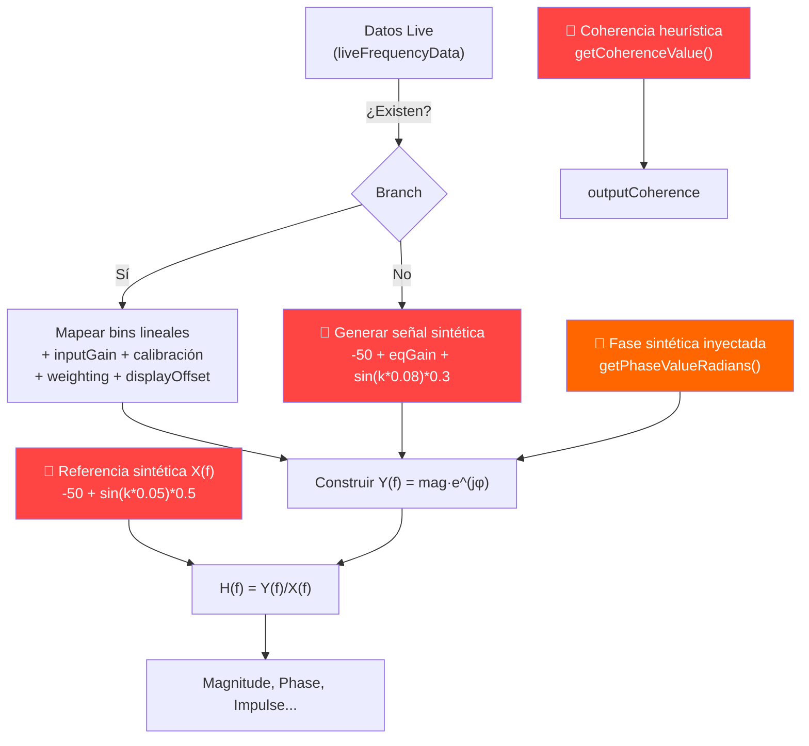

# Auditoría de Funciones Cosméticas en el Pipeline DSP

Análisis del flujo completo en [dspWorker.ts](file:///c:/Users/Abel/Documents/Asistente/asistente/src/lib/dsp/dspWorker.ts) y módulos asociados para identificar funciones que **aparentan realizar análisis real pero son simulaciones**.

---

## Diagrama del Pipeline Actual



---

## 🔴 Hallazgo 1 — CRÍTICO: La Señal de Referencia X(f) es Completamente Sintética

**Archivo:** [dspWorker.ts:L352-355](file:///c:/Users/Abel/Documents/Asistente/asistente/src/lib/dsp/dspWorker.ts#L352-L355)

```typescript
// Simulated pink noise reference
const refDb = -50 + Math.sin(k * 0.05) * 0.5;
const refMag = Math.pow(10, refDb / 20);
const refPhase = 0;
```

**Problema:** En un analizador FFT dual-channel real, X(f) es la FFT de la señal de referencia capturada del canal de entrada del sistema (típicamente pre-procesador). Aquí, X(f) es una **curva inventada**: un nivel fijo de -50 dB con una ondulación sinusoidal de ±0.5 dB. La fase de referencia es 0° constante.

**Consecuencia:** La Transfer Function `H(f) = Y(f) / X(f)` **no es una transfer function real**, sino simplemente una representación escalada de la magnitud de la señal de salida. La división por esta referencia sintética no agrega ninguna información — es algebraicamente equivalente a mostrar `Y(f) + 50 dB` con un ripple cosmético.

**Lo que debería ser:** X(f) proviene de la FFT de una señal de referencia real (tap de consola, pre-procesador) sincronizada temporalmente con Y(f).

---

## 🔴 Hallazgo 2 — CRÍTICO: Coherencia Puramente Heurística

**Archivo:** [dspWorker.ts:L188-215](file:///c:/Users/Abel/Documents/Asistente/asistente/src/lib/dsp/dspWorker.ts#L188-L215)

```typescript
function getCoherenceValue(freq: number, isMeasuring: boolean, eqBands: EQBand[]): number {
    let coh = 0.98;
    if (freq < 45) coh -= 0.35 * (1 - freq / 45);
    if (freq > 16000) coh -= (0.12 * (freq - 16000)) / 4000;
    // ... ajustes cosméticos por EQ bands
    if (isMeasuring) {
        coh += (Math.random() - 0.5) * 0.015;
    }
    return Math.max(0.01, Math.min(1, coh));
}
```

**Problema:** La coherencia real se calcula como `γ²(f) = |Gxy(f)|² / (Gxx(f) · Gyy(f))` y requiere **múltiples frames promediados** de auto-espectro y cross-espectro. Esta función genera valores fijos basados en la frecuencia con una caída cosmética en LF/HF y ruido aleatorio de ±0.75%.

**Consecuencia:** La curva de coherencia **siempre se ve "bien"** (~0.98) excepto en los extremos. No hay forma de que revele:
- Problemas de ruido ambiental
- Reflexiones destructivas
- Distorsión del sistema
- Problemas de sincronización

> [!CAUTION]
> Esto es lo más engañoso del pipeline. Un usuario vería coherencia alta y confiaría en que sus mediciones de amplitud y fase son válidas, cuando en realidad no existe verificación alguna de la calidad de los datos.

---

## 🟠 Hallazgo 3 — ALTO: La Fase se Inyecta Sintéticamente en Y(f)

**Archivo:** [dspWorker.ts:L49-186](file:///c:/Users/Abel/Documents/Asistente/asistente/src/lib/dsp/dspWorker.ts#L49-L186) y [L386-389](file:///c:/Users/Abel/Documents/Asistente/asistente/src/lib/dsp/dspWorker.ts#L386-L389)

```typescript
const phaseTotal = getPhaseValueRadians(f_k, isMeasuring, eqBands, calibrationFilters, sr) + refPhase;
fftInputReal[k] = liveMag * Math.cos(phaseTotal);
fftInputImag[k] = liveMag * Math.sin(phaseTotal);
```

**Problema:** La señal de entrada `liveData` es un array de **magnitudes reales** (del `AnalyserNode.getFloatFrequencyData`). No tiene información de fase. El pipeline **inventa** la fase usando:

1. Un delay fijo de 1.4 ms: `phase = -2π · f · 0.0014`
2. Los coeficientes biquad de los filtros EQ del playground
3. Los filtros de calibración
4. Ruido aleatorio de ±0.02 rad cuando `isMeasuring=true`

**Consecuencia:** La fase mostrada no refleja la fase real del sistema medido. Es una **predicción teórica** basada en los filtros configurados por el usuario, no una medición. La fase real incluiría:
- Latencia del sistema completo (no solo 1.4 ms fijo)
- Fase de los crossovers del speaker
- Efectos de reflexiones y sumación acústica
- Fase del amplificador

> [!IMPORTANT]
> La función `calculatePhase()` en `osmMetrics.ts` es matemáticamente correcta (atan2 de H(f)). El problema es que H(f) se construye con fase sintética inyectada, así que el cálculo correcto produce un resultado engañoso.

---

## 🟠 Hallazgo 4 — ALTO: VU Meters Replican el Mismo Valor

**Archivo:** [mathOrchestrator.svelte.ts:L103-107](file:///c:/Users/Abel/Documents/Asistente/asistente/src/lib/stores/mathOrchestrator.svelte.ts#L103-L107)

```typescript
const inChCount = uiStore.inChannels.filter(Boolean).length || 2;
const outChCount = uiStore.outChannels.filter(Boolean).length || 2;
meterStore.updateIn(Array.from({ length: inChCount }, () => data.dbIn));
meterStore.updateOut(Array.from({ length: outChCount }, () => data.dbIn));
```

**Problema:** El level meter muestra N canales de entrada y N de salida, pero **todos los canales reciben exactamente el mismo valor** (`data.dbIn`). Además, `dbIn` se calcula como el pico global del espectro, no individualmente por canal. Los meters de entrada y salida también muestran el mismo valor.

**Consecuencia:** El usuario ve múltiples barras de VU meter moviéndose, dando la impresión de monitoreo multicanal independiente, cuando en realidad es **un solo valor replicado** en todas las barras.

---

## 🟡 Hallazgo 5 — MEDIO: Crest Factor con Estimador Aproximado

**Archivo:** [dspWorker.ts:L442-458](file:///c:/Users/Abel/Documents/Asistente/asistente/src/lib/dsp/dspWorker.ts#L442-L458)

```typescript
if (metricsSet.has("Crest Factor")) {
    for (let k = 0; k < BINS; k++) {
        const mag = Math.sqrt(fftInputReal[k]**2 + fftInputImag[k]**2);
        const peakDb = 20 * Math.log10(mag + 1e-12);
        // Estimar RMS como promedio local de 5 bins
        let sumSq = 0, count = 0;
        for (let j = Math.max(0, k-2); j <= Math.min(BINS-1, k+2); j++) {
            const m = Math.sqrt(fftInputReal[j]**2 + fftInputImag[j]**2);
            sumSq += m * m;
            count++;
        }
        const rmsDb = 10 * Math.log10(sumSq / count + 1e-24);
        outputCrestFactor[k] = Math.max(0, Math.min(30, peakDb - rmsDb));
    }
}
```

**Problema:** El Crest Factor real es `CF = Peak / RMS` medido en el **dominio del tiempo** sobre una ventana de señal. Aquí se calcula como la diferencia entre el pico de un bin y el RMS de 5 bins vecinos en el dominio de la frecuencia. Esto no es Crest Factor — es una medida de "prominencia espectral local".

**Consecuencia:** Los valores mostrados no se corresponden con el Crest Factor real del programa (típicamente 12-20 dB para música). La aproximación de 5 bins produce valores de CF cercanos a 0 dB en señales de espectro suave, lo cual es incorrecto.

---

## 🟡 Hallazgo 6 — MEDIO: Modo Sin Datos Live — Transfer Function 100% Ficticia

**Archivo:** [dspWorker.ts:L374-383](file:///c:/Users/Abel/Documents/Asistente/asistente/src/lib/dsp/dspWorker.ts#L374-L383)

```typescript
} else {
    const binWidth = (sr / 2) / BINS;
    const idx = Math.max(0, Math.min(BINS - 1, Math.round(f_k / binWidth)));
    const eqGain = eqResponseCache[idx] || 0;
    liveDb = -50 + eqGain + Math.sin(k * 0.08) * 0.3;
    liveDb += getWeightingGain(f_k, weightingType || 'Z');
    liveDb += displayOffset || 0;
}
```

**Problema:** Cuando no hay datos live (no hay micrófono conectado), la señal Y(f) se genera como `-50 dB + EQ gain + ondulación sinusoidal`. Combinado con X(f) sintética (Hallazgo 1), la Transfer Function completa es **ficción pura**.

**Consecuencia:** En modo "playground" (sin medición), todas las métricas (Magnitude, Phase, Impulse, Step, Group Delay, Coherence) muestran datos que se ven plausibles pero son completamente inventados. El usuario puede pensar que está viendo una medición "en reposo", cuando es una animación generativa.

> [!NOTE]
> Este modo tiene valor como **demostración de la UI** y como herramienta educativa para entender qué efecto tienen los filtros EQ. El problema es que no se comunica al usuario que está viendo una simulación.

---

## Resumen de Severidad

| # | Hallazgo | Severidad | ¿Funciona con datos reales? |
|---|----------|:---------:|:---------------------------:|
| 1 | Referencia X(f) sintética | 🔴 Crítico | No — la TF siempre es inválida |
| 2 | Coherencia heurística | 🔴 Crítico | No — nunca refleja la realidad |
| 3 | Fase inyectada sintéticamente | 🟠 Alto | No — fase siempre es teórica |
| 4 | VU meters replicados | 🟠 Alto | No — siempre muestra 1 valor |
| 5 | Crest Factor aproximado | 🟡 Medio | Parcial — muestra algo relacionado |
| 6 | TF ficticia sin datos live | 🟡 Medio | N/A — es modo demo |

---

## Conclusión

> [!CAUTION]
> El pipeline DSP actual tiene **dos capas de realidad**:
>
> **Capa correcta (las matemáticas):** Los módulos `osmMetrics.ts`, `deconvolution.ts`, `fft.ts`, `averaging.ts`, `weighting.ts`, `windowFunction.ts` y `sourceWindowing.ts` implementan algoritmos correctos y verificados. Si recibieran datos reales, producirían resultados válidos.
>
> **Capa ficticia (los datos):** El pipeline en `dspWorker.ts` alimenta esas matemáticas correctas con **datos sintéticos o parcialmente fabricados**. La referencia es inventada, la fase es inyectada, la coherencia es una fórmula cosmética, y los meters son réplicas.

El resultado neto es un sistema que **se ve y se comporta como un analizador real** pero produce análisis engañoso. Las matemáticas están listas para datos reales — lo que falta es la adquisición real de señales dual-channel.

---

## Funciones NO Cosméticas (Verificadas como Correctas)

Para claridad, estas funciones son matemáticamente correctas y funcionan como se espera:

| Función | Archivo | Estado |
|---------|---------|--------|
| `calculateMagnitude()` | osmMetrics.ts | ✅ H(f) = Y·conj(X)/\|X\|² |
| `calculatePhase()` | osmMetrics.ts | ✅ atan2(Im,Re) → grados |
| `calculateImpulseResponse()` | osmMetrics.ts | ✅ IFFT(H(f)) con Hermitian |
| `calculateStepResponse()` | osmMetrics.ts | ✅ ∫ impulse dt |
| `calculateGroupDelay()` | osmMetrics.ts | ✅ -dφ/dω → ms |
| `calculateCoherence()` | osmMetrics.ts | ✅ \|Gxy\|²/(Gxx·Gyy) — **pero no se usa** |
| `deconvolve()` | deconvolution.ts | ✅ IFFT(Y/X) |
| `fft()` / `ifft()` | fft.ts | ✅ Radix-2 DIT correcto |
| `ComplexAveraging` | averaging.ts | ✅ FIFO y LPF vector |
| `getWeightingGain()` | weighting.ts | ✅ ANSI A/B/C/Z |
| `applySourceWindow()` | sourceWindowing.ts | ✅ Tukey windowing |
| `WindowFunction` | windowFunction.ts | ✅ Hann/Hamming/FlatTop/BH/HFT223D |
| Biquad coefficients | dspWorker.ts | ✅ Audio EQ Cookbook RBJ |
