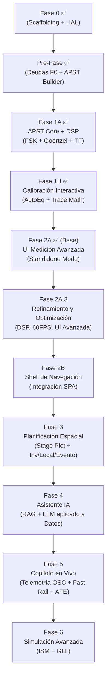

# Roadmap de implementación — Asistente de audio y video para asambleas

Cada fase produce un entregable funcional que se puede usar y testear independientemente. Las fases se construyen sobre las anteriores.

**Principio de priorización:** Primero que suene → después que mida → después que explique → después que alerte → después que recuerde → después que controle.

### Desarrollo Dual: PWA + Tauri (Transversal)
El proyecto produce **dos targets desde el mismo código** en todas las fases:
- **PWA (Web):** `npm run build` → archivos estáticos desplegados en `entrerios2.github.io/asistente`
- **Nativo (Tauri):** `cargo tauri build` → ejecutable `.exe` / `.app` con acceso ASIO, archivos locales y VRAM sin restricciones.

La separación se logra mediante un **HAL (Hardware Abstraction Layer)** establecido en Fase 0. Toda la lógica de negocio y DSP es agnóstica al entorno; solo las implementaciones de captura, archivos y red cambian.

```
asistente/
├── src/                    ← Svelte 5 (UI compartida)
│   └── lib/
│       ├── hal/            ← Capa de abstracción (interfaces)
│       │   ├── types.ts    ← AudioProvider, AudioListener
│       │   ├── web/        ← Impl: Web Audio API + AudioWorklet
│       │   └── tauri/      ← Impl: invoke() → Rust/cpal/ASIO
│       ├── dsp/            ← Motor DSP puro (consume HAL)
│       └── utils/          ← Tier detector, helpers
├── tools/
│   └── apst-builder/      ← CLI Node/TS para generar FLAC de secuencias
├── src-tauri/              ← Backend Rust (cpal, OSC nativo, mDNS, fs)
├── static/
├── vite.config.ts          ← base: '/asistente/'
└── docs/
```

### Alineación con Bloques UX (`Organizacion_interfaz.md`)

| Bloque UX | Áreas | Fases que lo alimentan |
|:----------|:------|:----------------------|
| **Planificación** | Sistema, Inventario, Locales, Eventos | Fase 4 + Fase 6 |
| **Instalación y puesta a punto** | Armado, Herramientas, Calibración | Fase 1A + 1B + Fase 3 (parcial) |
| **Operación** | Referencia, Copiloto | Fase 2 + Fase 3 + Fase 5 |

> **Nota UX de Medición:** La arquitectura visual de la sección Calibración (panel de control dual Secuencial/Manual, motor de vistas multi-cuadrante, gestor de snapshots compartidos y estrategia responsiva) está especificada en [`docs/UX_Medicion.md`](./UX_Medicion.md). Las fases 1A y 1B deben respetar y materializar esas definiciones.

---

## Fase 0 — Fundación, Scaffolding y HAL ✅ (Parcial)
**Objetivo:** Proyecto dual-target funcional con captura de audio y visualización básica.
**Estado:** Scaffolding, HAL y UI completados. Quedan deudas técnicas → Pre-Fase.

### Componentes completados

| Tarea | Estado |
|:------|:------:|
| Proyecto Svelte 5 + Vite + TypeScript + TailwindCSS v4 | ✅ |
| Tauri v2 backend Rust (`cargo tauri init`) | ✅ |
| HAL: interfaces (`AudioProvider`, `AudioListener`) | ✅ |
| HAL impl Web (`WebAudioProvider.ts`) | ✅ |
| HAL impl Tauri (`TauriAudioProvider.ts`, stub) | ✅ |
| HAL Factory (detección automática de entorno) | ✅ |
| Canvas RTA (magnitud vs frecuencia) | ✅ |
| Detección de Tier (0/1/2) | ✅ |
| PWA (`vite-plugin-pwa`, manifest, Service Worker) | ✅ |
| Headers COOP/COEP para SharedArrayBuffer | ✅ |

### Deudas técnicas (→ Pre-Fase)

| Tarea | Nota |
|:------|:-----|
| Motor FFT independiente (WebFFT o `fft.js` en TS) | Actualmente usa `AnalyserNode` nativo, violando el patrón HAL |
| `dsp/Analyzer.ts` (clase que consume HAL, no Web Audio directo) | No existe |
| Generador de Ruido Rosa funcional | Interfaz definida pero sin implementación |
| Deploy pipeline a GitHub Pages | No configurado |

---

## Pre-Fase — Cierre de Deudas F0 + APST Builder
**Objetivo:** Cerrar las deudas técnicas de Fase 0 y producir los assets de prueba FLAC.
**Depende de:** Fase 0 (parcial)

### Componentes

| Tarea | Sección DDS | Target | Complejidad |
|:------|:----------:|:------:|:-----------:|
| Motor FFT independiente (`fft.js` o impl TS pura) | 2.2 | Ambos | 🟡 |
| `dsp/Analyzer.ts`: migrar análisis de `AnalyserNode` al motor FFT propio | 2.2, 2.4 | Ambos | 🟡 |
| Generador de Ruido Rosa funcional (vía HAL) | 4.3.2 | Ambos | 🟢 |
| Deploy pipeline a `entrerios2.github.io/asistente` | — | PWA | 🟢 |
| **APST Builder** (CLI Node/TS): genera FLAC con cabeceras FSK HF/LF a 44.1/48/96 kHz | 2.5 | Ambos | 🟡 |
| **Selección de dispositivo de audio** (multi-backend: WASAPI Shared/Exclusive, ASIO, CoreAudio) | 2.4 | Nativo | 🟡 |
| **UI DeviceSelector** (dropdown agrupado por backend con badges, entrada + salida) | 2.4 | Nativo | 🟡 |

> **APST Builder:** Utilidad de línea de comandos en Node.js/TypeScript que pre-renderiza las secuencias acústicas y cabeceras FSK como archivos `.flac` lossless. La lógica de síntesis (tonos, sweeps, FSK encoding) es reutilizable en el browser para generación en tiempo real futura (Tier 2). Ver especificación completa en [Protocolo APST §2.5](./Protocolo_APST.md).

### Criterios de Aceptación
- [x] El RTA funciona con el motor FFT propio (sin `AnalyserNode`)
- [x] El código DSP no importa Web Audio API directamente (solo HAL)
- [x] El Ruido Rosa suena limpio por los altavoces
- [x] La PWA se despliega y es instalable desde `entrerios2.github.io/asistente`
- [x] El APST Builder genera los 12 segmentos atómicos + 7 secuencias compuestas en FLAC
- [x] En Tauri, el selector de dispositivos enumera todas las interfaces de audio disponibles (WASAPI, ASIO si hay drivers) y permite seleccionar entrada/salida independientemente

---

## Fase 1A — Infraestructura de Medición y APST Core ✅
**Objetivo:** El sistema reproduce secuencias FSK, detecta cabeceras Goertzel y ejecuta segmentos de medición.
**Estado:** Completada.

### Componentes

| Tarea | Sección DDS | Complejidad |
|:------|:----------:|:-----------:|
| Motor de Playback FSK (reproducción WAV/FLAC, selección automática por sample rate) | 4.13 | 🟡 |
| Detector Goertzel en AudioWorklet (bancos HF 1650/1850 Hz y LF 150/200 Hz) | 4.13, 2.2 | 🟡 |
| Orquestador de secuencias (parser de cadenas `V A F P`, máquina de estados) | 4.13 | 🟡 |
| Segmentos `V`, `A`, `N`, `F`, `P`, `T` | 4.13 | 🟡 |
| Modelo Híbrido Real-Time/Offline Buffer (según Tier) | 2.2 | 🟡 |
| Función de Transferencia dual-canal (Magnitud + Fase + Coherencia) | 4.3.2 | 🔴 |
| Integración Meyda.js para descriptores acústicos | 2.3 | 🟢 |
| Testeador de Cables (modo Loopback: `V P` sin altavoces) | 4.13 | 🟢 |

---

## Fase 1B — Calibración Interactiva y AutoEq ✅
**Objetivo:** El operador ve su medición, la compara con la curva objetivo y recibe sugerencias de EQ.
**Estado:** Completada. Quedan deudas técnicas documentadas en `informe_post_fase_1.md`.

### Componentes

| Tarea | Sección DDS | Complejidad |
|:------|:----------:|:-----------:|
| Curva Objetivo plana con parámetros editables (±3 dB, roll-offs opcionales) | 4.3.1 | 🟢 |
| Motor AutoEq: derivación de filtros PEQ (cortes prioritarios) | 4.3.3 | 🔴 |
| Trace Math Visualizer (3 capas: Medición + Filtro + Predicted) | 4.3.3 | 🟡 |
| Gráfico de Coherencia ("Semáforo") como gate del AutoEq | 4.7.1 | 🟡 |
| Alineamiento Temporal (Fase Desenrollada) | 4.3.2 | 🟡 |
| STI-Estimado desde IR | 4.3.2 | 🟡 |
| Snapshot Antes/Después + Auditoría STI-Est | 4.3.2 | 🟢 |
| Perfiles Genéricos de Seguridad (Agnóstico A/B/Desconocido) | 4.1 | 🟡 |
| Generador de Log Sweep manual (modo no-FSK) | 4.3.2 | 🟡 |

---

## Fase 2A — Consolidación Post-Fase 1 y UI de Medición Avanzada ✅ (Base)
**Objetivo:** Cerrar el backlog del informe post-fase-1 y materializar la especificación de interfaz de medición profesional (`docs/UX_Medicion.md`): panel dual Secuencial/Manual, motor de vistas multi-cuadrante, gestor de snapshots, funciones analíticas avanzadas y responsividad móvil.
**Estado:** La infraestructura base y el enrutamiento están completados. Queda pendiente el refinamiento final de UI y rendimiento (movido a Fase 2A.3).
**Depende de:** Fase 1B

### Componentes — Backlog Post-Fase 1

| Tarea | Ref | Complejidad |
|:------|:---:|:-----------:|
| **Procesamiento Dual Híbrido (Fast-Path / Slow-Path):** Fast-Path con detección de Showstoppers y RTA en vivo; Slow-Path con FFT masiva offline | DDS 2.2 | 🟡 |
| **Degradación Automática (Modo Ciego):** abortar Fast-Path si CPU insuficiente, garantizando grabación limpia | DDS 2.2 | 🟢 |
| **APST Builder — Formato WAV:** generación principal en `.wav` PCM sin compresión para máxima compat. con consolas USB | DDS 2.5 | 🟢 |
| **Modo Escucha Offline:** escucha pasiva esperando trigger FSK + descarga de archivos WAV de la secuencia activa | DDS 2.5, 4.13 | 🟡 |
| **Segmento `X` (Crosstalk):** evaluación de diafonía, opcional en la UI para cables mono | DDS 4.13 | 🟡 |
| **Testeador de Cables extendido** (`V P N X`): bucles de masa, blindaje, **Cable Score** exportable | DDS 4.13 | 🟡 |
| Coherencia real cableada en UI (reemplazar hardcode 0.85) | Informe 3.4 | 🟢 |
| Perfiles Agnósticos formales (curvas de compensación reales) | Informe 3.3 | 🟡 |
| APST Builder — matriz completa de ~57 archivos en CI/CD | Informe 3.5 | 🟢 |

### Componentes — UI de Medición (según `docs/UX_Medicion.md`)

| Tarea | Ref UX | Complejidad |
|:------|:------:|:-----------:|
| Layout 100vw/100vh sin scroll; estructura Sidebar + Main View + Header | §1 | 🟢 |
| Sidebar tabulado: Pestaña Secuencial (progreso en vivo + resultados numéricos + disparo offline/local) | §2A | 🟡 |
| Pestaña Manual: Generador de señales (R. Rosa/Blanco/Rojo, Seno, Sweep) + selección de canal de salida | §2B | 🟡 |
| Motor de Vistas Multi-cuadrante: grillas 1×1 hasta 3×2, selector de métrica por cuadrante con modal de configuración | §3 | 🔴 |
| Mediciones disponibles por cuadrante: RTA, TF Magnitud, Fase, Coherencia, Espectro, Nivel, Numérico, IR, Delay de Grupo | §3 | 🟡 |
| Trace Engine: superposición con presets de compatibilidad, estilos (sólido/dashed/fill), colores distintos | §3 | 🟡 |
| Grilla con ejes y referencias en los bordes; cursor crosshair con valores dinámicos; controles de escala (scroll/pinch) | §3 | 🟡 |
| Smoothing por octava (1/3 – 1/48); Coherence Blanking configurable; Phase Unwrap | §3 (Avanzado) | 🟡 |
| Gestor de Snapshots compartido: auto-save post-secuencia, manual-save, Y-Offset, íconos distintivos, ordenar por ubicación/fecha | §4 | 🟡 |
| Responsividad móvil: Bottom Sheet/Drawer, grilla ≤2×1 con swipe, modales fullscreen, hit targets ≥44px | §1 | 🟡 |
| Temas de contraste Sol/Oscuro (switch en Header) | §1 | 🟢 |
| Hotkeys: Espacio=Snapshot, D=Find Delay, 1–9=toggle visibilidad | §5 | 🟢 |

### Criterios de Aceptación
- [ ] El layout se ancla a 100vw/100vh sin generar scroll en ningún viewport
- [ ] En escritorio, sidebar fijo y hasta 6 cuadrantes configurables independientemente
- [ ] En móvil portrait, sidebar colapsa en Bottom Sheet y máx. 2 cuadrantes (swipe para más)
- [ ] El Gestor de Snapshots es accesible desde ambas pestañas con íconos distintivos (Secuencial vs Manual)
- [ ] Coherence Blanking enmascara trazos donde γ² < umbral definible
- [ ] El Modo Ciego se activa automáticamente en Tier 0 sin interrumpir la grabación
- [ ] El Testeador de Cables calcula y muestra el Cable Score; el Segmento X es opcional
- [ ] El botón dividido de "Escucha Offline" descarga los WAV correctos para la secuencia seleccionada

---

## Fase 2A.3 — Refinamiento Profesional y Optimización DSP-UI
**Objetivo:** Optimizar el motor de renderizado a 60 FPS, corregir la visualización absoluta de RTA y consolidar la UI interactiva (4 pestañas, ecualizadores dinámicos de 3 vías/checkboxes y cabecera reactiva) definida en el Plan de Implementación de la Fase 2A.
**Depende de:** Fase 2A (Base)

### Componentes
| Tarea | Ref UX | Complejidad |
|:------|:------:|:-----------:|
| **Reestructuración Sidebar:** 4 Pestañas principales con Material Icons específicos (`cadence`, `instant_mix`, `screenshot_frame_2`, `settings`). | Plan F2A.3 | 🟢 |
| **Pestaña Medición:** Panel compacto, botón principal como barra de estado/progreso, resultados dinámicos. | Plan F2A.3 | 🟡 |
| **Pestaña Ecualización:** Controles completos para Gráfico, Paramétrico (con checkboxes por polo), y Tono (3 vías). Botón de estado "Simular". | Plan F2A.3 | 🟡 |
| **Topbar y UI Rápida:** Vúmetros con indicador de igualación, selectores rápidos de generador y grilla estilo Word. | Plan F2A.3 | 🟢 |
| **Optimización de Rendering (60 FPS):** Implementación de *Logarithmic Binning* para el suavizado de curvas. | DSP | 🔴 |
| **Optimización de CPU:** Caché de filtros EQ usando Svelte 5 `$derived` para eliminar recálculo logarítmico en cada frame. | DSP | 🟡 |
| **Corrección de RTA Absoluto:** Escala Y dinámica de -120 a +10 dB para visualización correcta de niveles. | DSP | 🟢 |

### Criterios de Aceptación
- [ ] El Canvas mantiene 60 FPS consistentes durante la visualización RTA y EQ simultánea.
- [ ] La señal RTA en vivo es visible y escalada correctamente independientemente del piso de ruido.
- [ ] La UI principal está consolidada en las 4 pestañas definidas con la iconografía correcta.
- [ ] La selección dinámica de métricas funciona utilizando la matriz de compatibilidad de escalas.

---

## Fase 2B — Shell de Navegación Principal
**Objetivo:** Implementar la estructura global de la aplicación (`docs/Organizacion_interfaz.md`) e integrar la herramienta de medición standalone como un módulo funcional dentro del flujo.
**Depende de:** Fase 2A

### Componentes

| Tarea | Sección UX | Complejidad |
|:------|:----------:|:-----------:|
| **Enrutamiento Principal:** 3 bloques mayores (Planificación, Instalación, Operación) | Organizacion_interfaz | 🟢 |
| **Integración de Calibración:** Montar la UI de medición de la Fase 2A dentro de Instalación → Calibración | Organizacion_interfaz | 🟢 |
| Scaffolding de vistas vacías para Inventario, Locales, Eventos, Herramientas, etc. | Organizacion_interfaz | 🟢 |

### Criterios de Aceptación
- [ ] La aplicación arranca con el menú principal definido en el documento de organización.
- [ ] Es posible navegar a "Instalación > Calibración" y operar la UI de medición de Fase 2A.

---

## Fase 3 — Planificación Espacial, Persistencia y Modelo de Datos
**Objetivo:** Stage Plot MVP + entidades Inventario/Local/Evento + Venue Memory.
**Depende de:** Fase 2B

### Componentes

| Tarea | Sección DDS | Complejidad |
|:------|:----------:|:-----------:|
| **Modelo de datos: Inventario** (catálogo de activos, estados, metadatos) | 4.1.3 | 🟡 |
| **Modelo de datos: Local** (Árbol de Zonas, diseño geométrico reutilizable) | 4.1.3 | 🟡 |
| **Modelo de datos: Evento** (Local + Inventario, reservas, validación) | 4.1.3 | 🟡 |
| Stage Plot: lienzo Canvas con sala rectangular + posiciones XY | 4.1 | 🟡 |
| Árbol de Zonas aditivo (zona raíz + zonas hijas con inclinación) | 4.1.2 | 🟡 |
| Cálculo RT60 (Sabine) | 4.1 | 🟢 |
| Modos de Sala | 4.1 | 🟢 |
| Reglas Geométricas (3:1, Inversa del Cuadrado, Mic/Monitor) | 4.1 | 🟡 |
| Delays multi-altavoz compensados por temperatura | 4.1 | 🟢 |
| Generador de Sweet Spots | 4.1 | 🟢 |
| Importación CLF (.clf / .cf2) + Aproximación Paramétrica (fallback) | 4.1 | 🟡 |
| Persistencia IndexedDB (Nivel 1: local puro) | 2.6 | 🟡 |
| Exportar/Importar JSON (`AvSetupPayload` con schema draft-07) | 4.8.1 | 🟡 |
| Venue Memory: historial indexado por recinto | 4.12 | 🟡 |
| Reporte Post-Evento (PDF vía jsPDF) | 4.8.3 | 🟡 |
| Modo de Emergencia (PDF + QR) | 4.8.2 | 🟢 |

### Criterios de Aceptación
- [ ] Se puede diseñar una sala, posicionar equipos y calcular delays
- [ ] Las reglas geométricas disparan advertencias proactivas
- [ ] Un payload exportado se importa correctamente en otra instancia
- [ ] Al volver a un recinto, el sistema ofrece cargar la calibración anterior

---

## Fase 4 — Asistente IA para Medición (Copiloto IA)
**Objetivo:** El copiloto entiende lenguaje natural, explica sus sugerencias y educa al operador novato, asistiendo específicamente en los procesos de medición y diseño ya implementados.
**Depende de:** Fase 3

### Componentes

| Tarea | Sección DDS | Complejidad |
|:------|:----------:|:-----------:|
| RAG: vectorización del corpus + búsqueda por similitud | 4.5 | 🟡 |
| Corpus RAG: fragmentación de fuentes primarias | 4.5.1 | 🟡 |
| LLM local: Transformers.js + WebGPU (Tier 2) | 2.0 | 🔴 |
| LLM CPU: ONNX Runtime Web (Tier 1) | 2.0 | 🟡 |
| Ecualización Semántica ("suena encajonado" → PEQ) | 4.4 | 🟡 |
| UX Adaptativa: niveles Básico/Intermedio/Avanzado | 4.9 | 🟡 |
| Tiered Prompts (mensajes adaptativos por nivel de usuario) | 4.9 | 🟢 |
| Glosario Contextual vinculado al RAG | 4.9 | 🟢 |
| Tutorial Introductorio de Sonido en Vivo | 4.9 | 🟡 |
| Plantillas estáticas pre-compiladas para Tier 0 | 2.1 | 🟢 |

### Criterios de Aceptación
- [ ] "¿Por qué suena nasal?" genera una respuesta coherente con sugerencia de EQ
- [ ] El RAG recupera fragmentos relevantes del corpus técnico
- [ ] En Tier 0 (sin IA), las plantillas estáticas cubren los diagnósticos comunes

---

## Fase 5 — Copiloto en Vivo (Fast-Rail, AFE, Telemetría, OSC)
**Objetivo:** Dashboard de operación en tiempo real con integración bidireccional a consolas, telemetría y detección heurística de problemas (Fast-Rail).
**Depende de:** Fase 4

### Componentes

| Tarea | Sección DDS | Complejidad |
|:------|:----------:|:-----------:|
| Algoritmo AFE: detección de feedback (crecimiento + tonalidad) | 4.6.1 | 🟡 |
| Fast-Rail: 5 heurísticas (feedback, clipping, proximidad, sibilancia, caja) | 4.7.1 | 🟡 |
| Smart Toasts con Indicador de Confianza (🟢/🟡/🔴) | 4.7.1 | 🟡 |
| Health Score (1-10) en el dashboard | 4.7.1 | 🟢 |
| Carril Semántico para diagnósticos complejos | 4.7.1 | 🟡 |
| Waterfall Plot (2D Tier 0, 3D Tier 2) | 4.7.1 | 🟡 |
| Cliente OSC bidireccional (enviar/recibir) | 4.2 | 🟡 |
| Web MIDI API para consolas USB | 4.2 | 🟡 |
| Gemelo Digital: lectura de estado (mutes, faders, EQ, meters) | 4.2 | 🟡 |
| Undo/Rollback OSC (Snapshot de Canal) | 4.2 | 🟡 |
| Modo Centinela: monitoreo pasivo + triage dirigido via Solo | 4.6.2 | 🔴 |
| Guía de A/V: ingesta JSON + timeline + alertas mute/unmute | 4.11 | 🟡 |
| Integración GAS opcional (Nivel 3 de persistencia) | 2.6 | 🟡 |
| Telemetría Distribuida: mapa de calor SPL/STI | 4.14 | 🟡 |
| Calibración Distribuida (Listen-Only Mode) | 4.13 | 🟡 |
| Botón de Pánico | 4.8.2 | 🟢 |

### Criterios de Aceptación
- [ ] Un acople simulado dispara un Smart Toast en < 200ms
- [ ] El Health Score refleja el estado real del sistema
- [ ] La app lee los meters de una X32 en tiempo real
- [ ] Un comando OSC enviado se puede deshacer
- [ ] El mapa de calor muestra datos de nodos calibrados distribuidos

---

## Fase 6 — Simulación Avanzada e Integración SPA (Futuro)
**Objetivo:** Predicción acústica sin encender el sistema de sonido.
**Depende de:** Todas las fases anteriores

> **Nota:** Esta fase es aspiracional y no forma parte del MVP ni del roadmap comprometido.

### Componentes potenciales
- Motor de Simulación Nivel 2 (cobertura por bandas de octava)
- Motor de Simulación Nivel 3 (reflexiones tempranas ISM, ≤ 5 rebotes)
- Ciclo de Autocorrección (Simulación v1 → Medición → Ajuste → Simulación v2)
- Importación GLL con dispersión 3D
- Mapeo SPL con isobáricas + detección visual de Comb Filtering
- Integración bidireccional con la SPA de Gestión AV (§9 del DDS)

---

## Diagrama de Dependencias



---

## Resumen Ejecutivo

| Fase | Entregable | Módulos DDS / UX | Bloque UX | Principio |
|:----:|:-----------|:------------|:----------|:----------|
| **0** ✅ | Scaffolding + HAL + RTA básico | 2.0, 2.1, 2.4 | — | Que suene |
| **Pre** ✅ | Motor FFT propio + Ruido Rosa + APST Builder CLI | 2.2, 2.5 | — | Que suene (cierre) |
| **1A** ✅ | Orquestador APST funcional + TF dual-canal | 2.2, 2.3, 4.13 | Calibración | Que mida (FSK) |
| **1B** ✅ | AutoEq + Trace Math + STI-Est | 4.3, 4.7.1 | Calibración | Que mida (interactivo) |
| **2A** ✅ (Base) | UI Medición multi-cuadrante + Backlog post-F1 | DDS 2.2/2.5/4.13, UX_Medicion | Calibración | Que mida (base) |
| **2A.3** | Refinamiento Profesional, 60FPS y UI Consolidada | DSP, UX_Medicion | Calibración | Que mida (profesional) |
| **2B** | Shell de Navegación + SPA Routing | Organizacion_interfaz | Todos | Que navegue |
| **3** | Stage Plot + Inventario/Local/Evento + Persistencia | 4.1, 4.1.3, 4.8, 4.12 | Planificación | Que recuerde |
| **4** | Asistente IA para Medición y Diseño (RAG + LLM) | 4.4, 4.5, 4.9 | Referencia | Que explique |
| **5** | Copiloto en Vivo: Fast-Rail, AFE, Telemetría, OSC, GAS | 4.2, 4.6, 4.7, 4.11, 4.14 | Operación | Que alerte y controle |
| **6** | Simulación predictiva avanzada | 4.1 (full), 9 | Planificación+ | Que prediga |
