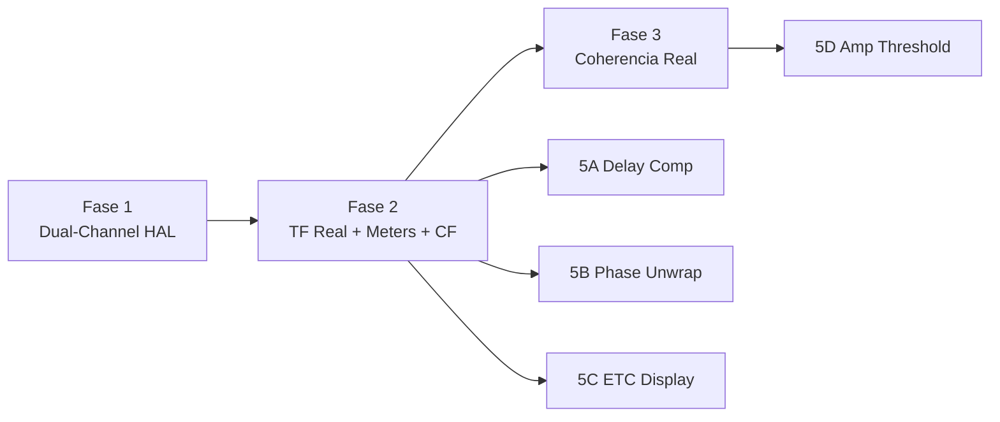

# Plan: Pipeline DSP Real — Analizador Dual-Channel (v3 Final)

Basado en auditorías [cosmetic](file:///C:/Users/Abel/.gemini/antigravity-ide/brain/83a06231-6bab-4806-929e-1eb797d424e9/audit_cosmetic_functions.md) y [McCarthy](file:///C:/Users/Abel/.gemini/antigravity-ide/brain/83a06231-6bab-4806-929e-1eb797d424e9/audit_mccarthy.md). Todas las decisiones de diseño resueltas.

---

## Decisiones de Diseño

| Decisión | Resolución |
|----------|------------|
| Fuente de datos time-domain | **Híbrido**: WorkletNode para time-domain preciso al worker, AnalyserNode solo para fast-path RTA (Spectrum) |
| Tamaño de bloque worklet | **FFT_SIZE** (8192 default). Worklet acumula y envía bloques completos |
| Transporte worklet→main | **Híbrido**: SAB si disponible, fallback postMessage |
| Asignación canales ref/meas | **Libre** con dropdown + opción auto-detect |
| Referencia en loopback | **3 opciones** (usuario elige): tap generador, analítica, loopback real |
| Modo single-channel | **Igual que stereo** — mismas 3 opciones de referencia disponibles |
| Ventana pre-FFT default | **Hann** (estándar SMAART). Configurable desde UI |
| Punto de averaging | Sobre **H(f)** (TF completa), no sobre Y(f) crudo |
| Coherencia | Acumulador exponencial **dentro de dspWorker.ts** |
| Overlap FFT | **50% default**, configurable |
| Delay compensation | **Ambos**: auto-detect (default) + override manual |
| Instantáneas legacy | **Borrado manual** por el usuario (etapa de desarrollo) |

---

## Fase 1 — Infraestructura Dual-Channel

> Captura de 2 canales time-domain desde HAL hasta el worker.

---

### [MODIFY] [audio-capture-processor.js](file:///c:/Users/Abel/Documents/Asistente/asistente/static/worklets/audio-capture-processor.js)

**Cambios:**

1. **Dos ring buffers** separados (ref + meas) en vez de 1:

```javascript
constructor() {
    super();
    // Dos buffers: referencia y medición
    this.refBuffer = null;    // SharedArrayBuffer o Float32Array
    this.measBuffer = null;
    this.refWriteIdx = 0;
    this.measWriteIdx = 0;
    this.bufferSize = 0;      // = FFT_SIZE
    this.samplesAccumulated = 0;
    this.fftSize = 8192;      // Recibido del main thread
    // ... (mantener FSK/Goertzel existente)
}
```

2. **Captura dual-channel con acumulación FFT_SIZE:**

```javascript
process(inputs) {
    const input = inputs[0];
    if (!input || !input[0]) return true;
    
    const ch0 = input[0];                  // Canal 0
    const ch1 = input[1] || input[0];      // Canal 1 (fallback mono)
    const len = ch0.length;                // 128 samples
    
    // Escribir en ring buffers
    for (let i = 0; i < len; i++) {
        this.refBuffer[this.refWriteIdx] = ch0[i];
        this.measBuffer[this.measWriteIdx] = ch1[i];
        this.refWriteIdx = (this.refWriteIdx + 1) % this.bufferSize;
        this.measWriteIdx = (this.measWriteIdx + 1) % this.bufferSize;
    }
    
    this.samplesAccumulated += len;
    
    // Cuando tenemos FFT_SIZE muestras, notificar
    if (this.samplesAccumulated >= this.fftSize) {
        this.samplesAccumulated = 0; // Reset (o -= fftSize/2 para 50% overlap)
        if (!this.hasSAB) {
            // Fallback: postMessage con copia
            this.port.postMessage({
                type: 'DUAL_BLOCK',
                ref: this.refBuffer.slice(),
                meas: this.measBuffer.slice()
            });
        }
        // Si SAB, el main thread lee directamente cuando quiere
    }
    
    // ... (mantener lógica FSK existente sobre ch0)
    return true;
}
```

3. **Recibir configuración** del main thread:

```javascript
this.port.onmessage = (event) => {
    if (event.data.type === 'init') {
        this.fftSize = event.data.fftSize;
        this.bufferSize = event.data.fftSize;
        // Inicializar SABs o buffers locales
        if (event.data.refSab && event.data.measSab) {
            this.refBuffer = new Float32Array(event.data.refSab);
            this.measBuffer = new Float32Array(event.data.measSab);
            this.hasSAB = true;
        } else {
            this.refBuffer = new Float32Array(this.bufferSize);
            this.measBuffer = new Float32Array(this.bufferSize);
            this.hasSAB = false;
        }
    }
    if (event.data.type === 'updateFftSize') {
        this.fftSize = event.data.fftSize;
        // Realocar si es necesario
    }
    if (event.data.type === 'setOverlap') {
        this.overlapFraction = event.data.overlap; // 0, 0.5, 0.75
    }
};
```

4. **50% overlap configurable:**

```javascript
// En vez de resetear a 0, retroceder la mitad para overlap
const hopSize = Math.round(this.fftSize * (1 - this.overlapFraction));
this.samplesAccumulated -= hopSize;
```

**Se mantiene:** Toda la lógica FSK/Goertzel/UART existente (opera solo sobre ch0).

---

### [MODIFY] [WebAudioProvider.ts](file:///c:/Users/Abel/Documents/Asistente/asistente/src/lib/hal/web/WebAudioProvider.ts)

**Cambios:**

1. **ChannelSplitter** para separar L/R:

```typescript
const splitter = this.audioContext.createChannelSplitter(2);
source.connect(splitter);

// AnalyserNodes para fast-path RTA (solo magnitud, sin referencia)
this.analyserRef = this.audioContext.createAnalyser();
this.analyserMeas = this.audioContext.createAnalyser();
this.analyserRef.fftSize = 8192;
this.analyserMeas.fftSize = 8192;

// El routing depende de la configuración del usuario
const refCh = uiStore.refChannel; // 0 o 1
const measCh = uiStore.measChannel; // 0 o 1
splitter.connect(this.analyserRef, refCh);
splitter.connect(this.analyserMeas, measCh);
```

2. **WorkletNode con 2 SABs:**

```typescript
const fftSize = uiStore.fftSize;
if (hasSAB) {
    this.refSab = new SharedArrayBuffer(fftSize * Float32Array.BYTES_PER_ELEMENT);
    this.measSab = new SharedArrayBuffer(fftSize * Float32Array.BYTES_PER_ELEMENT);
    this.workletNode.port.postMessage({ 
        type: 'init', 
        fftSize,
        refSab: this.refSab, 
        measSab: this.measSab 
    });
} else {
    this.workletNode.port.postMessage({ type: 'init', fftSize });
}
```

3. **readData() actualizado — enviar time-domain al listener:**

```typescript
const readData = () => {
    // Fast-path RTA (AnalyserNode, solo para Spectrum single-channel)
    if (this.analyserMeas && this.freqDataArray && listener.onFrequencyData) {
        this.analyserMeas.getFloatFrequencyData(this.freqDataArray);
        listener.onFrequencyData(this.freqDataArray);
    }
    
    // Dual-channel time-domain para el worker DSP
    if (listener.onTimeDomainData) {
        if (hasSAB) {
            const refData = new Float32Array(this.refSab);
            const measData = new Float32Array(this.measSab);
            listener.onTimeDomainData(measData, refData);
        }
        // Si no SAB, los datos llegan via postMessage del worklet
    }
    
    this.animationFrameId = requestAnimationFrame(readData);
};
```

4. **Modo loopback — conectar generador como referencia:**

```typescript
if (uiStore.refSourceMode === 'loopback') {
    // Crear MediaStreamDestination para capturar la salida del generador
    const dest = this.audioContext.createMediaStreamDestination();
    this.generatorGainNode.connect(dest);
    const loopbackSource = this.audioContext.createMediaStreamSource(dest.stream);
    loopbackSource.connect(splitter, 0, 0); // Inyectar como canal de referencia
}
```

5. **Modo tap del generador (single-channel o stereo con generador):**

```typescript
if (uiStore.refSourceMode === 'generator-tap') {
    // Copiar el buffer pre-renderizado del generador como referencia
    const genBuffer = this.getGeneratorBuffer(); // Buffer del pink/sweep/MLS activo
    listener.onTimeDomainData(measTimeDomain, genBuffer);
}
```

6. **Modo referencia analítica:**

```typescript
if (uiStore.refSourceMode === 'analytical') {
    // Generar X(f) teórica según el tipo de señal
    const analyticalRef = generateAnalyticalReference(
        uiStore.generatorType, fftSize, sampleRate
    );
    listener.onTimeDomainData(measTimeDomain, analyticalRef);
}
```

7. **Auto-detect canal de referencia:**

```typescript
if (uiStore.channelAssignment === 'auto') {
    // Calcular RMS de ambos canales; el más estable = referencia
    const rms0 = computeRMS(ch0Data);
    const rms1 = computeRMS(ch1Data);
    // El canal con menor varianza entre frames = referencia (pre-procesador)
}
```

---

### [MODIFY] [types.ts](file:///c:/Users/Abel/Documents/Asistente/asistente/src/lib/hal/types.ts)

```typescript
export interface AudioListener {
    onAudioData(data: AudioBufferChunk): void;
    onFrequencyData?(measData: Float32Array): void;
    onTimeDomainData?(measSamples: Float32Array, refSamples?: Float32Array): void;
}
```

---

### [MODIFY] [ui.svelte.ts](file:///c:/Users/Abel/Documents/Asistente/asistente/src/lib/stores/ui.svelte.ts)

Agregar configuraciones de routing:

```typescript
// Routing de canales
refChannel = $state(0);           // Canal físico para referencia (0=L, 1=R)
measChannel = $state(1);          // Canal físico para medición
channelAssignment = $state<'manual' | 'auto'>('manual');

// Modo de referencia
refSourceMode = $state<'channel' | 'generator-tap' | 'analytical' | 'loopback'>('channel');

// FFT overlap
fftOverlap = $state(0.5);        // 0, 0.5, 0.75

// Delay compensation (Fase 5A)
compensationDelayMs = $state(0);
autoDelayCompensation = $state(true);

// Averaging threshold (Fase 5D)
averagingThresholdDb = $state(-60);
```

---

## Fase 2 — Transfer Function Real en dspWorker

> Reemplazar TODA la fabricación de datos por FFT real de ambos canales.

---

### [MODIFY] [dspWorker.ts](file:///c:/Users/Abel/Documents/Asistente/asistente/src/lib/dsp/dspWorker.ts)

**Cambio de protocolo del mensaje:**

```typescript
// ANTES:
{ type: 'run-dsp', liveData: ArrayBuffer, ... }

// DESPUÉS:
{ type: 'run-dsp', measTimeDomain: ArrayBuffer, refTimeDomain: ArrayBuffer, ... }
```

**Nuevo flujo principal (reemplaza L349-394 completo):**

```typescript
self.onmessage = (event) => {
    if (event.data.type === 'run-dsp') {
        const { measTimeDomain, refTimeDomain, BINS, FFT_SIZE, 
                windowType, weightingType, averagingType, averagingDepth,
                averagingAlpha, enableSourceWindow, sourceWindowWidthMs,
                sourceWindowOffsetMs, sampleRate, metrics,
                compensationDelaySamples } = event.data;
        
        const sr = sampleRate || 48000;
        const metricsSet = new Set(metrics);
        
        // 0. Validar que tenemos datos reales
        if (!measTimeDomain || !refTimeDomain) return;
        
        const meas = new Float32Array(measTimeDomain);
        const ref = new Float32Array(refTimeDomain);
        
        // 1. Aplicar delay compensation a la referencia
        if (compensationDelaySamples > 0) {
            circularShift(ref, compensationDelaySamples);
        }
        
        // 2. Calcular niveles Peak/RMS ANTES de aplicar ventana
        const refLevel = processSignalLevel(ref);
        const measLevel = processSignalLevel(meas);
        
        // 3. Aplicar ventana pre-FFT a ambos canales
        windowProcessor.apply(meas, windowType || 'Hann');
        windowProcessor.apply(ref, windowType || 'Hann');
        
        // 4. FFT de ambos canales → espectros complejos REALES
        fft(ref, fftRefReal, fftRefImag);      // X(f)
        fft(meas, fftInputReal, fftInputImag); // Y(f)
        
        // 5. Aplicar ponderación frecuencial si corresponde
        if (weightingType && weightingType !== 'Z') {
            applyWeightingToSpectrum(fftInputReal, fftInputImag, 
                                     weightingType, sr, BINS);
        }
        
        // 6. Transfer Function H(f) = Y·conj(X) / |X|²
        calculateMagnitude(fftInputReal, fftInputImag, fftRefReal, fftRefImag,
                          outputMagnitude, hReal, hImag);
        
        // 7. Averaging sobre H(f) (no sobre Y crudo)
        if (averagingProcessor && averagingType !== 'None') {
            if (averagingType === 'FIFO') {
                averagingProcessor.processFIFO(hReal, hImag, avgHReal, avgHImag);
                hReal.set(avgHReal);
                hImag.set(avgHImag);
                // Recalcular magnitud desde H promediada
                for (let k = 0; k < BINS; k++) {
                    const mag = Math.sqrt(hReal[k]*hReal[k] + hImag[k]*hImag[k]);
                    outputMagnitude[k] = 20 * Math.log10(mag + 1e-8);
                }
            }
        }
        
        // 8. Phase de H(f)
        calculatePhase(fftInputReal, fftInputImag, fftRefReal, fftRefImag,
                       outputPhase);
        
        // 9. Coherencia real (acumulador exponencial)
        coherenceGxx, coherenceGyy, coherenceGxyR, coherenceGxyI — ver Fase 3
        
        // 10. Impulse Response = IFFT(H(f))
        deconvolve(fftInputReal, fftInputImag, fftRefReal, fftRefImag,
                   outputImpulse, tempFullReal, tempFullImag, 
                   tempFullRealOut, tempFullImagOut);
        
        // 11. Source windowing post-IFFT
        if (enableSourceWindow) {
            applySourceWindow(outputImpulse, sourceWindowWidthMs, 
                             sourceWindowOffsetMs, sr);
        }
        
        // 12. Step Response
        if (metricsSet.has("Step")) {
            calculateStepResponse(outputImpulse, outputStep, sr);
        }
        
        // 13. Group Delay
        if (metricsSet.has("Group Delay")) {
            for (let k = 0; k < BINS; k++) {
                tempPhaseRadians[k] = (outputPhase[k] * Math.PI) / 180;
            }
            calculateGroupDelay(tempPhaseRadians, (sr/2)/BINS, outputGroupDelay);
        }
        
        // 14. Auto delay compensation
        if (autoDelayCompensation) {
            let peakIdx = 0, peakVal = 0;
            for (let i = 0; i < outputImpulse.length; i++) {
                if (Math.abs(outputImpulse[i]) > peakVal) {
                    peakVal = Math.abs(outputImpulse[i]);
                    peakIdx = i;
                }
            }
            detectedDelaySamples = peakIdx;
        }
        
        // 15. Crest Factor real (time-domain)
        const globalCF = measLevel.peakDb - measLevel.rmsDb;
        outputCrestFactor.fill(globalCF);
        
        // Enviar resultados
        postMessage({
            type: 'dsp-results',
            outputMagnitude, outputPhase, outputCoherence,
            outputGroupDelay, outputImpulse, outputStep,
            outputCrestFactor, hReal, hImag,
            refPeakDb: refLevel.peakDb,
            refRmsDb: refLevel.rmsDb,
            measPeakDb: measLevel.peakDb,
            measRmsDb: measLevel.rmsDb,
            detectedDelaySamples,
        }, transferables);
    }
};
```

**Se ELIMINAN completamente (sin reemplazo simulado):**

| Función / Bloque | Líneas | Razón |
|---|:---:|---|
| `getPhaseValueRadians()` | L49-186 | Fase real viene de `calculatePhase(Y,X)` |
| `getCoherenceValue()` | L188-215 | Coherencia real viene del acumulador |
| `getCalibrationGainAt()` | L217-244 | Se mueve al orchestrator (preprocessing) |
| Referencia sintética | L352-355 | FFT real del canal ref |
| Señal ficticia sin datos | L374-383 | Sin datos = no se procesa |
| Inyección de fase | L386-389 | FFT produce componentes complejas naturalmente |
| Crest Factor 5-bin | L442-458 | CF real = Peak-RMS time-domain |
| `Math.random()` L183, L212 | 2 líneas | Eliminadas |

---

### [MODIFY] [mathOrchestrator.svelte.ts](file:///c:/Users/Abel/Documents/Asistente/asistente/src/lib/stores/mathOrchestrator.svelte.ts)

**Cambios en `run()`:**

```typescript
run(measTimeDomain: Float32Array | null, refTimeDomain: Float32Array | null) {
    if (!measTimeDomain || !refTimeDomain) return;
    if (!this.worker) return;
    
    const measCopy = new Float32Array(measTimeDomain);
    const refCopy = new Float32Array(refTimeDomain);
    
    this.worker.postMessage({
        type: 'run-dsp',
        measTimeDomain: measCopy.buffer,
        refTimeDomain: refCopy.buffer,
        BINS: this.BINS,
        FFT_SIZE: this.FFT_SIZE,
        metrics: Array.from(this.globalActiveMetrics),
        windowType: uiStore.windowType,
        weightingType: uiStore.weightingType,
        averagingType: uiStore.averagingType,
        averagingDepth: uiStore.averagingDepth,
        averagingAlpha: uiStore.averagingAlpha,
        enableSourceWindow: uiStore.enableSourceWindow,
        sourceWindowWidthMs: uiStore.sourceWindowWidthMs,
        sourceWindowOffsetMs: uiStore.sourceWindowOffsetMs,
        sampleRate: uiStore.sampleRate,
        compensationDelaySamples: this.compensationDelaySamples,
        autoDelayCompensation: uiStore.autoDelayCompensation,
    }, [measCopy.buffer, refCopy.buffer]);
}
```

**Cambios en `handleWorkerMessage()`:**

```typescript
// Meters independientes por canal
meterStore.updateIn([data.refPeakDb]);
meterStore.updateOut([data.measPeakDb]);

// Auto-delay detected
if (data.detectedDelaySamples !== undefined) {
    this.compensationDelaySamples = data.detectedDelaySamples;
}
```

**Cambios en `startTimer()`:**

```typescript
// Ya no llama run(liveFrequencyData)
// El HAL llama a onTimeDomainData() que invoca run() directamente
```

Se elimina `eqResponseCache` del pipeline DSP. Se mantiene como overlay visual en `quadrantDraw.ts`.

---

## Fase 3 — Coherencia Estadística Real

> Acumulador exponencial de Gxx, Gyy, Gxy dentro del worker.

---

### [MODIFY] [dspWorker.ts](file:///c:/Users/Abel/Documents/Asistente/asistente/src/lib/dsp/dspWorker.ts)

Agregar al scope del worker (no como módulo separado, según decisión):

```typescript
// Coherence accumulator state (persiste entre frames)
let cohGxx: Float32Array;
let cohGyy: Float32Array;
let cohGxyR: Float32Array;
let cohGxyI: Float32Array;
let cohAlpha = 0.1;
let cohFrameCount = 0;

function feedCoherence(refR, refI, measR, measI, bins) {
    for (let k = 0; k < bins; k++) {
        const xx = refR[k] * refR[k] + refI[k] * refI[k];
        const yy = measR[k] * measR[k] + measI[k] * measI[k];
        const xyR = measR[k] * refR[k] + measI[k] * refI[k];
        const xyI = measI[k] * refR[k] - measR[k] * refI[k];
        
        cohGxx[k] += (xx - cohGxx[k]) * cohAlpha;
        cohGyy[k] += (yy - cohGyy[k]) * cohAlpha;
        cohGxyR[k] += (xyR - cohGxyR[k]) * cohAlpha;
        cohGxyI[k] += (xyI - cohGxyI[k]) * cohAlpha;
    }
    cohFrameCount++;
}

function computeCoherence(output, bins) {
    for (let k = 0; k < bins; k++) {
        const crossMagSq = cohGxyR[k] * cohGxyR[k] + cohGxyI[k] * cohGxyI[k];
        const denom = cohGxx[k] * cohGyy[k] + 1e-12;
        output[k] = Math.min(1, Math.max(0, crossMagSq / denom));
    }
}
```

Se inicializan en el bloque de realocación de buffers (L311-340) y se resetean cuando cambia FFT_SIZE.

---

## Fase 4 — VU Meters y Crest Factor Reales

Ya cubierto en Fase 2 (incluido en el nuevo flujo del worker):

- **Meters:** `processSignalLevel()` de osmMetrics.ts sobre cada canal time-domain.
- **Crest Factor:** `CF = peakDb - rmsDb` global time-domain.
- **Orchestrator:** `meterStore.updateIn([refPeakDb])`, `meterStore.updateOut([measPeakDb])`.

---

## Fase 5 — Features McCarthy

### 5A. Delay Compensation

#### [MODIFY] [dspWorker.ts](file:///c:/Users/Abel/Documents/Asistente/asistente/src/lib/dsp/dspWorker.ts)

```typescript
function circularShift(buffer: Float32Array, samples: number): void {
    const N = buffer.length;
    const shift = ((samples % N) + N) % N;
    if (shift === 0) return;
    const temp = new Float32Array(shift);
    temp.set(buffer.subarray(0, shift));
    buffer.copyWithin(0, shift);
    buffer.set(temp, N - shift);
}
```

- Auto-detect: pico del IR → delay compensation samples.
- Manual: `uiStore.compensationDelayMs * sampleRate / 1000`.

### 5B. Phase Unwrap

#### [MODIFY] [canvasRenderers.ts](file:///c:/Users/Abel/Documents/Asistente/asistente/src/lib/dsp/canvasRenderers.ts)

En `drawPhasePath()`, agregar modo unwrap:

```typescript
if (metricConfig?.phaseDisplayMode === 'unwrap') {
    let acc = phaseData[0];
    for (let k = 1; k < bins; k++) {
        let d = phaseData[k] - phaseData[k-1];
        if (d > 180) d -= 360;
        if (d < -180) d += 360;
        acc += d;
        unwrapped[k] = acc;
    }
    // Escala Y dinámica basada en rango de unwrapped
}
```

#### [MODIFY] [MetricConfigPopover.svelte](file:///c:/Users/Abel/Documents/Asistente/asistente/src/components/medicion/MetricConfigPopover.svelte)

Agregar `"Unwrap"` al selector de Phase Display Mode.

### 5C. ETC Display

#### [MODIFY] [canvasRenderers.ts](file:///c:/Users/Abel/Documents/Asistente/asistente/src/lib/dsp/canvasRenderers.ts)

En `drawTimeDomainPath()`, agregar modo ETC:

```typescript
if (metricConfig?.impulseDisplayMode === 'ETC') {
    for (let i = 0; i < N; i++) {
        etcBuf[i] = 20 * Math.log10(Math.abs(data[i]) + 1e-12);
    }
    // Eje Y en dB, -60 a 0 referenciado al pico
}
```

#### [MODIFY] [MetricConfigPopover.svelte](file:///c:/Users/Abel/Documents/Asistente/asistente/src/components/medicion/MetricConfigPopover.svelte)

Agregar toggle "ETC (dB)" al panel de Impulse.

### 5D. Amplitude Thresholding en Averaging

#### [MODIFY] [averaging.ts](file:///c:/Users/Abel/Documents/Asistente/asistente/src/lib/dsp/averaging.ts)

Agregar `lastValidReal/Imag` buffers y threshold check en `processFIFO()`:

```typescript
if (thresholdDb !== undefined) {
    for (let i = 0; i < this.bins; i++) {
        const mag = Math.sqrt(inReal[i]**2 + inImag[i]**2);
        const db = 20 * Math.log10(mag + 1e-12);
        if (db < thresholdDb) {
            inReal[i] = this.lastValidReal[i];
            inImag[i] = this.lastValidImag[i];
        } else {
            this.lastValidReal[i] = inReal[i];
            this.lastValidImag[i] = inImag[i];
        }
    }
}
```

---

## Dependencias



---

## Archivos Modificados

| Archivo | Fases | Tipo |
|---------|:-----:|:----:|
| `static/worklets/audio-capture-processor.js` | 1 | MODIFY |
| `src/lib/hal/web/WebAudioProvider.ts` | 1 | MODIFY |
| `src/lib/hal/types.ts` | 1 | MODIFY |
| `src/lib/stores/ui.svelte.ts` | 1, 5A, 5D | MODIFY |
| `src/lib/dsp/dspWorker.ts` | 2, 3, 4, 5A | MODIFY (mayor) |
| `src/lib/stores/mathOrchestrator.svelte.ts` | 2, 4 | MODIFY |
| `src/lib/dsp/canvasRenderers.ts` | 5B, 5C | MODIFY |
| `src/components/medicion/MetricConfigPopover.svelte` | 5B, 5C | MODIFY |
| `src/lib/dsp/averaging.ts` | 5D | MODIFY |

---

## Verification Plan

### Automated
- `npm run build` después de cada fase.

### Manual
- Interfaz estéreo → L/R capturados independientemente.
- Pink noise loopback → TF plana (~0 dB), coherencia ~1.0.
- EQ en el path → TF muestra la curva del EQ.
- Delay → IR muestra pico en el offset correcto.
- Ruido no correlacionado → coherencia cae.
- Mono + generador como ref → TF funcional.
