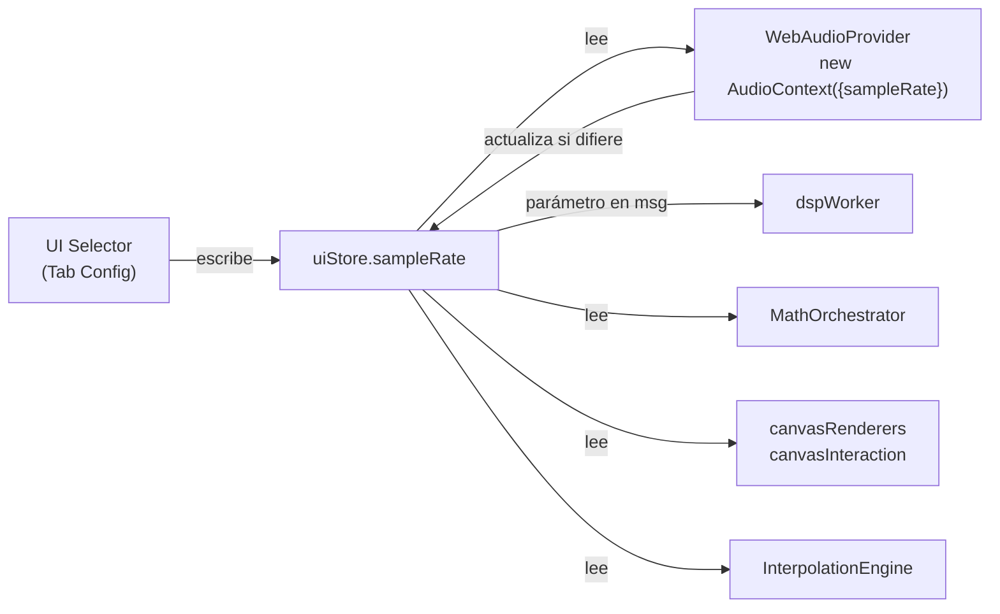
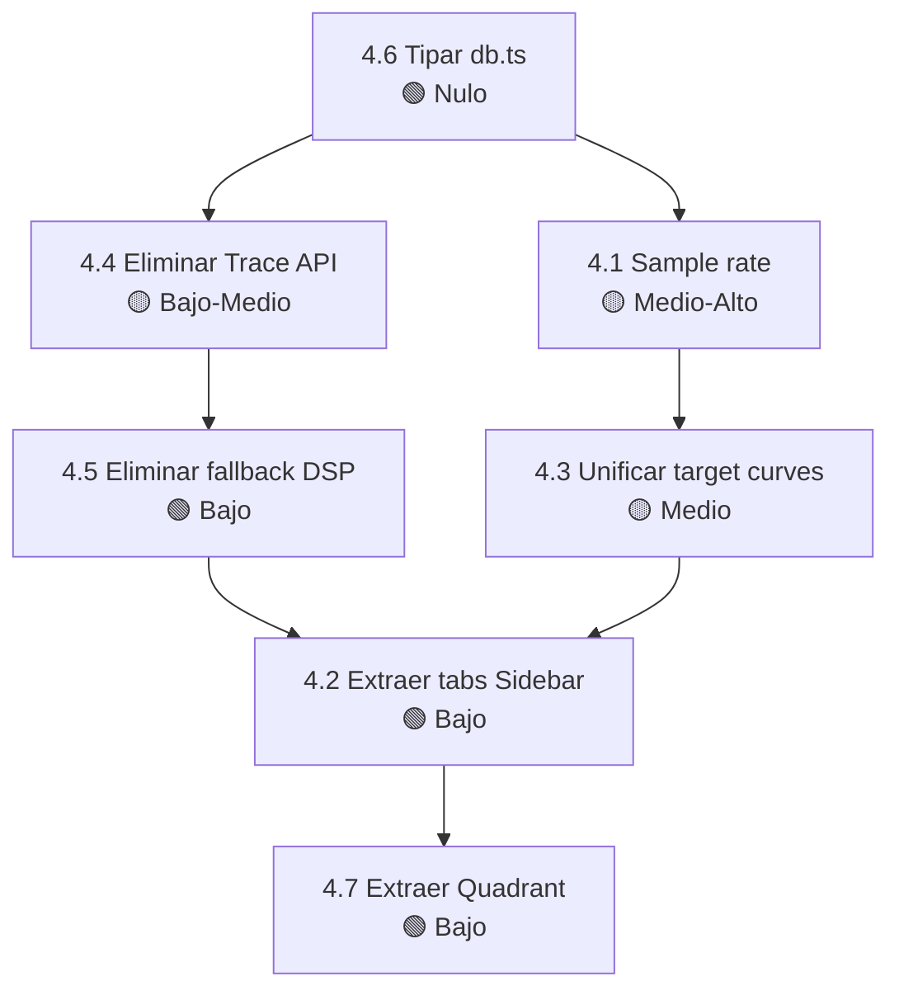

# Fase 4 — Plan de Refactoring Estructural

## Objetivo

Resolver los problemas arquitecturales de fondo del codebase: código duplicado, sistemas paralelos, archivos monstruo, y valores mágicos hardcodeados. 

Depende de que las Fases 1-3 estén completadas y verificadas.

### Decisiones tomadas
- **Provider HAL**: Opción A — cada tab importa `getAudioProvider()` directamente
- **Fallback DSP**: Eliminarlo

---

## 4.1 — Sample Rate Configurable

### Problema
`48000` hardcodeado en **37 ocurrencias** en 15+ archivos. Debe soportar 44100, 48000, y 96000 Hz.

### Fuente de verdad
`uiStore.sampleRate` — nueva propiedad reactiva. Se elimina `calibrationStore.sampleRate`.

### Flujo de datos



### Archivos afectados

| Archivo | Ocurrencias | Cambio |
|---------|-------------|--------|
| [ui.svelte.ts](file:///c:/Users/Abel/Documents/Asistente/asistente/src/lib/stores/ui.svelte.ts) | 0 → 1 | Agregar `sampleRate = $state(48000)` |
| [calibrationStore.svelte.ts](file:///c:/Users/Abel/Documents/Asistente/asistente/src/lib/stores/calibrationStore.svelte.ts) | 1 | Eliminar `sampleRate` propio, usar `uiStore.sampleRate` |
| [mathOrchestrator.svelte.ts](file:///c:/Users/Abel/Documents/Asistente/asistente/src/lib/stores/mathOrchestrator.svelte.ts) | 5 | → `uiStore.sampleRate` |
| [dspWorker.ts](file:///c:/Users/Abel/Documents/Asistente/asistente/src/lib/dsp/dspWorker.ts) | 5 | Recibir `sampleRate` en el mensaje |
| [WebAudioProvider.ts](file:///c:/Users/Abel/Documents/Asistente/asistente/src/lib/hal/web/WebAudioProvider.ts) | 4 | Leer de `uiStore.sampleRate` |
| [interpolationEngine.ts](file:///c:/Users/Abel/Documents/Asistente/asistente/src/lib/dsp/interpolationEngine.ts) | 2 | Agregar parámetro `sampleRate` |
| [canvasRenderers.ts](file:///c:/Users/Abel/Documents/Asistente/asistente/src/lib/dsp/canvasRenderers.ts) | 3 | Agregar parámetro `sampleRate` |
| [canvasInteraction.ts](file:///c:/Users/Abel/Documents/Asistente/asistente/src/lib/dsp/canvasInteraction.ts) | 1 | Parámetro en `rebuildFrequencyLUT` |
| [osmMetrics.ts](file:///c:/Users/Abel/Documents/Asistente/asistente/src/lib/dsp/osmMetrics.ts) | 1 | Parámetro en `calculateGroupDelay` |
| [Sidebar.svelte](file:///c:/Users/Abel/Documents/Asistente/asistente/src/components/medicion/Sidebar.svelte) | 3 | → `uiStore.sampleRate` |

### Consideraciones para 96 kHz
- `signalGenerators.ts` tiene coeficientes biquad precalculados para 48k → recalcular o parametrizar
- El buffer del worklet usa `bufferSize = 48000` → ajustar a `sampleRate`

### Riesgo: **Medio-Alto**

---

## 4.2 — Extraer Tabs del Sidebar

### Problema
[Sidebar.svelte](file:///c:/Users/Abel/Documents/Asistente/asistente/src/components/medicion/Sidebar.svelte) = **2,681 líneas** con 4 tabs independientes.

### Componentes a crear

| Componente | Rango | Líneas |
|------------|-------|--------|
| `TabMedicion.svelte` | L789 – L1275 | ~486 |
| `TabEcualizar.svelte` | L1276 – L1769 | ~493 |
| `TabInstantaneas.svelte` | L1770 – L2099 | ~329 |
| `TabConfig.svelte` | L2100 – L2680 | ~580 |

Cada tab importa `getAudioProvider()` directamente (opción A).

### Orden: TabConfig → TabInstantaneas → TabEcualizar → TabMedicion

### Riesgo: **Bajo** — refactor mecánico

---

## 4.3 — Unificar Target Curves

### Problema
Dos sistemas paralelos:
- `targetTrace` store (puntos editables, renderizado en canvas)
- `traceManager.getTargetCurve()` (Float32Array de bins, cálculo de desviaciones)

### Propuesta
Conservar `targetTrace` como fuente de verdad. `getTargetCurve()` derivará de él. Agregar presets BK y Harman a `targetTrace`. Eliminar `targetCurveType` y el cache de `traceManager`.

### Riesgo: **Medio**

---

## 4.4 — Eliminar API Legacy `Trace`

### 8 consumidores a migrar

| Archivo | Llamada actual | Migración |
|---------|---------------|-----------|
| `+page.svelte:14` | `captureSnapshot()` | `captureInstantanea()` |
| `+page.svelte:19` | `snapshots` | `instantaneas` |
| `mathOrchestrator:111` | `traces.find("live-1")` | `liveFrequencyData` directo |
| `Quadrant:457` | `traces.find("live-1")` | `liveFrequencyData` directo |
| `Sidebar:406` | `traces.some("live-1")` | Eliminar check |
| `Sidebar:407` | `addTrace()` | Eliminar |
| `Sidebar:425` | `updateLiveTrace()` | Buffer directo |
| `Sidebar:2004` | `removeTrace()` | `deleteInstantanea()` |

### Riesgo: **Bajo-Medio**

---

## 4.5 — Eliminar Fallback DSP

### Qué se elimina
~150 líneas del método `run()` en `mathOrchestrator.svelte.ts` — todo el path síncrono que se ejecuta cuando `this.worker === null`.

Funciones que solo el fallback usa y se eliminan:
- `getPhaseValueRadians()` (~20 líneas)
- `getCoherenceValue()` (~15 líneas)
- Buffers intermedios solo del fallback: `fftInputReal/Imag`, `fftRefReal/Imag`, `hReal/hImag`, `avgInputReal/Imag`, `tempFull*`, `windowProcessor`, `averagingProcessor`

### Cuándo dejaría de funcionar
- **CSP restrictivo** que bloquee `worker-src blob:` (GitHub Pages no lo tiene)
- **Webviews in-app** (Instagram/Facebook/TikTok browser) — algunos no soportan Workers
- **Error en el bundle** si Vite falla al generar el archivo del worker

En todos los casos la app se abre pero no procesa DSP. Agregamos un mensaje de error visible al usuario si el Worker falla.

### Riesgo: **Bajo** (en navegadores modernos)

---

## 4.6 — Tipar `db.ts`

Reemplazar `any` por `SerializedInstantanea`. Riesgo: **Nulo**.

---

## 4.7 — Extraer Componentes del Quadrant

### Problema
[Quadrant.svelte](file:///c:/Users/Abel/Documents/Asistente/asistente/src/components/medicion/Quadrant.svelte) = **2,445 líneas** (101 KB).

| Sección | Líneas | Tamaño |
|---------|--------|--------|
| `<script>` | 1,248 | Lógica de renderizado, interacción, interpolación, draw() |
| Template | 631 | Header + canvas + popovers + zoom menu |
| `<style>` | 567 | CSS de todos los elementos |

### Componentes extractables del template

| Componente nuevo | Rango actual | Líneas | Descripción |
|-----------------|-------------|--------|-------------|
| `QuadrantHeader.svelte` | L1278-L1501 | ~223 | Metric badges, dropdown de métricas, dropdown de capas, botón settings |
| `MetricConfigPopover.svelte` | L1636-L1876 | ~240 | Popover de configuración por métrica (PPO, modeY, phase range, coherence type, estilos de curva) |
| `GlobalConfigPopover.svelte` | L1554-L1633 | ~80 | Popover de FPS, suavizado temporal, zoom limits |
| `ZoomMenu.svelte` | L1517-L1551 | ~35 | Selector de modo zoom (XY/X/Y) + botón restore |

### Lógica del script extractable

| Módulo | Funciones | Líneas aprox |
|--------|-----------|-------------|
| `quadrantMetrics.ts` | `isMetricDisabled()`, `toggleMetric()`, `removeMetric()`, `getMetricAlpha()`, `allMetrics`, `metricStyles`, `metricConfigs` | ~120 |
| `quadrantSpectrogam.ts` | `initOffscreenCanvas()`, lógica de spectrogram update dentro de `draw()` | ~80 |

### Lo que se queda en Quadrant
- `draw()` — función central de renderizado (~600 líneas, pero difícil de extraer porque accede a todo el estado)
- Handlers de interacción (wheel, mouse, touch) — ya delegados a `canvasInteraction.ts`
- Canvas element + resize observer
- `$effect` para timer y registro de métricas

### Resultado esperado
- Quadrant.svelte: ~1600 → ~1200 líneas (reducción ~30-40%)
- La reducción es menor que en Sidebar porque `draw()` es monolítica y está muy acoplada al canvas

> [!IMPORTANT]
> ¿Querés intentar también modularizar `draw()` (la función de 600 líneas)? Es posible pero requiere pasar muchos parámetros al helper, lo que puede hacer el código más verboso sin ser más legible. La alternativa es dejarlo como está — ya delega a los renderers de `canvasRenderers.ts`.

---

## Orden de ejecución



---

## Verificación global

```bash
npm run build
npm run check
```

Verificación funcional:
- Canvas renderiza correctamente en 44100, 48000, 96000
- Tab EQ calcula desviaciones con nuevo sistema de target curves
- Instantáneas se guardan/cargan/eliminan
- Hotkeys funcionan
- Worker se inicializa correctamente; si falla, muestra mensaje de error
