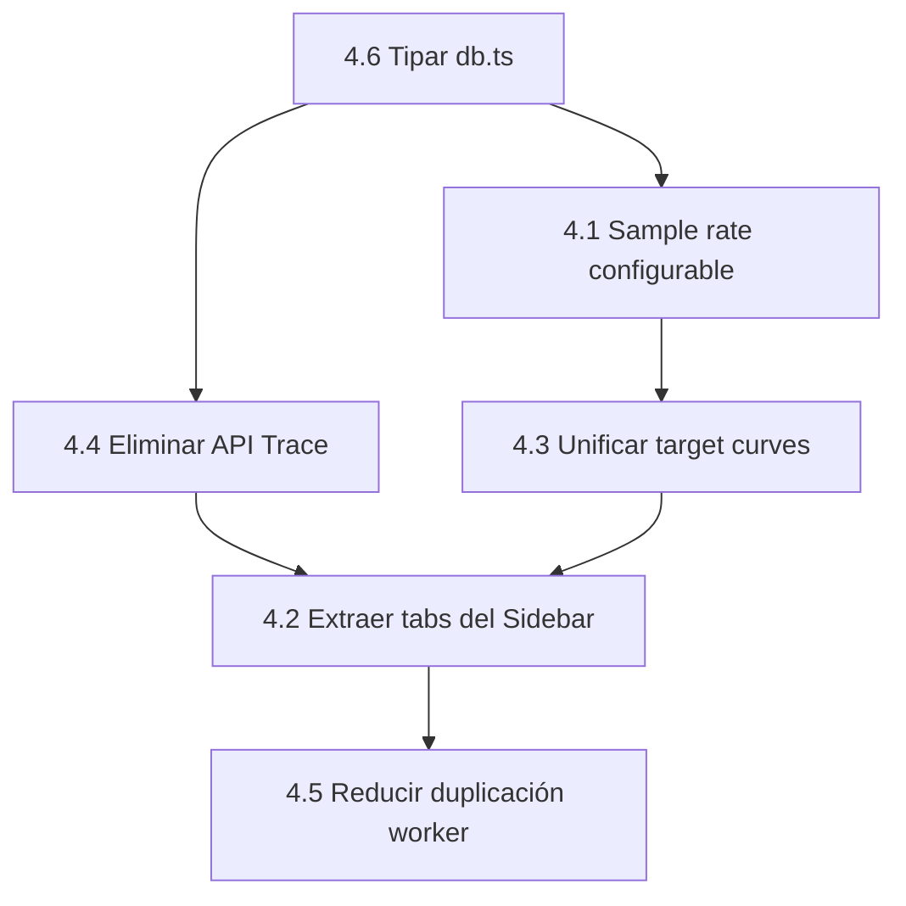

# Plan de Fase 4 — Refactoring Estructural

## Contexto

La Fase 4 aborda los problemas arquitecturales de fondo identificados en la auditoría. A diferencia de las Fases 1-3 (limpieza, bugfixes, perf), esta fase implica cambios estructurales que requieren testing cuidadoso.

---

## 4.1 — Sample Rate Configurable

### Problema
El valor `48000` aparece hardcodeado en **37 ocurrencias** distribuidas en 15+ archivos. El usuario quiere que sea configurable por usuario y/o por el dispositivo seleccionado.

### Diseño propuesto

**Fuente de verdad**: `uiStore.sampleRate` (ya existe `calibrationStore.sampleRate` pero debería unificarse).

**Flujo:**
1. `WebAudioProvider` crea el `AudioContext` con el `sampleRate` del store
2. Si el dispositivo no soporta el rate solicitado, el provider actualiza el store con el rate real obtenido (`audioContext.sampleRate`)
3. Todos los módulos leen de `uiStore.sampleRate`
4. El worker recibe `sampleRate` como parámetro en cada mensaje `run-dsp`

### Archivos afectados

| Archivo | Ocurrencias | Cambio |
|---------|-------------|--------|
| `ui.svelte.ts` | 0 → 1 | Agregar `sampleRate = $state(48000)` |
| `calibrationStore.svelte.ts` | 1 | Cambiar a leer de `uiStore.sampleRate` o eliminar la propiedad propia |
| `mathOrchestrator.svelte.ts` | 5 | Reemplazar `48000` por `uiStore.sampleRate` |
| `dspWorker.ts` | 5 | Recibir `sampleRate` en el mensaje y usarlo |
| `WebAudioProvider.ts` | 4 | Leer de `uiStore.sampleRate` al crear AudioContext |
| `interpolationEngine.ts` | 2 | Recibir `sampleRate` como parámetro |
| `canvasRenderers.ts` | 3 | Recibir `sampleRate` como parámetro |
| `canvasInteraction.ts` | 1 | Recibir `sampleRate` como parámetro en `rebuildFrequencyLUT` |
| `osmMetrics.ts` | 1 | Recibir `sampleRate` como parámetro en `calculateGroupDelay` |
| `sourceWindowing.ts` | 1 | Ya tiene parámetro, solo cambiar el default call |
| `leq.ts` | 1 | Ya tiene parámetro, solo cambiar el default call |
| `Sidebar.svelte` | 3 | Reemplazar `48000` por `uiStore.sampleRate` |

### UI
En la pestaña CONFIG del Sidebar, ya existe un selector de sample rate (L1109). Conectarlo a `uiStore.sampleRate` y hacer que `WebAudioProvider` lo respete.

### Riesgo
**Medio**. El sample rate afecta la resolución de frecuencia, el tamaño de buffers, y la interpretación de los datos espectrales. Un error aquí puede producir gráficos distorsionados o datos incorrectos.

---

## 4.2 — Extraer componentes del Sidebar

### Problema
`Sidebar.svelte` tiene **2,681 líneas** (146 KB). Contiene 4 paneles de tabs completamente independientes que comparten muy poco estado local.

### Diseño propuesto

Extraer cada panel de tab como un componente independiente:

| Componente nuevo | Líneas aprox | Rango actual en Sidebar |
|-----------------|-------------|------------------------|
| `TabMedicion.svelte` | ~480 | L789 – L1275 |
| `TabEcualizar.svelte` | ~490 | L1276 – L1769 |
| `TabInstantaneas.svelte` | ~330 | L1770 – L2099 |
| `TabConfig.svelte` | ~580 | L2100 – L2680 |

### Interfaz de cada componente

Todos los componentes leen directamente de los stores globales (`uiStore`, `traceManager`, `calibrationStore`, `mathOrchestrator`). No necesitan props.

```svelte
<!-- Sidebar.svelte (después del refactor) -->
{#if uiStore.activeTab === "medicion"}
    <TabMedicion />
{:else if uiStore.activeTab === "eq"}
    <TabEcualizar />
{:else if uiStore.activeTab === "snaps"}
    <TabInstantaneas />
{:else if uiStore.activeTab === "config"}
    <TabConfig />
{/if}
```

### Estado local a migrar

Hay variables `$state` en la sección `<script>` del Sidebar que solo pertenecen a un tab. Estas se mueven al componente correspondiente:

**→ TabMedicion:**
- `statusText`, `progress`, `sweepF1`, `sweepF2`, `sweepDuration`, `burstDuration`, `burstPeriod`, `mlsOrder`, `manualDelay`
- Funciones: `startMeasurement`, `stopMeasurement`, `linkGenerator`

**→ TabEcualizar:**
- `importTargetCurve()`, lógica de AutoEQ
- Variables de UI de ecualización

**→ TabInstantaneas:**
- `ensureMockSnapshots()`, `sortedSnapshots`, `sortOrder`, `editingId`, `editingName`
- Funciones: `startEditing`, `saveEditing`, `cancelEditing`

**→ TabConfig:**
- `audioDevices`, `isLoadingDevices`
- `configToSave`, `loadSavedConfig`
- Funciones de calibración, tema, layout

### Estado compartido (se queda en Sidebar o sube a un store)

- `provider` (HAL) — queda en Sidebar como variable compartida, se pasa como prop si es necesario
- `sampleRate` — se mueve a `uiStore.sampleRate` (tarea 4.1)

### Riesgo
**Bajo**. Es un refactor puramente mecánico — cortar/pegar bloques de template y script. No cambia la lógica.

### Orden de ejecución
1. Crear `TabConfig.svelte` primero (es el más independiente)
2. Luego `TabInstantaneas.svelte`
3. Luego `TabEcualizar.svelte`
4. Finalmente `TabMedicion.svelte` (el más complejo)

---

## 4.3 — Unificar sistemas de Target Curve

### Problema
Hay **dos sistemas paralelos** para curvas objetivo:

1. **`traceManager.getTargetCurve()`** — genera un `Float32Array` de bins con presets (flat, house, bk, harman, custom). Usado en el tab EQ para calcular desviaciones.

2. **`targetTrace` store** — define puntos `{f, g}` con interpolación logarítmica y presets (Flat, X-Curve, House). Usado para renderizar la curva visual en el canvas.

Son dos implementaciones distintas del mismo concepto, con presets similares pero no idénticos.

### Diseño propuesto

Conservar **`targetTrace`** como la fuente de verdad (por ser más flexible con su sistema de puntos editables) y hacer que `traceManager.getTargetCurve()` derive sus datos de `targetTrace`.

```typescript
// traceManager.getTargetCurve() — refactorizado
getTargetCurve(bins: number, sampleRate: number): Float32Array {
    const target = new Float32Array(bins);
    const binWidth = (sampleRate / 2) / bins;
    for (let i = 0; i < bins; i++) {
        const freq = Math.max(i * binWidth, 1);
        target[i] = targetTrace.getInterpolatedGain(freq);
    }
    return target;
}
```

Los presets de `traceManager` (house, bk, harman) se migran como presets de `targetTrace`:
- `targetTrace.applyPreset('House')` → mismos puntos que tenía traceManager
- Se agregan presets 'BK' y 'Harman' a `targetTrace`
- Se elimina `traceManager.targetCurveType`, `targetCurveCustom`, y todo el caching de target curve

### Riesgo
**Medio**. Hay que verificar que las desviaciones calculadas en el tab EQ sigan produciendo los mismos resultados con el nuevo sistema interpolado por puntos vs. el antiguo cálculo por bin.

---

## 4.4 — Eliminar API legacy `Trace`

### Problema
La interface `Trace` y sus métodos wrapper (`addTrace`, `removeTrace`, `updateLiveTrace`, `captureSnapshot`, `get snapshots`, `get traces`) son una capa de retrocompatibilidad. Todo fluye internamente por `Instantanea`.

### Consumidores actuales

| Ubicación | Método | Puede migrar a |
|-----------|--------|---------------|
| `+page.svelte:14` | `captureSnapshot()` | `captureInstantanea()` |
| `+page.svelte:19` | `get snapshots` | `instantaneas` |
| `mathOrchestrator:111` | `traces.find("live-1")` | Acceso directo a `liveFrequencyData` |
| `Quadrant.svelte:457` | `traces.find("live-1")` | Acceso directo a `liveFrequencyData` |
| `Sidebar:406` | `traces.some("live-1")` | Eliminar check (siempre existe) |
| `Sidebar:407` | `addTrace()` | Eliminar (el live trace siempre existe) |
| `Sidebar:425` | `updateLiveTrace()` | `traceManager.liveFrequencyData.set(data)` |
| `Sidebar:2004` | `removeTrace()` | `deleteInstantanea()` |

### Diseño propuesto

1. Migrar cada consumidor a la API directa de `Instantanea`
2. Eliminar la interface `Trace` y todos sus métodos wrapper
3. El `$derived` `traces` se elimina — era costoso (evaluaba en cada tick del DSP timer)

### Riesgo
**Bajo-medio**. Son cambios puntuales en ~8 ubicaciones. El riesgo principal es romper el flujo de datos live en `Sidebar` y `mathOrchestrator`.

---

## 4.5 — Reducir duplicación Worker / Fallback

### Problema
`dspWorker.ts` (538 líneas) y el fallback síncrono en `mathOrchestrator.svelte.ts` (~150 líneas) duplican:
- `getPhaseValueRadians()` — implementación biquad completa inline en worker vs. uso de `biquad.ts` en orchestrator
- `getCoherenceValue()` — variantes menores
- `getCalibrationGainAt()` — idéntica a `calibrationStore`
- Pipeline DSP completo

### Diseño propuesto

Extraer la lógica compartida a un módulo `dspPipeline.ts` que pueda ser importado tanto por el worker como por el orchestrator:

```
src/lib/dsp/
├── dspPipeline.ts      ← NUEVO: lógica compartida
├── dspWorker.ts         ← importa de dspPipeline
└── ... 
```

El módulo exportaría:
- `computePhaseValue(freq, isMeasuring, eqBands, calibrationFilters, sampleRate): number`
- `computeCoherence(freq, isMeasuring, eqBands): number`
- `computeCalibrationGain(freq, points): number`
- `runDSPPipeline(config): DSPResults` — la función principal del pipeline

El fallback síncrono en `mathOrchestrator` llamaría a `runDSPPipeline()` directamente, y el worker también.

### Riesgo
**Medio**. El worker tiene su propia implementación optimizada (WebFFT, coeficientes inline). Hay que asegurarse de que la refactorización no degrade performance.

### Alternativa
Si el worker nunca falla en los navegadores target, se puede simplemente **eliminar el fallback síncrono** del orchestrator. Esto reduce la duplicación a cero sin necesidad de refactorizar.

---

## 4.6 — Tipar `db.ts`

### Problema
Todas las funciones usan `any`.

### Diseño propuesto

```typescript
import type { Instantanea } from '../stores/traceManager.svelte';

interface SerializedInstantanea {
    id: string;
    name: string;
    timestamp: number;
    data: Record<string, ArrayBuffer | number[]>;
    visible: boolean;
    color: string;
    source: 'manual' | 'secuencial';
    metric: string;
    offsetY: number;
}

export async function saveInstantanea(item: SerializedInstantanea): Promise<void> { ... }
export async function loadAllInstantaneas(): Promise<SerializedInstantanea[]> { ... }
export async function deleteInstantanea(id: string): Promise<void> { ... }
```

### Riesgo
**Nulo**. Solo cambian las signatures de tipo.

---

## Orden de ejecución recomendado



1. **4.6** — sin riesgo, buena base
2. **4.1** — importante para correctitud
3. **4.4** — elimina complejidad innecesaria
4. **4.3** — simplifica stores
5. **4.2** — refactor grande pero mecánico (se beneficia de que 4.1/4.3/4.4 ya limpiaron)
6. **4.5** — último porque requiere más análisis de performance

---

## Preguntas abiertas

1. **Fallback síncrono**: ¿Lo necesitás? Si la app solo corre en navegadores modernos con soporte de Web Workers, podríamos eliminarlo en vez de refactorizarlo (4.5).

2. **Sample rate**: ¿Querés que soporte rates distintos de 44100/48000 (ej: 96000)? Esto afecta el tamaño de buffers y la resolución de frecuencia.

3. **Sidebar tabs**: ¿Querés que los componentes extraídos sigan usando TailwindCSS inline como está ahora, o preferís migrarlos a CSS con variables?

4. **Target curve**: ¿El sistema actual del tab EQ (traceManager.getTargetCurve) se usa para algo más que calcular desviaciones? Si es solo visual, la migración es segura.
