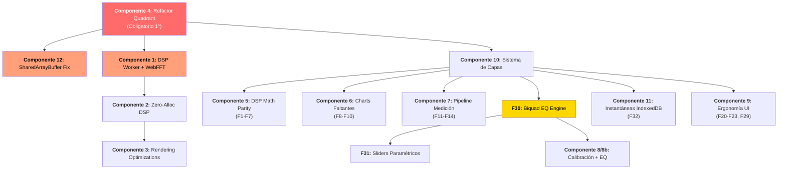

# Auditoría de Performance y Paridad con OSM — Plan Integral

Auditoría completa del codebase de la herramienta de medición de audio con dos ejes:
1. **Performance:** Identificar y priorizar bottlenecks de rendimiento que afectan la experiencia en tiempo real.
2. **Paridad OSM:** Comparar contra [psmokotnin/osm](https://github.com/psmokotnin/osm) para identificar features profesionales faltantes.

---

## Resumen Ejecutivo

Se identificaron **15 oportunidades de optimización de performance** (P0-P4) y **32 features funcionales** respecto a OSM y mejoras propias (F1-F32), organizadas en: DSP/Math (F1-F7, F30), Charts (F8-F10), Pipeline de medición (F11-F14), Infraestructura (F15-F19), Ergonomía UI (F20-F29, F31) e Instantáneas (F32). Los problemas más críticos de performance están en el **motor DSP ejecutándose en el hilo principal** y el **componente monolítico Quadrant.svelte** (2558 líneas). Los gaps funcionales más importantes son: **weighting A/B/C/Z**, **averaging complejo**, **deconvolución real**, **source windowing**, **funciones de ventana avanzadas**, **simulación EQ biquad precisa (RBJ)**, **sistema de capas de medición**, e **instantáneas multimétricas con IndexedDB**.

---

## Hallazgos por Prioridad

### 🔴 P0 — CRÍTICO (Bloquean el hilo principal)

---

#### 1. FFT Radix-2 ejecutándose en el Main Thread

**Archivo:** [fft.ts](file:///c:/Users/Abel/Documents/Asistente/asistente/src/lib/dsp/fft.ts)
**Archivo consumidor:** [osmMetrics.ts](file:///c:/Users/Abel/Documents/Asistente/asistente/src/lib/dsp/osmMetrics.ts)

**Problema:**  
La FFT Radix-2 (operación O(N log N)) se ejecuta síncronamente en el main thread. Con `fftSize = 8192`, cada invocación de `fft()` implica ~100K operaciones aritméticas. Cuando se ejecuta dentro de `calculateSpectrumRTA()`, `calculateImpulseResponse()` (que llama a `ifft()`), etc., estas computaciones bloquean el rendering pipeline del browser.

**Impacto:** Jank visible en 60fps, especialmente con layouts multi-cuadrante (2x2, 3x2).

**Solución propuesta:**
- Mover el motor DSP completo a un **Web Worker** dedicado.
- Comunicación mediante `SharedArrayBuffer` (ya configurado con los headers COOP/COEP en [vite.config.ts](file:///c:/Users/Abel/Documents/Asistente/asistente/vite.config.ts)).
- El worker recibe buffers de entrada y escribe resultados directamente en buffers compartidos que el main thread lee sin copia.
- Alternativa: Evaluar el uso de **WebFFT** (repo de referencia `IQEngine/WebFFT`) que auto-selecciona la implementación más rápida (WASM KissFFT, GPU FFT, etc.).

---

#### 2. `MathOrchestrator.run()` invocado dentro del `draw()` de cada Quadrant

**Archivo:** [Quadrant.svelte:686](file:///c:/Users/Abel/Documents/Asistente/asistente/src/components/medicion/Quadrant.svelte#L686)
**Archivo:** [mathOrchestrator.svelte.ts:201](file:///c:/Users/Abel/Documents/Asistente/asistente/src/lib/stores/mathOrchestrator.svelte.ts#L201)

**Problema:**  
`mathOrchestrator.run(liveTrace)` se invoca **desde el `draw()` del canvas**, dentro del `requestAnimationFrame` de **cada** Quadrant activo. Con layout 2x2 (4 cuadrantes) a 10 FPS, son 40 invocaciones/segundo de `run()`.

Aunque el orchestrator tiene throttling interno, la llamada igualmente:
- Ejecuta `checkDirty()` que hace `JSON.stringify(traceManager.eqBands)` (ver P1 #4)
- Itera `globalActiveMetrics` (construye un `Set` nuevo cada vez)
- Evalúa múltiples condiciones reactivas

**Solución propuesta:**
- Desacoplar el ciclo de cálculo DSP del ciclo de renderizado. El `MathOrchestrator` debe tener su propio timer independiente controlado por `dspUpdateRate`.
- Los Quadrants solo **leen** los buffers de salida; nunca disparan el cálculo.
- Esto elimina la duplicación de invocaciones en layouts multi-cuadrante.

---

### 🟠 P1 — ALTO (GC pressure y cómputos redundantes)

---

#### 3. Allocations dentro de hot loops (GC pressure)

**Archivos afectados:**

| Archivo | Línea | Allocation |
|---------|-------|------------|
| [Analyzer.svelte.ts:42](file:///c:/Users/Abel/Documents/Asistente/asistente/src/lib/dsp/Analyzer.svelte.ts#L42) | L42 | `new Float32Array(this.buffer)` — clon del buffer en cada FFT |
| [Analyzer.svelte.ts:56](file:///c:/Users/Abel/Documents/Asistente/asistente/src/lib/dsp/Analyzer.svelte.ts#L56) | L56 | `new Float32Array(half)` — nuevo array para dbSpectrum |
| [fft.ts:104](file:///c:/Users/Abel/Documents/Asistente/asistente/src/lib/dsp/fft.ts#L104) | L104 | `new Float32Array(input)` + `new Float32Array(N)` en cada `fft()` |
| [fft.ts:115-116](file:///c:/Users/Abel/Documents/Asistente/asistente/src/lib/dsp/fft.ts#L115) | L115 | `new Float32Array()` x2 en cada `ifft()` |
| [fft.ts:25-28](file:///c:/Users/Abel/Documents/Asistente/asistente/src/lib/dsp/fft.ts#L25) | L25 | `new Float32Array(N)` en `magnitude()` |
| [osmMetrics.ts:270](file:///c:/Users/Abel/Documents/Asistente/asistente/src/lib/dsp/osmMetrics.ts#L270) | L270 | `new Float32Array(spectrum)` en `SpectrogramQueue.push()` |
| [TransferFunction.ts:53-54](file:///c:/Users/Abel/Documents/Asistente/asistente/src/lib/dsp/TransferFunction.ts#L53) | L53 | `new Float32Array(bins)` x2 en `calculateH()` |
| [TransferFunction.ts:78](file:///c:/Users/Abel/Documents/Asistente/asistente/src/lib/dsp/TransferFunction.ts#L78) | L78 | `new Float32Array(bins)` en `calculateCoherence()` |

**Impacto:** A 10 FPS con fftSize=8192, se asignan ~320KB de Float32Arrays por frame, forzando GC pauses regulares.

**Solución propuesta:**
- `fft()` e `ifft()` deben aceptar buffers de salida pre-alocados como parámetros (pattern ya usado en `osmMetrics.ts` con `tempHReal`/`tempHImag`).
- `Analyzer.computeFFT()` debe reutilizar un buffer de análisis pre-alocado en el constructor.
- `TransferFunction.calculateH()` y `calculateCoherence()` deben escribir en buffers del caller.
- `SpectrogramQueue` debe usar un ring buffer con pool de Float32Arrays pre-alocados en vez de `push()`/`shift()`.

---

#### 4. `JSON.stringify()` en hot path de `checkDirty()`

**Archivo:** [mathOrchestrator.svelte.ts:119](file:///c:/Users/Abel/Documents/Asistente/asistente/src/lib/stores/mathOrchestrator.svelte.ts#L119)

```typescript
const bandsStr = JSON.stringify(traceManager.eqBands);
```

**Problema:** `JSON.stringify` es O(N) con allocations de strings en cada invocación. Se ejecuta **en cada call a `run()`**, que sucede en cada frame de cada cuadrante.

**Solución propuesta:**
- Reemplazar por un hash rápido basado en `Array.reduce()` numérico:
```typescript
const hash = traceManager.eqBands.reduce((h, b) => h + b.freq * 1e6 + b.gain * 1e3 + b.q, 0);
```
- O usar un `version` counter en `traceManager` que se incrementa en cada mutación de `eqBands`.

---

#### 5. Cache EQ duplicada entre `MathOrchestrator` y `Quadrant`

**Archivo:** [mathOrchestrator.svelte.ts:135-154](file:///c:/Users/Abel/Documents/Asistente/asistente/src/lib/stores/mathOrchestrator.svelte.ts#L135)
**Archivo:** [Quadrant.svelte:545-567](file:///c:/Users/Abel/Documents/Asistente/asistente/src/components/medicion/Quadrant.svelte#L545)

**Problema:** El cálculo de la respuesta EQ se computa **dos veces**:
1. `updateEQCache()` en el MathOrchestrator (imperativo, en cada dirty)
2. `eqResponseCache` como `$derived.by()` en cada Quadrant (reactivo, recalcula con cada cambio de eqBands)

Con 4 cuadrantes, eso son 5 cómputos idénticos del mismo loop de 4096 bins × N bandas.

**Solución propuesta:**
- Eliminar `eqResponseCache` del Quadrant y consumir exclusivamente `mathOrchestrator.eqResponseCache`.
- O mover el cálculo a un `$derived` único en el MathOrchestrator.

---

#### 6. `globalActiveMetrics` reconstruye un `Set` en cada acceso

**Archivo:** [mathOrchestrator.svelte.ts:71-79](file:///c:/Users/Abel/Documents/Asistente/asistente/src/lib/stores/mathOrchestrator.svelte.ts#L71)

**Problema:** Es un getter que crea un `new Set()` e itera todos los cuadrantes registrados en cada acceso. Se usa en `run()` que ejecuta en cada frame.

**Solución propuesta:**
- Convertir a `$derived` o cachear el Set y solo recalcular cuando `activeMetricsByQuadrant` cambie (usar version counter).

---

### 🟡 P2 — MEDIO (Ineficiencias de rendering)

---

#### 7. `SpectrogramQueue.push()/shift()` — O(N) en operación FIFO

**Archivo:** [osmMetrics.ts:269-275](file:///c:/Users/Abel/Documents/Asistente/asistente/src/lib/dsp/osmMetrics.ts#L269)
**Archivo:** [Quadrant.svelte:756-758](file:///c:/Users/Abel/Documents/Asistente/asistente/src/components/medicion/Quadrant.svelte#L756)

**Problema:** `Array.shift()` es O(N) porque desplaza todos los elementos. Con `maxHistory = 100` y arrays de 800+ floats, esto genera presión de GC innecesaria cada 3 frames.

**Solución propuesta:**
- Usar un **ring buffer** con puntero circular: `writeIndex = (writeIndex + 1) % maxHistory`.
- Elimina `shift()` completamente.
- Pool pre-alocado de `Float32Array` para evitar `new Float32Array(spectrum)`.

---

#### 8. `drawSpectrogram` — `fillRect` pixel-by-pixel

**Archivo:** [Quadrant.svelte:738-753](file:///c:/Users/Abel/Documents/Asistente/asistente/src/components/medicion/Quadrant.svelte#L738)

**Problema:** Cada fila del espectrograma se dibuja con un `fillRect(x, yRow, 1, 1)` individual por cada píxel X. Con un canvas de 800px de ancho, son 800 llamadas a `fillRect` + 800 cambios de `fillStyle` por frame.

**Solución propuesta:**
- Usar `ImageData` + `putImageData()` para escribir la fila completa de una vez.
- Pre-acocar un `Uint8ClampedArray` del ancho del canvas × 4 (RGBA) y escribir los colores directamente en él.
- Reducir de 800 API calls a 1 sola llamada `putImageData()`.

---

#### 9. `getPPOSmoothedValue()` — cómputo por-pixel sin caché

**Archivo:** [Quadrant.svelte:414-435](file:///c:/Users/Abel/Documents/Asistente/asistente/src/components/medicion/Quadrant.svelte#L414)

**Problema:** Dentro del loop de dibujo por pixel (`for x = 0 to width`), `getPPOSmoothedValue()` calcula `Math.pow(2, ...)` y un loop interno de suma para cada píxel. Con PPO < 48, esto es un inner loop significativo en el hot path de rendering.

**Solución propuesta:**
- Pre-computar el array suavizado una vez por frame (cuando el orchestrator produce datos nuevos), almacenarlo en un buffer pre-alocado, y leerlo directamente en el loop de dibujo.
- Alternativamente, usar prefix sums (ya implementado en `smoothDataLog`) para O(1) por query.

---

#### 10. `ComplexMath` — Tuple allocations `[number, number]`

**Archivo:** [math.ts](file:///c:/Users/Abel/Documents/Asistente/asistente/src/lib/dsp/math.ts)

**Problema:** Cada llamada a `ComplexMath.mul()`, `mulConjugate()`, `div()` retorna un array `[number, number]`. Dentro de un loop de 4096 bins, esto genera 4096 micro-allocations por métrica.

**Ejemplo en:** [TransferFunction.ts:41](file:///c:/Users/Abel/Documents/Asistente/asistente/src/lib/dsp/TransferFunction.ts#L41)
```typescript
const [crossR, crossI] = ComplexMath.mulConjugate(mR, mI, rR, rI);
```

**Solución propuesta:**
- Reemplazar los retornos de tuple por parámetros de output (`out` array) o inlinear las operaciones directamente en los loops que las consumen (el compiler de V8 puede no inlinear métodos estáticos con retorno de array).
- Las funciones de `osmMetrics.ts` ya usan este patrón (operaciones inline), así que se trata de alinear `TransferFunction.ts`.

---

### 🔵 P3 — BAJO (Mejoras arquitectónicas)

---

#### 11. Quadrant.svelte — Componente monolítico de 2558 líneas

**Archivo:** [Quadrant.svelte](file:///c:/Users/Abel/Documents/Asistente/asistente/src/components/medicion/Quadrant.svelte)

**Problema:** Un único archivo `.svelte` de 94KB contiene:
- Pipeline de interpolación temporal (~100 líneas)
- 11 funciones de dibujo Canvas (~500 líneas)  
- Gestores de eventos (zoom/pan/touch) (~150 líneas)
- Configuración de métricas por cuadrante (~200 líneas)
- Simulación de valores DSP duplicada del orchestrator (~50 líneas)
- 445 líneas de CSS
- 350+ líneas de markup HTML

**Impacto:** Dificulta la optimización granular, ya que todo el componente se re-evalúa como una unidad. Las 10+ variables `$state` generan cadenas de reactividad difíciles de trazar.

**Solución propuesta (refactor incremental):**
- Extraer `drawGrid`, `drawSpectrogram`, `drawLevelOverlay`, `drawNumericOverlay`, `drawCrosshair` a un módulo `canvasRenderers.ts` importable.
- Extraer la lógica de interpolación a `interpolationEngine.ts`.
- Extraer los event handlers de zoom/pan a `canvasInteraction.ts`.
- Mantener `Quadrant.svelte` como orquestador delgado (~300 líneas).

---

#### 12. Sidebar.svelte — 2188 líneas monolíticas

**Archivo:** [Sidebar.svelte](file:///c:/Users/Abel/Documents/Asistente/asistente/src/components/medicion/Sidebar.svelte)

**Problema:** 110KB de UI, lógica de captura de audio, gestión de EQ, snapshots, y configuración en un solo componente. Aunque no es un hot path de rendering, el tamaño afecta el initial parse time y la mantenibilidad.

**Solución propuesta:**
- Separar en sub-componentes por pestaña: `MedicionTab.svelte`, `EqTab.svelte`, `SnapshotsTab.svelte`, `ConfigTab.svelte`.
- Lazy-load de pestañas inactivas.

---

#### 13. `meterStore` — Reactive churn por array replacement

**Archivo:** [meterStore.svelte.ts](file:///c:/Users/Abel/Documents/Asistente/asistente/src/lib/stores/meterStore.svelte.ts)
**Consumidor:** [Header.svelte:254-276](file:///c:/Users/Abel/Documents/Asistente/asistente/src/components/medicion/Header.svelte#L254)

**Problema:** `updateIn(levels)` y `updateOut(levels)` asignan un array nuevo cada vez (`this.inLevels = levels`), disparando re-renders del Header VU meter en cada frame del orchestrator.

**Solución propuesta:**
- Usar `$state.raw()` para los levels y actualizar individualmente o con un version counter.
- El Header debería usar `requestAnimationFrame` throttled para actualizar los VU meters en vez de reaccionar a cada cambio de state.

---

### ⚪ P4 — NICE TO HAVE (Micro-optimizaciones)

---

#### 14. Ventana de Hanning/Blackman recalculada en cada FFT

**Archivo:** [fft.ts:9-18](file:///c:/Users/Abel/Documents/Asistente/asistente/src/lib/dsp/fft.ts#L9)

**Problema:** `applyWindow()` calcula `Math.cos()` para cada muestra en cada invocación. Con N=8192, son 8192 llamadas a `Math.cos()` por FFT.

**Solución propuesta:**
- Pre-calcular la ventana una vez como lookup table (`Float32Array`) para cada tamaño de FFT usado.
- Aplicar con multiplicación simple: `data[n] *= windowLUT[n]`.

---

#### 15. `calculateStepResponse` — Hardcoded sampleRate

**Archivo:** [osmMetrics.ts:164](file:///c:/Users/Abel/Documents/Asistente/asistente/src/lib/dsp/osmMetrics.ts#L164)

```typescript
const dt = 1.0 / 48000.0; 
```

**Problema menor:** El sampleRate está hardcodeado. Si alguna vez se usa otro sampleRate, el escalado será incorrecto. No es un problema de performance pero sí de correctitud.

---

## Resoluciones de Preguntas Abiertas y Decisiones de Diseño

> [!NOTE]
> **1. Target de FPS y dspUpdateRate:**
> * Por defecto: `fps = 30` y `dspUpdateRate = 2` (Hz).
> * Ambos valores serán completamente configurables por el usuario desde el panel de interfaz en la configuración de la UI.
>
> **2. Motor FFT:**
> * Sí, se utilizará **WebFFT** (`IQEngine/WebFFT`) como motor FFT para optimizar las operaciones matemáticas.
>
> **3. Refactorización de Quadrant.svelte:**
> * Se realizará en primer lugar (como prerrequisito obligatorio) para minimizar riesgos de regresión antes de implementar las optimizaciones P0 y P1.

---

## Proposed Changes

### Componente 1: DSP Worker Pipeline

#### [NEW] `src/lib/dsp/dspWorker.ts`
Worker dedicado que ejecuta el pipeline completo de `osmMetrics` fuera del main thread. Comunicación vía `SharedArrayBuffer` (con fallback a `ArrayBuffer` + `postMessage` — ver Componente 12).

> [!IMPORTANT]
> **Decisión resuelta: Motor FFT = WebFFT.** El worker utilizará **WebFFT** (`IQEngine/WebFFT`) como motor FFT principal, que auto-selecciona la implementación más rápida disponible (WASM KissFFT, nativa, etc.). El módulo `fft.ts` actual se convierte en **wrapper/fallback** de WebFFT para garantizar compatibilidad en entornos donde WebFFT no esté disponible (ver Componente 2).

#### [MODIFY] [mathOrchestrator.svelte.ts](file:///c:/Users/Abel/Documents/Asistente/asistente/src/lib/stores/mathOrchestrator.svelte.ts)
- Desacoplar `run()` de los frames de Quadrant.
- Timer propio con `setInterval(dspUpdateRate)`.
- Eliminar `checkDirty()` con JSON.stringify, reemplazar por version counter.
- Eliminar `globalActiveMetrics` getter, convertir a `$derived`.

---

### Componente 2: Zero-Allocation DSP

#### [MODIFY] [fft.ts](file:///c:/Users/Abel/Documents/Asistente/asistente/src/lib/dsp/fft.ts)
- Refactorizar como **wrapper/fallback** de WebFFT: exponer la misma API (`fft()`, `ifft()`, `magnitude()`) pero delegar internamente a WebFFT cuando esté disponible.
- `fft()` e `ifft()` aceptan buffers de output pre-alocados.
- `applyWindow()` usa LUT pre-computada (compartida con `windowFunction.ts` de F4).
- `magnitude()` escribe en buffer del caller.
- Detección en inicialización:
  ```typescript
  import { WebFFT } from 'webfft'; // o import dinámico
  let engine: WebFFT | null = null;
  try { engine = new WebFFT(fftSize); } catch { /* fallback a Radix-2 local */ }
  ```

#### [MODIFY] [math.ts](file:///c:/Users/Abel/Documents/Asistente/asistente/src/lib/dsp/math.ts)
- Eliminar retornos de tuple `[number, number]`.
- Proveer variantes inline o con output parameter.

#### [MODIFY] [TransferFunction.ts](file:///c:/Users/Abel/Documents/Asistente/asistente/src/lib/dsp/TransferFunction.ts)
- `calculateH()` y `calculateCoherence()` escriben en buffers pre-alocados del caller.
- Inlinear `ComplexMath.mulConjugate()`.

#### [MODIFY] [osmMetrics.ts](file:///c:/Users/Abel/Documents/Asistente/asistente/src/lib/dsp/osmMetrics.ts)
- `SpectrogramQueue` → ring buffer con pool de Float32Arrays.

---

### Componente 3: Rendering Optimizations

#### [MODIFY] [Quadrant.svelte](file:///c:/Users/Abel/Documents/Asistente/asistente/src/components/medicion/Quadrant.svelte)
- Eliminar `mathOrchestrator.run()` del `draw()`.
- Eliminar `eqResponseCache` duplicada.
- Pre-computar PPO smoothing por frame.
- Espectrograma: `ImageData` en vez de `fillRect` pixel-by-pixel.

#### [MODIFY] [meterStore.svelte.ts](file:///c:/Users/Abel/Documents/Asistente/asistente/src/lib/stores/meterStore.svelte.ts)
- Throttle de actualizaciones o `$state.raw()`.

---

### Componente 4: Refactor Arquitectónico (Obligatorio — Primer Paso)

#### [NEW] `src/lib/dsp/canvasRenderers.ts`
#### [NEW] `src/lib/dsp/interpolationEngine.ts`  
#### [NEW] `src/lib/dsp/canvasInteraction.ts`

Extracción de lógica del Quadrant monolítico.

---

## Verification Plan

### Automated Tests
- Medir FPS promedio con `performance.now()` antes/después de cada cambio, usando layout 2x2 con Magnitude + Phase + Coherence activas.
- Medir GC pauses con Chrome DevTools Performance panel (Memory tab → allocation timeline).
- Verificar que los valores numéricos de las métricas no cambien (regression test con snapshots de datos).

### Manual Verification
- Comparar visualmente la fluidez de las curvas en layouts multi-cuadrante.
- Verificar que el espectrograma sigue renderizando correctamente.
- Confirmar que los VU meters no tienen lag visible respecto a la señal de audio.

---
---

# Análisis de Paridad con Open Sound Meter (psmokotnin/osm)

Investigación del repositorio de referencia [psmokotnin/osm](https://github.com/psmokotnin/osm) para identificar características que faltan en el sistema actual y mejoras que se pueden implementar.

## Resumen de la Comparación

OSM es una aplicación nativa (C++/Qt) madura para medición acústica con ~20 módulos matemáticos dedicados, rendering por GPU (OpenGL/Metal), y un pipeline de procesamiento multi-hilo. Nuestro sistema web (SvelteKit/Canvas2D) tiene un subconjunto funcional pero carece de varias capacidades profesionales clave.

---

## 🔴 Gaps Críticos (Features profesionales ausentes)

---

### F1. Ponderación de Frecuencia (A/B/C/Z Weighting)

**Referencia OSM:** `src/math/weighting.h` — Implementa curvas A, B, C, K, Z según ANSI 1.43-1997 con filtros biquad en cascada.

**Estado actual:** ❌ **No implementado.** No existe ningún módulo de weighting. El sistema muestra dB lineales (Z-weighting implícito) sin opción de aplicar ponderación.

**Impacto:** Sin weighting A/C, las mediciones de SPL no son comparables con estándares profesionales (IEC 61672). Cualquier medidor de nivel serio requiere al menos dBA y dBC.

**Implementación propuesta:**
- [NEW] `src/lib/dsp/weighting.ts` — Filtros biquad A/B/C/Z con coeficientes pre-calculados para 48kHz.
- Agregar selector de weighting en la UI de configuración por métrica (Quadrant popover).
- Aplicar el filtro en el pipeline del `MathOrchestrator` antes de calcular Level/SPL.

---

### F2. Averaging Complejo con Tres Modos (Off / LPF / FIFO)

**Referencia OSM:** `src/math/averaging.h` y `src/meta/metameasurement.h` — Define el enum `AverageType { Off, LPF, FIFO }`. Para LPF (Low Pass Filter), OSM implementa un filtro de suavizado temporal Bessel de 5to orden por-bin (`src/math/lowpassfilter.h` y `src/math/bessellpf.h`) que suaviza las transiciones de forma estable. Para FIFO, implementa un promedio circular aritmético complejo con profundidad configurable (1-64 frames).

**Estado actual:** ⚠️ **Parcial.** El sistema usa solo exponential smoothing temporal (un solo coeficiente `smoothing` en `Quadrant.svelte`). No hay selector de tipo de averaging ni implementación de filtro Bessel por-bin ni de FIFO complejo.

**Impacto:** El averaging complejo estable (LPF Bessel o FIFO) es fundamental para obtener coherencia estable y transfer functions confiables. Sin él, las mediciones en ambientes ruidosos son sumamente inestables y difíciles de leer.

**Implementación propuesta:**
- [NEW] `src/lib/dsp/averaging.ts` — Implementar la clase `ComplexAveraging` con soporte para:
  - **Modo Off:** Sin filtrado.
  - **Modo LPF:** Filtro paso bajo (IIR/Bessel aproximado por-bin) para suavizado temporal estable de magnitud y fase.
  - **Modo FIFO:** Ring buffer de profundidad configurable (1-64 frames) para promedio lineal complejo aritmético.
- [MODIFY] `src/lib/stores/mathOrchestrator.svelte.ts` — Integrar el selector de modo `Off / LPF / FIFO` y profundidad en el pipeline de procesamiento de `run()`.
- Agregar selector en el panel lateral y popover de Quadrant para cambiar el tipo de promedio y profundidad.

---

### F3. Deconvolución en Tiempo Real

**Referencia OSM:** `src/math/deconvolution.h` — Módulo dedicado con su propia FFT forward/inverse, window function configurable, y búsqueda del pico máximo (`maxIndex`).

**Estado actual:** ⚠️ **Rudimentario.** `TransferFunction.ts` calcula H(f) pero no implementa deconvolución propiamente dicha. No hay cálculo de impulse response basado en deconvolución del estímulo conocido.

**Impacto:** La deconvolución es la base para obtener IR real del sistema bajo medición (no solo la FFT de la señal capturada). Sin ella, la IR mostrada es una aproximación.

**Implementación propuesta:**
- [NEW] `src/lib/dsp/deconvolution.ts` — Deconvolución en dominio de frecuencia: `IR = IFFT(FFT(output) / FFT(input))`.
- Integrar con el generador de señal (sweep/MLS) para deconvolución automática del estímulo.
- Window function configurable para la deconvolución.

---

### F4. Funciones de Ventana Avanzadas con LUT Pre-calculada

**Referencia OSM:** `src/math/windowfunction.h` — 7 tipos de ventana: **Rectangular, Hann, Hamming, FlatTop, BlackmanHarris, HFT223D, Exponential**. Cada ventana pre-calcula los coeficientes en `m_data` con `gain` y `norm` factors.

**Estado actual:** ⚠️ **Solo 2 ventanas.** `fft.ts` implementa Hanning y Blackman-Harris inline, recalculando `Math.cos()` en cada invocación (ver hallazgo P4 #14).

**Gaps:**
- Faltan: **FlatTop** (esencial para calibración de amplitud), **Hamming**, **HFT223D** (ultra-baja fuga espectral), **Exponential** (para análisis de decaimiento/RT60).
- No hay LUT pre-calculada ni factores de corrección de ganancia/normalización.

**Implementación propuesta:**
- [MODIFY] `src/lib/dsp/fft.ts` o [NEW] `src/lib/dsp/windowFunction.ts`:
  - Enum `WindowType { Rectangular, Hann, Hamming, FlatTop, BlackmanHarris, HFT223D, Exponential }`.
  - LUT pre-calculada por `(type, size)`.
  - Factores `gain` y `norm` para corrección de amplitud y energía.
  - Selector en la UI por cuadrante/medición.

---

### F5. Source Windowing (Windowing en Dominio Tiempo/Frecuencia)

**Referencia OSM:** `src/source/sourcewindowing.h` — Windowing como source derivada con modos configurable (Time domain / Frequency domain), rango de frecuencia `[minFrequency, maxFrequency]`, offset y width ajustables, y tipo de ventana seleccionable.

**Estado actual:** ❌ **No implementado.** No hay capacidad de aplicar windowing selectivo en el IR para aislar reflexiones directas vs. tardías (fundamental para mediciones de sala).

**Impacto:** Sin time windowing, no se puede separar la respuesta directa del altavoz de las reflexiones de la sala. Herramienta estándar en Smaart, ARTA, REW, y OSM.

**Implementación propuesta:**
- [NEW] `src/lib/dsp/sourceWindowing.ts` — Aplicar ventana temporal/frecuencial a una medición almacenada.
- Parámetros: modo (time/freq), wide, offset, minFreq, maxFreq, tipo de ventana.
- UI: controles de windowing en el popover de métrica cuando se muestra IR.

---

### F6. Medidor Leq (Nivel Sonoro Equivalente Continuo)

**Referencia OSM:** `src/math/leq.h` — Integración temporal con `integration_tree` para cálculos de Leq sobre periodos configurables (1s, 5s, 10s, 30s, 60s, etc.).

**Estado actual:** ❌ **No implementado.** El meter actual muestra solo nivel instantáneo sin integración temporal.

**Impacto:** Leq es la métrica estándar para mediciones de ruido ambiental (ISO 1996, IEC 61672). Sin ella, las mediciones de nivel carecen de significado normativo.

**Implementación propuesta:**
- [NEW] `src/lib/dsp/leq.ts` — Integration tree para Leq con periodos seleccionables.
- Mostrar Leq en el overlay numérico del Quadrant junto con el nivel instantáneo.

---

### F7. Equal Loudness Contour (Curvas Isofónicas)

**Referencia OSM:** `src/math/equalloudnesscontour.h` — Implementación de curvas isofónicas ISO 226:2003 con interpolación por frecuencia y nivel.

**Estado actual:** ❌ **No implementado.**

**Impacto:** Permite mostrar la percepción real del oído humano sobre la respuesta en frecuencia. Útil como overlay de referencia sobre el gráfico de magnitud.

**Implementación propuesta:**
- [NEW] `src/lib/dsp/equalLoudness.ts` — Tablas ISO 226 y cálculo de phon por frecuencia/loudness.
- Overlay opcional dibujable en el gráfico de magnitud.

---

## 🟠 Gaps Importantes (Charts y visualizaciones faltantes)

---

### F8. Gráficos de Tipo Faltantes

**Referencia OSM:** `src/chart/type.h` define 14 tipos de gráfico:

| Tipo OSM | Estado en Asistente | Notas |
|----------|-------------------|-------|
| RTA (Spectrum) | ✅ Implementado | — |
| Magnitude | ✅ Implementado | — |
| Phase | ✅ Implementado | — |
| Coherence | ✅ Implementado | — |
| Group Delay | ✅ Implementado | — |
| Impulse | ✅ Implementado | — |
| Step | ✅ Implementado | — |
| Spectrogram | ✅ Implementado | — |
| Level | ✅ Implementado | — |
| SPL (Numeric) | ✅ Implementado | — |
| **Scope** | ❌ Falta | Osciloscopio temporal de la señal raw |
| **Crest Factor** | ❌ Falta | Ratio peak/RMS por frecuencia |
| **Nyquist** | ❌ Falta | Gráfico polar Re/Im de H(f) |
| **Phase Delay** | ❌ Falta | Delay de fase (distinto de Group Delay) |

**Implementación propuesta:**
- **Scope:** Renderizar buffer de audio raw como waveform (más simple de todos, solo dibujar `Float32Array`).
- **Crest Factor:** `peakValue / rmsValue` por bin, dibujar como gráfico basado en frecuencia.
- **Nyquist:** Gráfico XY polar con `Re(H(f))` vs `Im(H(f))`. OSM usa `xyplot.cpp`.
- **Phase Delay:** `φ(f) / (2πf)` — trivial una vez que se tiene Phase.

---

### F9. Target Trace (Curva Objetivo)

**Referencia OSM:** `src/targettrace.h` — Curva de referencia editable con puntos frecuencia/ganancia, presets (house curves), offset, color y width configurables.

**Estado actual:** ❌ **No implementado.** No hay forma de dibujar una curva objetivo sobre el gráfico de magnitud para comparar visualmente contra la respuesta medida.

**Impacto:** Feature estándar en todo software profesional de medición. Permite definir la "curva ideal" y ver desviaciones.

**Implementación propuesta:**
- [NEW] `src/lib/stores/targetTrace.svelte.ts` — Store con puntos editables, presets, y offset.
- Presets: Flat, X-Curve (cinema), House Curve, Custom.
- Dibujar como overlay semitransparente en `Quadrant.svelte`.

---

### F10. Palette de Colores para Espectrograma

**Referencia OSM:** `src/chart/palette.h/.cpp` — Sistema de paletas de color configurable para el espectrograma (jet, hot, cool, etc.).

**Estado actual:** ⚠️ **Hardcoded.** La paleta del espectrograma está embebida en la función `drawSpectrogram` de `Quadrant.svelte` sin opción de cambiar.

**Implementación propuesta:**
- [NEW] `src/lib/dsp/colorPalettes.ts` — Paletas pre-calculadas (Jet, Magma, Viridis, Hot, Grayscale) como LUT de 256 entradas RGB.
- Selector de paleta en la config del Quadrant.

---

## 🟡 Gaps de Pipeline de Medición

---

### F11. Filter Source (Fuente con Cadena de Filtros)

**Referencia OSM:** `src/source/filtersource.h` — Fuente virtual que aplica cadenas de filtros (biquad) a una medición, permitiendo simular el efecto de un EQ antes de aplicarlo al hardware.

**Estado actual:** ⚠️ **Parcial.** El sistema tiene `Simulated Magnitude` pero no como una fuente independiente reutilizable.

**Implementación propuesta:**
- Convertir la lógica de `Simulated Magnitude` a un `FilterSource` reutilizable que pueda encadenarse con cualquier trazo.

---

### F12. Union/Math Source (Operaciones entre Trazos)

**Referencia OSM:** `src/source/union.h` — Permite operaciones matemáticas entre múltiples mediciones: **suma, resta, promedio vectorial, promedio de potencia, mín, máx, e inversión**.

**Estado actual:** ❌ **No implementado.** No se pueden sumar, restar o promediar trazos entre sí.

**Impacto:** Fundamental para comparar mediciones (A-B = diferencia), crear promedios espaciales (promedio de N posiciones de micrófono), o calcular la corrección inversa.

**Implementación propuesta:**
- [NEW] `src/lib/dsp/mathSource.ts` — Operaciones entre trazos: Add, Subtract, Average (vector/power), Min, Max, Invert.
- UI para seleccionar trazos de entrada y operación.

---

### F13. Generador: WAV File Playback

**Referencia OSM:** `src/generator/wav.h` — Permite usar un archivo WAV como señal de estímulo además de las señales sintéticas.

**Estado actual:** ❌ **No implementado.** El generador solo soporta señales sintéticas (pink, white, sweep, etc.).

**Implementación propuesta:**
- Agregar tipo `'wav'` al `SignalType` en `types.ts`.
- UI para seleccionar archivo WAV local.
- Decodificar con `AudioContext.decodeAudioData()` y reproducir como `BufferSource`.

---

### F14. Multi-Channel Model en el Generador

**Referencia OSM:** `src/generator/channelmodel.h` — Modelo de canales avanzado que permite ruteo independiente por canal (no solo L/R/Stereo sino canales arbitrarios).

**Estado actual:** ⚠️ **Básico.** Solo soporta L/R/Stereo con `StereoPannerNode`.

**Implementación propuesta:**
- Expandir cuando se use Tauri con interfaces multi-canal (>2 canales).

---

## 🔵 Gaps de Infraestructura

---

### F15. Remote/Network Measurement (Descartado temporalmente)

**Referencia OSM:** `src/remote/` — Módulo con `tcpserver.h`, `remoteclient.h`, `networkthread.h` para mediciones distribuidas en red.

**Estado:** ❌ **No se implementará por el momento.** De acuerdo con la priorización del usuario, este módulo queda pospuesto y fuera del alcance de la versión actual para centrarse en performance, ergonomía de UI e interacción local.

---

### F16. Rendering GPU (OpenGL/Metal → WebGL/WebGPU)

**Referencia OSM:** `src/chart/opengl/`, `src/chart/metal/` — Rendering por GPU con shaders dedicados para gráficos de alta densidad.

**Estado actual:** Canvas 2D API puro (CPU rendering).

**Impacto:** Con muchos trazos y puntos, el Canvas 2D se vuelve el bottleneck. WebGL permitiría rendering de miles de puntos con anti-aliasing por hardware.

**Implementación propuesta (futuro - TIER_2):**
- Evaluar `WebGL2` para los gráficos de línea.
- Evaluar `WebGPU` (ya detectado en `tierDetector.ts`) para computación FFT en GPU.

---

### F17. Calibración, Ganancia y Offset de Entrada Global

**Problema:**
Los micrófonos y las interfaces de medición introducen desviaciones frecuenciales que distorsionan las lecturas acústicas. Además, las sensibilidades son variables y se requiere una forma global de aplicar calibración acústica de respuesta en frecuencia, ganancia absoluta y offset de nivel en dB.

**Impacto:**
Sin calibración, los resultados de RTA o función de transferencia no corresponden con la respuesta física real de los parlantes o de la sala. Sin ganancia y offset ajustables, no se pueden calibrar los niveles de presión sonora (SPL) de manera exacta.

**Implementación propuesta (Ajustada en Panel Lateral):**
- [NEW] `src/lib/stores/calibrationStore.svelte.ts` — Expandir para dar soporte a:
  - **Carga de Archivo de Calibración:** Cargar archivos `.cal` o `.txt` con pares `Frecuencia [Hz] \t Ganancia [dB]`. Interpolar logarítmicamente para aplicar los factores correctivos sobre los bins de la FFT.
  - **Ajuste de Ganancia de Entrada (Gain):** Ajuste en dB global (suma pre-FFT o multiplicador lineal).
  - **Ajuste de Offset de Entrada (Offset):** Offset absoluto en dB para visualización SPL global.
- [MODIFY] `src/lib/stores/ui.svelte.ts` — Agregar estados de configuración global reactiva: `inputCalFile` (datos y nombre), `inputGain`, `inputOffset`.
- [MODIFY] `src/lib/stores/mathOrchestrator.svelte.ts` — Aplicar la compensación de calibración interpolada, ganancia y offset en el método `run()` tras obtener el espectro raw.
- [MODIFY] `src/components/medicion/Sidebar.svelte` — **Todos estos controles se ajustarán exclusivamente en la pestaña de configuración global del panel lateral.** Añadir controles interactivos para subir el archivo de calibración, visor de la curva cargada, y sliders / inputs numéricos de alta precisión para ganancia (-20dB a +20dB) y offset (-100dB a +100dB).

---

### F18. Cantidad Dinámica de Canales basada en Dispositivo (Con fallbacks)

**Problema:**
La cantidad de canales configurables en la UI está hardcodeada a 4 canales estáticos (`CH 1-4`), independientemente de que la placa de sonido real conectada ofrezca menos canales (ej. 2) o más (ej. 8 o 16).

**Impacto:**
Genera confusión y posibles errores al habilitar canales inexistentes o limita al usuario de utilizar interfaces profesionales multi-canal con Tauri.

**Implementación propuesta (Con fallbacks 2x2):**
- **Asumir por defecto (y para la versión web) 2 canales de entrada y 2 canales de salida.**
- [MODIFY] `src-tauri/src/lib.rs` — Modificar el struct `AudioDevice` expuesto a Tauri para añadir un campo `channels: u16`. Obtener el número máximo de canales reales soportado a través de CPAL llamando a `device.supported_input_configs()` / `device.supported_output_configs()` y poblar este campo. En entorno web o fallback, asignar por defecto `2` canales.
- [MODIFY] `src/lib/hal/types.ts` y `TauriAudioProvider.ts` — Actualizar los tipos e implementar la propagación del campo `channels` del dispositivo.
- [MODIFY] `src/components/medicion/Sidebar.svelte` — Reemplazar el bucle estático `[0, 1, 2, 3]` de canales activos por un renderizado dinámico basado en la cantidad real de canales que ofrece la interfaz de audio seleccionada (`inChannels` / `outChannels` en `uiStore`, limitando a 2 en la versión web).
- [MODIFY] `src/components/medicion/Header.svelte` — **Ajustar los vúmetros a la cantidad real de canales.** Modificar el Header para que dibuje de forma dinámica la cantidad exacta de VU meters (IN y OUT) correspondientes a los canales activos detectados, evitando visualizaciones vacías de canales deshabilitados.

---

### F19. Integración e Paridad Completa de Tema Claro/Oscuro

**Problema:**
El switch de modo oscuro/claro existe en el store global pero no se garantiza la legibilidad estéticamente pulida de todos los paneles interactivos, overlays de medición ni de los elementos renderizados en los Canvas (cuadrícula, ejes cartesianos, etiquetas de texto y colores de trazo de curvas).

**Impacto:**
Al cambiar de tema, pueden procesarse regresiones estéticas severas como texto ilegible (blanco sobre blanco) o trazos sin contraste.

**Implementación propuesta:**
- [MODIFY] `src/components/medicion/Quadrant.svelte` — Adaptar los métodos de dibujado en Canvas (`drawGrid`, `drawAxes`, `drawCrosshair`) para consultar reactivamente `uiStore.isDarkMode` o usar variables CSS del root. Ajustar los colores de fondo, grilla y ejes en tiempo real para mantener una visibilidad premium en temas claro y oscuro.
- [MODIFY] `src/components/medicion/Header.svelte` y `Sidebar.svelte` — Revisar y pulir todas las clases de Tailwind y estilos CSS vanilla para garantizar una coherencia perfecta del tema claro/oscuro en menús, VU meters, botones y popovers, aplicando colores elegantes y micro-animaciones premium.

---

## 🟢 Mejoras de Ergonomía e Interacción de UI

---

### F20. Pestañas Superiores y Ocultación del Panel Lateral (Sidebar & Toggle)

**Problema:**
Para maximizar el área de pantalla dedicada a los canvas de gráficos multi-cuadrante, se requiere la capacidad de ocultar/contraer el panel lateral de configuración por completo. Adicionalmente, las pestañas de navegación deben ubicarse al tope para seguir un estándar industrial ergonómico.

**Impacto:**
En laptops o pantallas compactas, el Sidebar consume ~300px valiosos que restan resolución a las curvas de medición. Las pestañas en la base del panel dificultan la navegación ágil.

**Implementación propuesta:**
- [MODIFY] `src/components/medicion/Sidebar.svelte` — Mover los botones selectores de pestañas (Tabs) de la sección inferior a la **parte superior del panel lateral**, empleando un diseño Flex vertical minimalista y sofisticado.
- [MODIFY] `src/lib/stores/ui.svelte.ts` — Agregar un estado global reactivo: `showSidebar = $state(true)`.
- [MODIFY] `src/components/medicion/Header.svelte` — Agregar un control de colapso en la barra superior (botón premium con icono interactivo) para encender/apagar `uiStore.showSidebar`.
- [MODIFY] `src/routes/+page.svelte` (o contenedor principal) — Aplicar una clase CSS de transición fluida sobre el ancho del Sidebar (`transition-all duration-300 ease-in-out`), encogiéndolo a `w-0` y aplicando `overflow-hidden` cuando `showSidebar` es falso para expandir al instante los cuadrantes de medición al 100% del ancho del viewport.

---

### F21. Zoom Diferenciado sobre Eje X o Eje Y

**Problema:**
En análisis acústico detallado, es indispensable poder estirar el zoom únicamente en frecuencia (eje horizontal X) sin distorsionar la ganancia (eje vertical Y) para inspeccionar resonancias estrechas, o viceversa para ver fluctuaciones finas de amplitud en dB. El zoom proporcional XY restringe este tipo de análisis técnico avanzado.

**Impacto:**
Los ingenieros de audio necesitan ajustar independientemente las escalas de ambos ejes para superponer trazos con precisión quirúrgica.

**Implementación propuesta:**
- [MODIFY] `src/components/medicion/Quadrant.svelte` — Rediseñar los gestos y eventos en el canvas para dar soporte a zoom diferenciado:
  * **Interacción mediante Rueda del Mouse (Wheel):**
    * **Scroll simple (Rueda sola):** Hace zoom exclusivamente en el **Eje X** (Zoom horizontal logarítmico en frecuencia, o lineal en tiempo).
    * **Alt + Scroll (Rueda + Alt):** Hace zoom exclusivamente en el **Eje Y** (Zoom vertical en dB/fase/coherencia).
    * **Doble clic:** Restablece de inmediato los zooms y offsets de ambos ejes a la escala original 1.0 y desplazamiento 0.
  * **Interacción en Pantallas Táctiles y Laptops (UI Flotante):**
    * Incorporar una botonera de herramientas flotante ultra-delgada en la esquina superior del cuadrante con 3 opciones de estado: `[XY]` (Zoom Proporcional), `[X]` (Zoom Horizontal), y `[Y]` (Zoom Vertical).
    * Al tener seleccionado un eje, los gestos táctiles de pellizcar (pinch-to-zoom) y arrastrar con trackpads se restringirán de manera automática al eje activo, permitiendo un manejo ergonómico sin teclado.

---

### F22. Cursor de Mano Dinámico (Grab/Grabbing) durante el Pan

**Problema:**
La interfaz actual mantiene el cursor tipo cruz (`crosshair`) permanentemente, lo cual no da suficiente feedback al usuario de que está arrastrando y desplazando el gráfico (haciendo Pan) en vez de simplemente consultar un bin de frecuencia.

**Impacto:**
Falta de feedback visual táctil y orgánico durante la navegación espacial por el canvas.

**Implementación propuesta:**
- [MODIFY] `src/components/medicion/Quadrant.svelte` — Implementar cambios dinámicos del cursor en el canvas:
  * Cursor por defecto sobre el canvas: Cursor de cruz (`crosshair`) o de mano abierta (`cursor: grab`) cuando se encuentra en modo de navegación.
  * Durante el arrastre (`isDragging = true` en `handleMouseDown`): Aplicar inmediatamente la propiedad CSS `cursor: grabbing` al contenedor principal del cuadrante.
  * Al soltar el click o salir del cuadrante (`isDragging = false`): Regresar el cursor al estado `cursor: grab` o `crosshair`.

---

### F23. Control de Colores y Estilo de Línea sobre las Métricas

**Problema:**
Al habilitar múltiples curvas simultáneas en un cuadrante (ej. Magnitude en vivo, curva objetivo/Target, y Magnitude simulada), es necesario poder personalizar visualmente el color, el grosor y el estilo de cada trazo para distinguirlas claramente y evitar la confusión visual.

**Impacto:**
Los colores y estilos estáticos por defecto reducen la legibilidad cuando se comparan múltiples trazos simultáneamente.

**Implementación propuesta:**
- [MODIFY] `src/components/medicion/Quadrant.svelte` — Expandir el popover de configuración individual por métrica (`activeConfigMetric` activa) añadiendo un panel de **Personalización de Trazo**:
  * **Color de Curva:** Selector de color nativo `input[type="color"]` para sobrescribir reactivamente `style.color` en el diccionario `metricStyles`.
  * **Grosor de Línea:** Control deslizante (Slider) interactivo de `1px` a `5px` para modificar `style.lineWidth`.
  * **Estilo de Trazo:** Un selector de tres opciones de tipo de línea que reasigna el array `style.lineDash`:
    * *Sólida:* Dash array vacío (`[]`).
    * *Discontinua:* Dash array espaciado (ej. `[6, 6]`).
    * *Punteada:* Dash array fino (ej. `[2, 3]`).
- El ciclo `draw()` del canvas leerá de inmediato las modificaciones reactivas de `metricStyles` y redibujará las líneas con sus nuevos atributos gráficos sin ningún lag.

---

### F24. Sistema de Capas de Medición Estilizadas

**Problema:**
Al comparar múltiples tomas o altavoces (ej. canal L vs canal R), usar el mismo tipo de línea o cambiar los colores de las capas genera confusión visual inmediata con las distintas métricas representadas en pantalla (ej. Magnitude, Phase, Coherence).

**Impacto:**
Si el color se utiliza para distinguir la capa de medición y también el tipo de métrica, la gráfica se vuelve incomprensible con 4 o más líneas cruzadas.

**Implementación propuesta:**
- **Color Reservado para la Métrica:** El color denota estrictamente el tipo de métrica (ej. Magnitud = siempre Rojo, Fase = siempre Magenta, Coherencia = siempre Amarillo).
- **Estilo de Línea (Dash) Reservado para la Capa:** Cada capa de medición utiliza un patrón de línea secuencial característico para distinguirse al instante en el gráfico:
  * **Capa 1 (Activa/Medida):** Línea Sólida (`lineDash: []`), con un grosor destacado superior (ej. `2.5px` o `3px`) y 100% de opacidad para llamar la atención del ojo.
  * **Capa 2 (Frozen/Fondo):** Línea Discontinua larga (`lineDash: [8, 4]`), grosor más fino (ej. `1.2px` o `1.5px`) y opacidad al 75%.
  * **Capa 3 (Frozen/Fondo):** Línea Punteada fina (`lineDash: [2, 3]`), grosor más fino (ej. `1.2px` o `1.5px`) y opacidad al 75%.
  * **Capa 4 (Frozen/Fondo):** Línea Trazo-Punto alternado (`lineDash: [8, 3, 2, 3]`), grosor más fino (ej. `1.2px` o `1.5px`) y opacidad al 75%.
  * **Capas Adicionales:** El usuario puede agregar cuantas capas desee, asignando patrones de dash personalizados en la configuración del cuadrante.
- **Resaltado Dinámico:** La capa seleccionada como activa de medición se engrosa visualmente al instante, y al detenerse, regresa a su grosor fino de fondo si el usuario activa otra capa de trabajo.

---

### F25. Movilidad de Capas entre Cuadrantes

**Problema:**
En configuraciones multi-pantalla o de cuadrantes divididos (ej. 2x2), las capas medidas están ligadas localmente al cuadrante donde fueron adquiridas. El usuario no puede transferir o mover una curva de un cuadrante a otro para realizar comparaciones cruzadas.

**Impacto:**
Falta de flexibilidad ergonómica si el usuario desea medir en un panel de Magnitud (Cuadrante 1) y luego transferir esa curva al panel de Coherencia o Fase (Cuadrante 2).

**Implementación propuesta:**
- [MODIFY] `src/lib/stores/traceManager.svelte.ts` — Desacoplar las capas de las variables de estado locales de cada cuadrante. Almacenar el array global de capas en el store global de trazos.
- Cada objeto capa tendrá la propiedad `quadrantId: string` que lo asocia reactivamente al panel correspondiente.
- **Interacción contextual (Selector):** Agregar en el panel de control de la capa un menú desplegable *"Mover a..."* que liste los cuadrantes activos disponibles (ej. "Mover a Cuadrante 2"). Al hacer clic, se actualiza el `quadrantId` de la capa y se redibuja en el nuevo cuadrante de inmediato.
- **Interacción física (Drag & Drop):** Habilitar el atributo `draggable="true"` en los Pills/Badges de las capas en la cabecera. El usuario podrá arrastrar la insignia física de la "Capa 2" desde la cabecera del Cuadrante 1 y soltarla sobre el Canvas del Cuadrante 2 para realizar la transferencia al instante.

---

### F26. Instantáneas Integradas como Fuentes de Capas

**Problema:**
Las capas de medición usualmente solo permiten capturar audio en vivo. Si el usuario desea comparar una medición en vivo actual contra una instantánea (Snapshot) cargada en el historial general, debe lidiar con dos sistemas de dibujado paralelos e inconsistentes.

**Impacto:**
Dificulta la comparación directa bajo un mismo estilo de línea y máscara de métricas.

**Implementación propuesta:**
- Cada capa se redefine como un **contenedor de datos unificado** con origen configurable: `sourceType: 'live' | 'snapshot'`.
- Al cambiar el tipo de fuente de una capa (ej. Capa 3) a `'snapshot'`, se le despliega al usuario un selector con los snapshots guardados en el historial global de `traceManager.traces`.
- Al vincular un snapshot, la `Capa 3` copia el buffer Float32Array estático de dicho snapshot de manera síncrona.
- El motor de dibujado Canvas dibuja la capa con el estilo e identidad correspondiente: el color de la métrica (ej. Magnitud = Rojo) y el patrón de trazo de la capa (ej. Capa 3 = Punteada). Esto permite una integración y comparación estéticas perfectas.

---

### F27. Medición Manual: Captura Automática y Generador Vinculado

**Problema:**
La adquisición manual de mediciones acústicas requiere múltiples clics en distintas pestañas (ir a Generador, encender ruido rosa, ir a Medición, pulsar medir, pulsar detener, apagar el generador manualmente y luego pulsar "guardar snapshot"). Esto entorpece la experiencia y genera fatiga visual.

**Impacto:**
Pérdida de fluidez de trabajo y riesgo de dejar el generador encendido continuamente a altos volúmenes, lo que molesta al operador y sobrecalienta las bocinas.

**Implementación propuesta:**
- **Ubicación de controles:** Añadir dos opciones interactivas premium directamente en la sección de mediciones manuales de `Sidebar.svelte` (Panel de Medición Manual):
  * **Checkbox "Auto-guardar al detener":** Al conmutar `uiStore.autoSaveSnapshotOnStop`, al hacer clic en "Detener" la medición, el sistema congela síncronamente el buffer y genera de inmediato un snapshot permanente con un nombre de tiempo secuencial automático (ej. *"Manual Snap (12:40:56)"*).
  * **Checkbox "Vincular Generador al medir":** Al conmutar `uiStore.linkGeneratorToMeasurement`, al hacer clic en el botón **"Medir"**, el sistema inicia la captura de entrada y enciende de inmediato el generador (ej. emitiendo Ruido Rosa al nivel y ruteo configurados). Al pulsar **"Detener"**, el generador se apaga automáticamente, protegiendo los altavoces de ruido ininterrumpido.

---

---

### F28. Capa Calculada Adaptativa con Filtro de Métricas

**Problema:**
La Capa Calculada promedia o procesa matemáticamente todas las métricas en paralelo de forma obligatoria. Si el usuario desea promediar la Magnitud de tres tomas para ecualizar, pero necesita ver las curvas de Fase y Coherencia individuales de cada altavoz por separado en el mismo gráfico para alineación temporal fina, el sistema dibuja curvas de promedio redundantes e indeseadas que saturan el área de dibujo.

**Impacto:**
Exceso de ruido visual en la gráfica y consumo de CPU innecesario al computar promedios vectoriales complejos para métricas secundarias en las que el usuario no está interesado en ese instante.

**Implementación propuesta:**
- **Cómputo Adaptativo sobre Capas Visibles:** La Capa Calculada tomará de forma síncrona y reactiva **únicamente las capas de medición asignadas a su `quadrantId` que tengan el ojo de visibilidad encendido**. Si el usuario apaga el ojo de la Capa 1, esta se excluye instantáneamente del promedio matemático en tiempo real.
- **Filtro de Métricas Destinatarias (`targetMetrics`):** En el popover de configuración de la Capa Calculada, se incorpora una sección de checkboxes interactiva *"Aplicar a:"* (`[x] Magnitud`, `[ ] Fase`, `[ ] Coherencia`). El canvas del cuadrante solo calculará y renderizará la curva de la Capa Calculada para la métrica $M$ si esta se encuentra seleccionada en `targetMetrics`.
- **Acoplamiento de Auto EQ al tipo de ecualizador (`eqType`):**
  * El cálculo del Auto EQ (que genera filtros correctores en el `calibrationStore` comparando una respuesta con la `Target Curve`) se restringirá estrictamente al **tipo de ecualizador que define el usuario** en `Sidebar.svelte` (`grafico` | `parametrico` | `tono`).
  * *Ecualizador Gráfico:* Frecuencias centrales y factores Q fijos (ej. 1/1 o 1/3 octava ISO). El Auto EQ optimizará **únicamente las ganancias** individuales de estas bandas fijas.
  * *Ecualizador Paramétrico:* $N$ filtros con control de frecuencia, Q y ganancia libre. El Auto EQ realizará una **optimización multi-variable completa** sobre los tres parámetros de cada filtro.
  * *Ecualizador de Tono:* Optimización en ganancia y frecuencia para los filtros generales de estante (Bass/Treble shelves).

---

### F29. Ergonomía Visual Premium en Cuadrante Único o Dividido

**Problema:**
Graficar simultáneamente múltiples capas y múltiples métricas en un solo cuadrante satura la vista con líneas de varios grosores y estilos. Es crucial proveer herramientas de micro-interacción inteligentes para que el usuario pueda enfocar y aislar trazos al instante sin tener que configurar, apagar o prender menús de forma repetida.

**Impacto:**
Fatiga visual del operador e incapacidad de realizar diagnósticos acústicos quirúrgicos en lienzos saturados.

**Implementación propuesta:**
- **Filtro de Enfoque por Hover (Hover Focus):** Al pasar el cursor por encima del Pill/Badge de una métrica específica en la cabecera (ej. "Magnitude"), el canvas **atenúa al 15% de opacidad todas las demás métricas** (Fase, Coherencia, etc.), dejando relucir las curvas de Magnitud de todas las capas con su brillo al 100% para una comparación instantánea.
- **Máscara de Opacidad por Coherencia (Coherence Masking):** En lugar de graficar la Coherencia como otra línea molesta en pantalla, se usará para **difuminar/desvanecer las curvas de Magnitud y Fase en vivo**. Si la Coherencia en una frecuencia baja del umbral (ej. < 0.5), el trazo de Magnitud o Fase se vuelve semitransparente localmente en esa frecuencia, limpiando la pantalla de reflexiones caóticas automáticamente.
- **Modo Aislado por Clic (Solo Mode):** Al hacer clic directamente sobre cualquier curva física en el canvas, o sobre su leyenda en pantalla, esa curva específica entra en modo aislado: se dibuja en trazo grueso destacado al 100% de brillo y todas las demás capas y métricas se atenúan al 20% de opacidad. Un segundo clic o hacer clic fuera desactiva el aislamiento.
- **HUD Overlay de Capas en Esquina:** Un HUD semitransparente atenuado en la esquina superior del gráfico que lista las capas visibles del cuadrante y permite cambiar de forma rápida el ojo y el dash pattern sin abrir el menú global.

---

### F32. Gestión de Instantáneas Multimétricas Avanzadas con IndexedDB y Formato `.snapshot.json`

**Problema:**
Actualmente, las instantáneas (snapshots) solo guardan la métrica que está activa en el cuadrante al momento de la captura, descartando las demás. Además, su persistencia se limita a la sesión de renderizado, y el uso de `localStorage` para almacenamiento permanente corre el riesgo de superar el límite estricto de 5MB si se guardan múltiples buffers de datos FFT extensos (como Magnitud, Fase y Coherencia simultáneos).

**Impacto:**
Pérdida de datos cruciales al cambiar de visualización en el cuadrante, e imposibilidad de persistir un historial extenso de mediciones acústicas fiables o de transferirlas/respaldarlas en archivos independientes.

**Implementación propuesta:**
- **Terminología Unificada:** Cambiar en código y UI todas las referencias de "Capturas" / "Snapshots" a **Instantáneas**.
- **Configuración de Instantánea:** Añadir un botón de configuración al lado de "Tomar Instantánea" en `Sidebar.svelte` para desplegar un popover interactivo con checkboxes (`[x] Magnitud`, `[x] Fase`, `[ ] Coherencia`, `[ ] Respuesta al Impulso`, etc.).
- **Procesamiento de Instantánea Completo:** Al gatillar una instantánea, el DSP (`MathOrchestrator`) resolverá de forma síncrona el cálculo de todas las métricas activas en los cuadrantes más las seleccionadas en la configuración, emitiendo una única estructura multimétrica consolidada en el `traceManager`:
  ```typescript
  export interface Instantanea {
      id: string;
      name: string;
      timestamp: number;
      color: string;
      style: string;
      visible: boolean;
      offsetY: number;
      data: {
          Magnitude?: Float32Array;
          Phase?: Float32Array;
          Coherence?: Float32Array;
          Impulse?: Float32Array;
          GroupDelay?: Float32Array;
      };
  }
  ```
- **Motor de Almacenamiento Local (IndexedDB):** Implementar persistencia indefinida y de alta performance mediante IndexedDB (almacenamiento estructurado nativo del navegador/Tauri). Esto permite almacenar objetos `Float32Array` binarios de forma directa (sin serializaciones costosas) y sin límites virtuales de almacenamiento de datos.
- **Exportación e Importación de Archivos `.snapshot.json`:**
  * **Guardar archivo:** Botón de exportación en la lista para descargar la instantánea como archivo JSON legible con extensión `.snapshot.json`.
  * **Cargar archivo:** Botón para cargar archivos `.snapshot.json` mediante `<input type="file">`, validando su firma, convirtiendo los arrays de vuelta a `Float32Array` e inyectándolos en el `traceManager` y en IndexedDB de forma reactiva.

---

## Tabla Resumen de Paridad

| Categoría | Feature | OSM | Asistente | Prioridad |
|-----------|---------|-----|-----------|-----------|
| **DSP/Math** | Weighting A/B/C/Z | ✅ | ❌ | 🔴 Alta |
| **DSP/Math** | Averaging complejo (3 modos) | ✅ | ⚠️ Parcial | 🔴 Alta |
| **DSP/Math** | Calibración, Ganancia y Offset | ❌ | ❌ | 🔴 Alta |
| **DSP/Math** | Capa Calculada (Promedios) | ✅ | ❌ | 🔴 Alta |
| **DSP/Math** | Deconvolución | ✅ | ⚠️ Parcial | 🔴 Alta |
| **DSP/Math** | Window Functions (7 tipos) | ✅ | ⚠️ Solo 2 | 🔴 Alta |
| **DSP/Math** | Source Windowing | ✅ | ❌ | 🔴 Alta |
| **DSP/Math** | Leq (Nivel Equivalente) | ✅ | ❌ | 🟠 Media |
| **DSP/Math** | Equal Loudness Contour | ✅ | ❌ | 🟡 Baja |
| **Charts** | Scope (Osciloscopio) | ✅ | ❌ | 🟠 Media |
| **Charts** | Crest Factor | ✅ | ❌ | 🟡 Baja |
| **Charts** | Nyquist Plot | ✅ | ❌ | 🟡 Baja |
| **Charts** | Phase Delay | ✅ | ❌ | 🟡 Baja |
| **Charts** | Target Trace | ✅ | ❌ | 🟠 Media |
| **Charts** | Paleta Espectrograma | ✅ | ⚠️ Hardcoded | 🟡 Baja |
| **Pipeline** | Filter Source | ✅ | ⚠️ Parcial | 🟠 Media |
| **Pipeline** | Union/Math Source | ✅ | ❌ | 🟠 Media |
| **Generator** | WAV Playback | ✅ | ❌ | 🟠 Media |
| **Generator** | Multi-Channel Model | ✅ | ⚠️ Básico | 🟡 Baja |
| **Infra** | Canales dinámicos (Rust/CPAL) | ✅ | ❌ | 🔴 Alta |
| **Visual** | Integración Tema Claro/Oscuro | ✅ | ⚠️ Parcial | 🔴 Alta |
| **Visual** | Ergonomía Visual (Hover Focus, etc.)| ❌ | ❌ | 🔴 Alta |
| **Infra** | Remote Measurement | ✅ | ❌ | 🔵 Futuro |
| **Infra** | GPU Rendering | ✅ | ❌ | 🔵 Futuro |

---

## Proposed Changes — Features OSM

### Componente 5: DSP Math Parity

#### [NEW] `src/lib/dsp/weighting.ts`
Filtros biquad A/B/C/Z con coeficientes ANSI 1.43-1997 pre-calculados.

#### [NEW] `src/lib/dsp/averaging.ts`
Averaging con soporte para 3 modos: **Off**, **LPF** (suavizado Bessel 5to orden por-bin), y **FIFO** (promedio complejo circular).

#### [NEW] `src/lib/dsp/deconvolution.ts`
Deconvolución en dominio de frecuencia para IR real del sistema bajo test.

#### [NEW] `src/lib/dsp/windowFunction.ts`
7 tipos de ventana con LUT, factores gain/norm, y selector por medición.

#### [NEW] `src/lib/dsp/sourceWindowing.ts`
Windowing selectivo en dominio tiempo/frecuencia para aislar reflexiones.

#### [NEW] `src/lib/dsp/leq.ts`
Integration tree para Leq con periodos seleccionables (1s a 10min).

#### [NEW] `src/lib/dsp/equalLoudness.ts`
Curvas isofónicas ISO 226:2003 como overlay de referencia.

---

### Componente 6: Charts Faltantes

#### [MODIFY] [Quadrant.svelte](file:///c:/Users/Abel/Documents/Asistente/asistente/src/components/medicion/Quadrant.svelte)
- Agregar renderizadores para Scope, Crest Factor, Nyquist Plot, Phase Delay.
- Agregar overlay de Target Trace.
- Selector de paleta de espectrograma.

#### [NEW] `src/lib/dsp/colorPalettes.ts`
LUTs de 256 entradas para paletas Jet, Magma, Viridis, Hot, Grayscale.

#### [NEW] `src/lib/stores/targetTrace.svelte.ts`
Store con puntos editables, presets (Flat, X-Curve, House, Custom), offset y color.

---

### Componente 7: Pipeline de Medición

#### [NEW] `src/lib/dsp/mathSource.ts`
Operaciones entre trazos: Add, Subtract, Average, Min, Max, Invert.

#### [MODIFY] [WebAudioProvider.ts](file:///c:/Users/Abel/Documents/Asistente/asistente/src/lib/hal/web/WebAudioProvider.ts)
- Agregar soporte WAV playback al generador.
- Agregar tipo `'wav'` a `SignalType`.

---

### Componente 8: Calibración, Canales y Visual Parity

#### [MODIFY] [calibrationStore.svelte.ts](file:///c:/Users/Abel/Documents/Asistente/asistente/src/lib/stores/calibrationStore.svelte.ts)
- Implementar soporte para subida, parseo e interpolación logarítmica de archivo de calibración (.cal/.txt) con pares Freq/Gain.
- Gestionar ganancia y offset global de entrada.

#### [MODIFY] [ui.svelte.ts](file:///c:/Users/Abel/Documents/Asistente/asistente/src/lib/stores/ui.svelte.ts)
- Guardar estados globales de archivo de calibración cargado, ganancia, offset de entrada y estado de visibilidad del Sidebar (`showSidebar`).
- Guardar persistencia del tema visual y adaptar `inChannels` y `outChannels` dinámicamente según el hardware (asumiendo 2 de entrada y 2 de salida por defecto y para la versión web).

#### [MODIFY] [mathOrchestrator.svelte.ts](file:///c:/Users/Abel/Documents/Asistente/asistente/src/lib/stores/mathOrchestrator.svelte.ts)
- Aplicar calibración de entrada interpolada, ganancia y offset global en el pipeline DSP (`run()`).
- Soportar el selector de averaging de 3 modos (Off / LPF Bessel / FIFO circular).

#### [MODIFY] [lib.rs](file:///c:/Users/Abel/Documents/Asistente/asistente/src-tauri/src/lib.rs)
- Añadir campo `channels` a `AudioDevice`.
- Obtener cantidad de canales de entrada/salida reales en Rust a través de CPAL `supported_input_configs()` / `supported_output_configs()`, asignando 2 canales por defecto para entornos simulados o web.

#### [MODIFY] [types.ts](file:///c:/Users/Abel/Documents/Asistente/asistente/src/lib/hal/types.ts)
- Actualizar el struct `AudioDevice` para incluir la propiedad `channels`.

#### [MODIFY] [TauriAudioProvider.ts](file:///c:/Users/Abel/Documents/Asistente/asistente/src/lib/hal/tauri/TauriAudioProvider.ts) y [WebAudioProvider.ts](file:///c:/Users/Abel/Documents/Asistente/asistente/src/lib/hal/web/WebAudioProvider.ts)
- Propagar la cantidad de canales reales soportados por el dispositivo de audio (por defecto 2 entradas y 2 salidas).

#### [MODIFY] [Sidebar.svelte](file:///c:/Users/Abel/Documents/Asistente/asistente/src/components/medicion/Sidebar.svelte)
- **Calibración:** Añadir controles interactivos en la pestaña de configuración global para subir el archivo de calibración (`.cal`/`.txt`), visor de la curva cargada, y sliders/inputs numéricos de alta precisión para ganancia de entrada (-20dB a +20dB) y offset de nivel (-100dB a +100dB).
- **Canales dinámicos:** Reemplazar el bucle estático `[0, 1, 2, 3]` de canales activos por un renderizado dinámico basado en la cantidad real de canales que ofrece la interfaz de audio seleccionada, limitando a 2 en la versión web.

---

### Componente 9: Ergonomía, Layout y Zoom

#### [MODIFY] [Sidebar.svelte](file:///c:/Users/Abel/Documents/Asistente/asistente/src/components/medicion/Sidebar.svelte)
- **Pestañas superiores:** Mover los botones selectores de pestañas del panel lateral al tope superior para facilitar un flujo de navegación estándar de la industria.

#### [MODIFY] [Header.svelte](file:///c:/Users/Abel/Documents/Asistente/asistente/src/components/medicion/Header.svelte)
- **Toggle Sidebar:** Agregar un botón minimalista premium para alternar `uiStore.showSidebar` de forma reactiva.

#### [MODIFY] [routes/+page.svelte](file:///c:/Users/Abel/Documents/Asistente/asistente/src/routes/+page.svelte) (o contenedor principal de visualización)
- **Animación del panel lateral:** Integrar una animación CSS de colapso con transiciones fluidas sobre el ancho del Sidebar (`w-0`, `overflow-hidden` con clase `transition-all duration-300`) para colapsarlo por completo y permitir a los cuadrantes expandirse y ocupar el 100% de la pantalla.

#### [MODIFY] [Quadrant.svelte](file:///c:/Users/Abel/Documents/Asistente/asistente/src/components/medicion/Quadrant.svelte)
- **Zoom Diferenciado:**
  - Rediseñar el manejador de rueda de ratón: Scroll simple = Zoom eje X (frecuencias/tiempo); Alt + Scroll = Zoom eje Y (dB/fase/coherencia); Doble clic = Reinicio completo a escala 1.0.
  - Implementar botonera de herramientas flotantes `[XY]`, `[X]`, `[Y]` para control de zoom diferenciado directo en móviles, pantallas táctiles y laptops.
- **Cursor de mano en Pan:**
  - Habilitar `cursor: grab` por defecto sobre el canvas al estar en modo de navegación/pan.
  - Habilitar dinámicamente `cursor: grabbing` al arrastrar el gráfico con el mouse presionado (`isDragging = true`).
- **Editor de estilo y color por métrica:**
  - Añadir panel de personalización de curvas directamente en el popover `activeConfigMetric`, con selector interactivo de color (`input[type="color"]`), slider de grosor (1px a 5px) y selector de tipo de línea (sólido, discontinuo, punteado). Actualizar `metricStyles` reactivamente y refrescar el canvas al instante.
- **Ergonomía Visual de Cuadrante Único o Dividido:**
  - **Filtro de Enfoque por Hover (Hover Focus):** Atenuar al 15% de opacidad otras métricas al pasar el cursor sobre la insignia de una métrica activa en la cabecera.
  - **Máscara de Opacidad por Coherencia (Coherence Masking):** Desvanecer o volver semitransparente localmente los trazos de Magnitud y Fase en las frecuencias con baja coherencia (por debajo del umbral configurable de 0.5), eliminando el ruido visual caótico.
  - **Modo Aislado por Clic (Solo Mode):** Resaltar en trazo grueso al 100% de brillo la curva sobre la que se haga clic en el canvas, atenuando las demás al 20% para un diagnóstico ágil.
  - **HUD de Capas en Esquina:** Añadir HUD semitransparente con lista de capas asociadas al cuadrante y alternancia directa de visibilidad (`Ojo`) y patrones de línea.
- Asegurar paridad y contraste estético impecable de la grilla, crosshairs y overlays en temas claro y oscuro.

---

### Componente 10: Capas de Medición y Medición Manual Automatizada

#### [MODIFY] [ui.svelte.ts](file:///c:/Users/Abel/Documents/Asistente/asistente/src/lib/stores/ui.svelte.ts)
- Agregar variables reactivas globales: `autoSaveSnapshotOnStop = $state(false)` y `linkGeneratorToMeasurement = $state(false)`.
- Gestionar `activeLayerId = $state('')` para identificar de forma global qué capa está en estado activo de medición.

#### [MODIFY] [traceManager.svelte.ts](file:///c:/Users/Abel/Documents/Asistente/asistente/src/lib/stores/traceManager.svelte.ts)
- Desacoplar las capas de medición de las instancias locales del componente Quadrant.
- Almacenar y exponer un array global de capas (`layers = $state<MeasurementLayer[]>([])`), donde cada objeto capa contiene: `id`, `name`, `visible` (ojo de visibilidad), `isMeasuring`, `quadrantId` (asociación espacial al cuadrante en pantalla), `sourceType` ('live' | 'snapshot' | 'calculated'), y `data` (Float32Array).
- Proveer métodos para agregar, borrar, renombrar, duplicar y mover capas.

#### [MODIFY] [mathOrchestrator.svelte.ts](file:///c:/Users/Abel/Documents/Asistente/asistente/src/lib/stores/mathOrchestrator.svelte.ts)
- Ajustar el pipeline de procesamiento `run()` para actualizar de forma exclusiva el buffer Float32Array de la capa que tenga `isMeasuring === true`. Al pausar, apagar el flag conservando el último buffer síncronamente.
- **Auto EQ acoplado a `eqType`:**
  - Ajustar el algoritmo de Auto EQ para restringir la optimización matemática según el ecualizador seleccionado en `uiStore` (`eqType`). Si es gráfico, optimiza solo las ganancias de las bandas de octava fijas del store; si es paramétrico, realiza una optimización multi-variable libre (frecuencia, Q, ganancia) de los filtros paramétricos globales.

#### [MODIFY] [Quadrant.svelte](file:///c:/Users/Abel/Documents/Asistente/asistente/src/components/medicion/Quadrant.svelte)
- **Sistema de Capas Estilizadas:**
  - Adaptar el método `draw()` del canvas para iterar y renderizar sobre todas las capas asignadas a su `quadrantId` que se encuentren en `visible === true`.
  - Aplicar las reglas de codificación: **Color reservado para la Métrica** (Magnitud = Rojo, Fase = Magenta), **Estilo de línea (Dash) reservado para la Capa** (Capa 1 = Sólido, Capa 2 = Discontinuo `[8, 4]`, Capa 3 = Punteado `[2, 3]`).
  - Resaltar la capa activa incrementando su grosor (`lineWidth: 2.6px` o `3px`) y opacidad (100%), mientras que las capas secundarias de fondo se dibujan finas (`1.2px` o `1.5px`) con opacidad al 75%.
- **Movilidad de Capas:** Drag and drop o selector (`ondragstart`, `ondragover`, `ondrop`) para transferir capas entre cuadrantes visualmente de forma instantánea.
- **Snapshots como Fuentes:**
  - Implementar selector de fuente (`sourceType: 'live' | 'snapshot'`). Al seleccionar snapshot, cargar la instantánea del historial y rellenar el buffer estático de la capa con sus datos.

---

### F30. Simulación Matemática de EQ de Alta Precisión (Biquads Coeficientes RBJ)

**Problema:**
La simulación de filtros paramétricos y gráficos actual utiliza una aproximación simplificada (gaussiana en magnitud y una fase sintética rígida) que no representa el comportamiento físico real de un circuito de ecualización o DSP profesional, lo que causa divergencias entre la simulación y la medición real.

**Impacto:**
Los cálculos predictivos del ecualizador no coinciden con la calibración final, reduciendo la confiabilidad y utilidad de la simulación predictiva en tiempo real.

**Implementación propuesta:**
- **Modelo de Respuesta Compleja en Frecuencia:** Implementar la evaluación analítica en frecuencia del filtro biquad estándar (Robert Bristow-Johnson Audio EQ Cookbook) para cada tipo de filtro:
  * **Peaking (Campana):** Magnitud y fase dependientes de la ganancia, frecuencia de corte y Q.
  * **Low/High Shelf (Estantería):** Modelos precisos de paso banda de estantería.
  * **Low/High Pass (Filtros de corte):** Atenuación asintótica de 12dB/octava y desplazamiento de fase.
- **Evaluación por Bin de Frecuencia:**
  Para cada bin $f$, calcular la variable angular de tiempo discreto $\omega = 2\pi f / f_s$:
  $$\text{Num}_{\text{real}} = b_0 + b_1\cos(\omega) + b_2\cos(2\omega)$$
  $$\text{Num}_{\text{imag}} = -(b_1\sin(\omega) + b_2\sin(2\omega))$$
  $$\text{Den}_{\text{real}} = a_0 + a_1\cos(\omega) + a_2\cos(2\omega)$$
  $$\text{Den}_{\text{imag}} = -(a_1\sin(\omega) + a_2\sin(2\omega))$$
  - **Magnitud (dB):** $10 \log_{10}\left(\frac{\text{Num}_{\text{real}}^2 + \text{Num}_{\text{imag}}^2}{\text{Den}_{\text{real}}^2 + \text{Den}_{\text{imag}}^2}\right)$
  - **Fase (radianes):** $\text{atan2}(\text{Num}_{\text{imag}}, \text{Num}_{\text{real}}) - \text{atan2}(\text{Den}_{\text{imag}}, \text{Den}_{\text{real}})$
- **Integración en el Pipeline:**
  * Sustituir la aproximación gaussiana en `mathOrchestrator.svelte.ts` y en `calibrationStore.svelte.ts` por el cálculo analítico exacto de la respuesta en frecuencia de todos los filtros activos sumados (magnitud en dB y fase acumulada en radianes).

---

### F31. Controles Paramétricos Interactivos con Sliders, Entrada de Valor y Reset por Doble Click

**Problema:**
La interfaz de configuración de los filtros paramétricos en el panel lateral actual solo permite entrada de números directamente para Frecuencia y Q, y un slider para Ganancia sin entrada numérica. La interacción no es ágil para los ingenieros de sonido que necesitan afinar parámetros al instante o restablecerlos rápidamente.

**Impacto:**
Dificultad de control fino de los polos de EQ paramétricos en situaciones de ajuste rápido o calibración en vivo.

**Implementación propuesta:**
- **Componentes de Control Premium (Frecuencia, Ganancia, Q):**
  Para cada uno de los filtros paramétricos activos en `Sidebar.svelte`:
  * **Frecuencia (20 Hz - 20000 Hz):** Añadir slider con comportamiento de escala logarítmica y un input numérico sincronizado.
  * **Ganancia (-15 dB a +15 dB):** Slider lineal e input numérico en dB.
  * **Q (0.1 a 10.0):** Slider lineal e input numérico de factor de calidad.
- **Acción de Reset mediante Doble Click:**
  * Escuchar el evento `ondblclick` en cada slider o grupo de control para restablecer inmediatamente el parámetro a su valor neutro/defecto:
    - Ganancia -> `0 dB`
    - Q -> `1.0`
    - Frecuencia -> Valor por defecto logarítmico secuencial basado en el ID del filtro (Filtro 1: `80 Hz`, Filtro 2: `500 Hz`, Filtro 3: `2000 Hz`, Filtro 4: `8000 Hz`, Filtro 5: `12000 Hz`, Filtro 6: `16000 Hz`).

---

## Tabla Resumen de Paridad (Actualización)

| Categoría | Feature | OSM | Asistente | Prioridad |
|-----------|---------|-----|-----------|-----------|
| **DSP/Math** | Simulación Matemática de EQ Precisa (Biquads) | ✅ | ⚠️ Aprox. | 🔴 Alta |
| **Visual** | Controles de EQ con Sliders, Numérico y Reset | ✅ | ⚠️ Parcial | 🔴 Alta |
| **DSP/Math** | Instantáneas Multimétricas e IndexedDB | ✅ | ⚠️ Parcial | 🔴 Alta |

---

## Proposed Changes (Adiciones)

### Componente 8b: Simulación EQ Biquad y Controles Paramétricos

#### [MODIFY] [calibrationStore.svelte.ts](file:///c:/Users/Abel/Documents/Asistente/asistente/src/lib/stores/calibrationStore.svelte.ts)
- Implementar la evaluación analítica biquad en `calculateFilterGainAt` y expandirlo a respuestas complejas (magnitud y fase) para todos los tipos de filtros paramétricos soportados.

#### [MODIFY] [mathOrchestrator.svelte.ts](file:///c:/Users/Abel/Documents/Asistente/asistente/src/lib/stores/mathOrchestrator.svelte.ts)
- Modificar `updateEQCache()` y `getPhaseValueRadians()` para usar el cálculo biquad complejo del nuevo modelo en lugar de aproximaciones gaussianas/simples, obteniendo curvas de predicción de magnitud y fase 100% realistas en el visualizador.

#### [MODIFY] [Sidebar.svelte](file:///c:/Users/Abel/Documents/Asistente/asistente/src/components/medicion/Sidebar.svelte)
- Rediseñar los controles del ecualizador paramétrico. Añadir sliders horizontales (con mapeo logarítmico para frecuencia), campos numéricos y eventos de doble clic `ondblclick` para resetear al valor neutral por defecto de cada canal.
- Reemplazar toda la terminología de "Capturas" por "Instantáneas".
- Añadir botón de configuración de Instantáneas con checkbox de métricas (`[x] Magnitud`, `[x] Fase`, `[ ] Coherencia`, etc.).
- Añadir botón de exportar/descargar `.snapshot.json` y cargador de archivos para importar.

---

### Componente 11: Gestión de Instantáneas Avanzadas

#### [NEW] `src/lib/utils/db.ts`
- Implementar clase de utilidad IndexedDB simple para inicializar la base de datos `asistente_db` y gestionar las operaciones CRUD de lectura/escritura binaria de las instantáneas de forma rápida y sin límites.

#### [MODIFY] [traceManager.svelte.ts](file:///c:/Users/Abel/Documents/Asistente/asistente/src/lib/stores/traceManager.svelte.ts)
- Reestructurar el tipo `Trace` y el array `traces` para soportar la estructura de `Instantanea` multimétrica (`data` conteniendo opcionalmente múltiples métricas pre-computadas).
- Sincronizar el ciclo de vida (agregar, borrar, renombrar) de las instantáneas reactivamente con IndexedDB para cargarlas de forma diferida al arrancar la aplicación.
- Proveer métodos auxiliares para exportar a JSON (convirtiendo Float32Array a Number[]) e importar (haciendo el cast inverso).

#### [MODIFY] [Quadrant.svelte](file:///c:/Users/Abel/Documents/Asistente/asistente/src/components/medicion/Quadrant.svelte)
- Modificar el renderizado de instantáneas visibles para extraer el buffer correspondiente a la métrica del cuadrante (`instantanea.data[activeMetric]`) y pintarlo de manera transparente.
- Reemplazar "Capturas" por "Instantáneas" en leyendas y overlays.

---

### Componente 12: Compatibilidad y Resiliencia de SharedArrayBuffer

#### [NEW] [coi-serviceworker.js](file:///c:/Users/Abel/Documents/Asistente/asistente/static/coi-serviceworker.js)
- Registrar service worker de auto-aislamiento de origen cruzado (injectando las cabeceras COOP y COEP en el navegador) para habilitar el uso de `SharedArrayBuffer` en entornos de hosting estáticos sin acceso a configuración de cabeceras en el servidor (como GitHub Pages).

#### [MODIFY] [app.html](file:///c:/Users/Abel/Documents/Asistente/asistente/src/app.html) (o index.html)
- Enlazar el script de `coi-serviceworker.js` al inicio del ciclo de carga para habilitar la aislamiento cruzado de forma temprana en el browser.

#### [MODIFY] [WebAudioProvider.ts](file:///c:/Users/Abel/Documents/Asistente/asistente/src/lib/hal/web/WebAudioProvider.ts) y [TauriAudioProvider.ts](file:///c:/Users/Abel/Documents/Asistente/asistente/src/lib/hal/tauri/TauriAudioProvider.ts)
- Implementar un fallback dinámico en caso de que `SharedArrayBuffer` no esté definido en el contexto del navegador (ej. `typeof SharedArrayBuffer === "undefined"`):
  - Conmutar de manera automática al uso de un `ArrayBuffer` convencional y transferir los datos del analizador/micrófono de manera transparente mediante `postMessage` estándar de los web workers (o directamente por copia si es en el mismo hilo). Esto asegura funcionalidad total e ininterrumpida de la captura de audio en cualquier servidor web sin importar la configuración de seguridad.

---
---

## Tabla de Dependencias entre Features

> [!IMPORTANT]
> Las siguientes dependencias deben respetarse en el orden de ejecución para evitar re-trabajo y regresiones.

| Feature / Componente | Depende de | Razón |
|----------------------|-----------|-------|
| Componente 1 (DSP Worker) | Componente 4 (Refactor Quadrant) | El refactor extrae la lógica que el worker consumirá |
| Componente 1 (DSP Worker) | Componente 12 (SharedArrayBuffer Fix) | El worker necesita el fallback SAB/ArrayBuffer |
| Componente 2 (Zero-Alloc DSP) | Componente 1 (DSP Worker) | Las optimizaciones de buffers aplican al worker |
| Componente 3 (Rendering) | Componente 4 (Refactor Quadrant) | Los renderers extraídos son los que se optimizan |
| Componente 8b (Biquad EQ) | F30 (Simulación Biquad) | Los controles F31 actualizan coeficientes biquad de F30 |
| Componente 10 (Capas) | Componente 4 (Refactor Quadrant) | El sistema de capas modifica el draw loop del Quadrant |
| Componente 11 (Instantáneas) | Componente 10 (Capas) | Las instantáneas son fuentes de capas (F26) |
| F11 (Filter Source) | F30 (Biquad EQ) | El motor biquad de F30 ES el motor que F11 necesita |
| F26 (Instantáneas como Fuentes) | F32 (Instantáneas IndexedDB) | F26 consume lo que F32 persiste |
| F28 (Capa Calculada) | F24 (Capas Estilizadas) | La capa calculada opera sobre el sistema de capas de F24 |
| F28 (Capa Calculada) | F12 (Math Source) | Ambas hacen operaciones entre trazos; F28 reactiva, F12 manual |
| F31 (Sliders EQ) | F30 (Biquad EQ) | Los sliders deben actualizar coeficientes biquad, no la aproximación gaussiana |
| F1 (Weighting) | Componente 1 (DSP Worker) | Los coeficientes de weighting dependen de `sampleRate` dinámico del worker |

---

## Nota de Consolidación: `traceManager.svelte.ts`

> [!WARNING]
> **Dos componentes reestructuran `traceManager.svelte.ts` de formas potencialmente conflictivas:**
>
> - **Componente 10** (L1053): Introduce `layers = $state<MeasurementLayer[]>([])` con `sourceType: 'live' | 'snapshot' | 'calculated'` y `data: Float32Array` (plano, un buffer por métrica activa).
> - **Componente 11** (L1154): Reestructura `Trace` para `Instantanea` multimétrica con `data: { Magnitude?: Float32Array, Phase?: Float32Array, ... }` (mapa de buffers).
>
> **Diseño unificado recomendado:**
> - `MeasurementLayer.data` es siempre plano (`Float32Array`) para la métrica que el cuadrante está mostrando.
> - Cuando `sourceType === 'snapshot'`, la capa referencia a una `Instantanea` completa y extrae `instantanea.data[metricaDelCuadrante]` para llenar su `data` plano.
> - El `Trace` legado se evoluciona a `Instantanea` sin romper la interfaz existente: se añade el mapa `data` multimétrico y el campo `metric` existente pasa a ser el indicador de cuál se muestra por defecto.

---

## Índice Consolidado de Modificaciones por Archivo

> [!NOTE]
> Los archivos más críticos reciben modificaciones de múltiples componentes. Este índice facilita la planificación del orden de edición para evitar conflictos de merge.

### `mathOrchestrator.svelte.ts`
| Componente | Modificación |
|-----------|-------------|
| Comp. 1 | Timer propio `setInterval(dspUpdateRate)`, desacoplar `run()` de frames, version counter, `$derived` para globalActiveMetrics |
| Comp. 8 | Aplicar calibración interpolada, ganancia/offset global, averaging 3 modos |
| Comp. 8b | `updateEQCache()` y `getPhaseValueRadians()` → cálculo biquad complejo |
| Comp. 10 | Pipeline de capas: actualizar buffer de capa con `isMeasuring`, Auto EQ acoplado a `eqType` |

### `Quadrant.svelte`
| Componente | Modificación |
|-----------|-------------|
| Comp. 3 | Eliminar `mathOrchestrator.run()` del `draw()`, eliminar `eqResponseCache` duplicada, pre-computar PPO, ImageData espectrograma |
| Comp. 6 | Renderizadores para Scope, Crest Factor, Nyquist, Phase Delay; Target Trace overlay; selector de paleta |
| Comp. 9 | Zoom diferenciado X/Y, cursor grab/grabbing, editor de estilo/color, Hover Focus, Coherence Masking, Solo Mode, HUD de capas |
| Comp. 10 | Sistema de capas estilizadas: draw loop itera capas por `quadrantId`, drag & drop, snapshots como fuentes |
| Comp. 11 | Renderizado de instantáneas multimétrica, terminología "Instantáneas" |

### `Sidebar.svelte`
| Componente | Modificación |
|-----------|-------------|
| Comp. 8 | Calibración (subir archivo .cal, visor curva, sliders ganancia/offset), canales dinámicos |
| Comp. 8b | Rediseñar controles EQ paramétrico (sliders log, inputs numéricos, ondblclick reset) |
| Comp. 8b | Terminología "Instantáneas", botón configuración, exportar/importar `.snapshot.json` |
| Comp. 9 | Pestañas al tope superior |

### `traceManager.svelte.ts`
| Componente | Modificación |
|-----------|-------------|
| Comp. 10 | Array global de capas `layers[]`, métodos CRUD de capas, desacoplamiento de Quadrant |
| Comp. 11 | Tipo `Instantanea` multimétrica, sincronización con IndexedDB, export/import JSON |

### `fft.ts`
| Componente | Modificación |
|-----------|-------------|
| Comp. 2 | Wrapper/fallback WebFFT, buffers de output pre-alocados, LUT para ventanas |

### `WebAudioProvider.ts`
| Componente | Modificación |
|-----------|-------------|
| Comp. 7 | Soporte WAV playback, tipo `'wav'` en `SignalType` |
| Comp. 8 | Propagación de cantidad de canales reales |
| Comp. 12 | Fallback SAB → ArrayBuffer + postMessage |

---

## Fragmentos de Código de Referencia

> [!NOTE]
> Los siguientes fragmentos son implementaciones de referencia para guiar la ejecución. No son código final — deben adaptarse a las convenciones existentes del proyecto.

### A. Motor Biquad RBJ (F30) — `src/lib/dsp/biquad.ts`

```typescript
/**
 * Calcula los coeficientes biquad según Robert Bristow-Johnson Audio EQ Cookbook.
 * Retorna [b0, b1, b2, a0, a1, a2] normalizados.
 */
export function peakingCoeffs(fc: number, gain: number, Q: number, fs: number): number[] {
    const A  = Math.pow(10, gain / 40); // gain en dB
    const w0 = 2 * Math.PI * fc / fs;
    const sinW0 = Math.sin(w0);
    const cosW0 = Math.cos(w0);
    const alpha = sinW0 / (2 * Q);

    const b0 =  1 + alpha * A;
    const b1 = -2 * cosW0;
    const b2 =  1 - alpha * A;
    const a0 =  1 + alpha / A;
    const a1 = -2 * cosW0;
    const a2 =  1 - alpha / A;

    return [b0, b1, b2, a0, a1, a2];
}

export function lowShelfCoeffs(fc: number, gain: number, Q: number, fs: number): number[] {
    const A  = Math.pow(10, gain / 40);
    const w0 = 2 * Math.PI * fc / fs;
    const sinW0 = Math.sin(w0);
    const cosW0 = Math.cos(w0);
    const alpha = sinW0 / 2 * Math.sqrt((A + 1/A) * (1/Q - 1) + 2);
    const sqrtA2alpha = 2 * Math.sqrt(A) * alpha;

    const b0 =      A * ((A + 1) - (A - 1) * cosW0 + sqrtA2alpha);
    const b1 =  2 * A * ((A - 1) - (A + 1) * cosW0);
    const b2 =      A * ((A + 1) - (A - 1) * cosW0 - sqrtA2alpha);
    const a0 =           (A + 1) + (A - 1) * cosW0 + sqrtA2alpha;
    const a1 =     -2 * ((A - 1) + (A + 1) * cosW0);
    const a2 =           (A + 1) + (A - 1) * cosW0 - sqrtA2alpha;

    return [b0, b1, b2, a0, a1, a2];
}

export function highShelfCoeffs(fc: number, gain: number, Q: number, fs: number): number[] {
    const A  = Math.pow(10, gain / 40);
    const w0 = 2 * Math.PI * fc / fs;
    const sinW0 = Math.sin(w0);
    const cosW0 = Math.cos(w0);
    const alpha = sinW0 / 2 * Math.sqrt((A + 1/A) * (1/Q - 1) + 2);
    const sqrtA2alpha = 2 * Math.sqrt(A) * alpha;

    const b0 =      A * ((A + 1) + (A - 1) * cosW0 + sqrtA2alpha);
    const b1 = -2 * A * ((A - 1) + (A + 1) * cosW0);
    const b2 =      A * ((A + 1) + (A - 1) * cosW0 - sqrtA2alpha);
    const a0 =           (A + 1) - (A - 1) * cosW0 + sqrtA2alpha;
    const a1 =      2 * ((A - 1) - (A + 1) * cosW0);
    const a2 =           (A + 1) - (A - 1) * cosW0 - sqrtA2alpha;

    return [b0, b1, b2, a0, a1, a2];
}

/**
 * Evalúa la respuesta compleja H(e^jω) de un filtro biquad en una frecuencia dada.
 * Retorna [magnitudDb, phaseRad].
 */
export function biquadResponse(
    coeffs: number[], freq: number, fs: number
): [number, number] {
    const [b0, b1, b2, a0, a1, a2] = coeffs;
    const w = 2 * Math.PI * freq / fs;
    const cosW  = Math.cos(w);
    const sinW  = Math.sin(w);
    const cos2W = Math.cos(2 * w);
    const sin2W = Math.sin(2 * w);

    const numReal = b0 + b1 * cosW + b2 * cos2W;
    const numImag = -(b1 * sinW + b2 * sin2W);
    const denReal = a0 + a1 * cosW + a2 * cos2W;
    const denImag = -(a1 * sinW + a2 * sin2W);

    const numMagSq = numReal * numReal + numImag * numImag;
    const denMagSq = denReal * denReal + denImag * denImag;

    const magnitudeDb = 10 * Math.log10(numMagSq / (denMagSq + 1e-20));
    const phaseRad = Math.atan2(numImag, numReal) - Math.atan2(denImag, denReal);

    return [magnitudeDb, phaseRad];
}

/**
 * Versión optimizada para llenar un cache completo de BINS frecuencias.
 * Evita crear arrays intermedios — escribe directo en buffers pre-alocados.
 * Alineada con la directiva de Zero-Allocation del Componente 2.
 */
export function fillBiquadResponseCache(
    coeffs: number[],
    bins: number,
    fs: number,
    outMagnitude: Float32Array,
    outPhase: Float32Array
): void {
    const [b0, b1, b2, a0, a1, a2] = coeffs;
    const nyquist = fs / 2;

    for (let i = 0; i < bins; i++) {
        const freq = (i * nyquist) / bins || 1e-6;
        const w = 2 * Math.PI * freq / fs;
        const cosW  = Math.cos(w);
        const sinW  = Math.sin(w);
        const cos2W = Math.cos(2 * w);
        const sin2W = Math.sin(2 * w);

        const nR = b0 + b1 * cosW + b2 * cos2W;
        const nI = -(b1 * sinW + b2 * sin2W);
        const dR = a0 + a1 * cosW + a2 * cos2W;
        const dI = -(a1 * sinW + a2 * sin2W);

        const nSq = nR * nR + nI * nI;
        const dSq = dR * dR + dI * dI;

        outMagnitude[i] = 10 * Math.log10(nSq / (dSq + 1e-20));
        outPhase[i] = Math.atan2(nI, nR) - Math.atan2(dI, dR);
    }
}
```

---

### B. Utilidad IndexedDB (F32 / Componente 11) — `src/lib/utils/db.ts`

```typescript
const DB_NAME = 'asistente_db';
const DB_VERSION = 1;
const STORE_NAME = 'instantaneas';

function openDB(): Promise<IDBDatabase> {
    return new Promise((resolve, reject) => {
        const request = indexedDB.open(DB_NAME, DB_VERSION);
        request.onupgradeneeded = () => {
            const db = request.result;
            if (!db.objectStoreNames.contains(STORE_NAME)) {
                db.createObjectStore(STORE_NAME, { keyPath: 'id' });
            }
        };
        request.onsuccess = () => resolve(request.result);
        request.onerror = () => reject(request.error);
    });
}

export async function saveInstantanea(item: any): Promise<void> {
    const db = await openDB();
    return new Promise((resolve, reject) => {
        const tx = db.transaction(STORE_NAME, 'readwrite');
        tx.objectStore(STORE_NAME).put(item);
        tx.oncomplete = () => resolve();
        tx.onerror = () => reject(tx.error);
    });
}

export async function loadAllInstantaneas(): Promise<any[]> {
    const db = await openDB();
    return new Promise((resolve, reject) => {
        const tx = db.transaction(STORE_NAME, 'readonly');
        const request = tx.objectStore(STORE_NAME).getAll();
        request.onsuccess = () => resolve(request.result);
        request.onerror = () => reject(request.error);
    });
}

export async function deleteInstantanea(id: string): Promise<void> {
    const db = await openDB();
    return new Promise((resolve, reject) => {
        const tx = db.transaction(STORE_NAME, 'readwrite');
        tx.objectStore(STORE_NAME).delete(id);
        tx.oncomplete = () => resolve();
        tx.onerror = () => reject(tx.error);
    });
}
```

---

### C. SharedArrayBuffer Fallback (Componente 12) — patrón de detección en `WebAudioProvider.ts`

```typescript
// En WebAudioProvider.ts — startCapture()
const hasSAB = typeof SharedArrayBuffer !== 'undefined';

let analysisBuffer: Float32Array;
if (hasSAB) {
    // Zero-copy: worker y main thread comparten el mismo bloque de memoria
    const sab = new SharedArrayBuffer(Float32Array.BYTES_PER_ELEMENT * fftSize);
    analysisBuffer = new Float32Array(sab);
} else {
    // Fallback: transferencia por copia (compatible con cualquier hosting)
    console.warn('[AudioProvider] SharedArrayBuffer no disponible. Usando fallback ArrayBuffer.');
    analysisBuffer = new Float32Array(fftSize);
}

// El analyser escribe en analysisBuffer
analyserNode.getFloatFrequencyData(analysisBuffer);

// Si no hay SAB, se transfiere vía postMessage al worker (si existe)
// o se procesa directamente en el main thread
if (!hasSAB && worker) {
    worker.postMessage(
        { type: 'fft-data', buffer: analysisBuffer.buffer },
        [analysisBuffer.buffer]  // Transferable — zero-copy al worker
    );
    // Re-crear buffer para el próximo frame (el anterior fue transferido)
    analysisBuffer = new Float32Array(fftSize);
}
```

---

### D. Slider Logarítmico para Frecuencia (F31) — patrón UI en Svelte 5

```svelte
<!-- Mapeo logarítmico: el slider va de 0 a 1, el valor real de 20 a 20000 Hz -->
<script>
    const MIN_FREQ = 20;
    const MAX_FREQ = 20000;
    const LOG_MIN = Math.log10(MIN_FREQ);
    const LOG_MAX = Math.log10(MAX_FREQ);

    function freqToSlider(freq: number): number {
        return (Math.log10(freq) - LOG_MIN) / (LOG_MAX - LOG_MIN);
    }
    function sliderToFreq(val: number): number {
        return Math.round(Math.pow(10, LOG_MIN + val * (LOG_MAX - LOG_MIN)));
    }

    let sliderVal = $derived(freqToSlider(filter.freq));

    const DEFAULT_FREQS: Record<number, number> = {
        1: 80, 2: 500, 3: 2000, 4: 8000, 5: 12000, 6: 16000
    };
</script>

<div class="eq-control">
    <label>Frecuencia</label>
    <input
        type="range" min="0" max="1" step="0.001"
        value={sliderVal}
        oninput={(e) => filter.freq = sliderToFreq(+e.currentTarget.value)}
        ondblclick={() => filter.freq = DEFAULT_FREQS[filter.id] ?? 1000}
    />
    <input
        type="number" min="20" max="20000"
        bind:value={filter.freq}
        ondblclick={() => filter.freq = DEFAULT_FREQS[filter.id] ?? 1000}
    />
</div>
```

---

## Tabla Resumen de Paridad Consolidada

> [!NOTE]
> Esta tabla unifica las dos tablas de paridad anteriores en una sola referencia completa.

| # | Categoría | Feature | OSM | Asistente | Prioridad |
|---|-----------|---------|-----|-----------|-----------|
| F1 | **DSP/Math** | Weighting A/B/C/Z | ✅ | ❌ | 🔴 Alta |
| F2 | **DSP/Math** | Averaging complejo (3 modos) | ✅ | ⚠️ Parcial | 🔴 Alta |
| F3 | **DSP/Math** | Deconvolución | ✅ | ⚠️ Parcial | 🔴 Alta |
| F4 | **DSP/Math** | Window Functions (7 tipos) | ✅ | ⚠️ Solo 2 | 🔴 Alta |
| F5 | **DSP/Math** | Source Windowing | ✅ | ❌ | 🔴 Alta |
| F6 | **DSP/Math** | Leq (Nivel Equivalente) | ✅ | ❌ | 🟠 Media |
| F7 | **DSP/Math** | Equal Loudness Contour | ✅ | ❌ | 🟡 Baja |
| F8 | **Charts** | Scope / Crest Factor / Nyquist / Phase Delay | ✅ | ❌ | 🟠 Media |
| F9 | **Charts** | Target Trace | ✅ | ❌ | 🟠 Media |
| F10 | **Charts** | Paleta Espectrograma | ✅ | ⚠️ Hardcoded | 🟡 Baja |
| F11 | **Pipeline** | Filter Source | ✅ | ⚠️ Parcial | 🟠 Media |
| F12 | **Pipeline** | Union/Math Source | ✅ | ❌ | 🟠 Media |
| F13 | **Generator** | WAV Playback | ✅ | ❌ | 🟠 Media |
| F14 | **Generator** | Multi-Channel Model | ✅ | ⚠️ Básico | 🟡 Baja |
| F15 | **Infra** | Remote Measurement | ✅ | ❌ | 🔵 Futuro |
| F16 | **Infra** | GPU Rendering | ✅ | ❌ | 🔵 Futuro |
| F17 | **DSP/Math** | Calibración, Ganancia y Offset | ❌ | ❌ | 🔴 Alta |
| F18 | **Infra** | Canales dinámicos (Rust/CPAL) | ✅ | ❌ | 🔴 Alta |
| F19 | **Visual** | Integración Tema Claro/Oscuro | ✅ | ⚠️ Parcial | 🔴 Alta |
| F20 | **UI** | Pestañas Superiores y Toggle Sidebar | — | ❌ | 🟠 Media |
| F21 | **UI** | Zoom Diferenciado X/Y | ✅ | ❌ | 🔴 Alta |
| F22 | **UI** | Cursor Grab/Grabbing | — | ❌ | 🟡 Baja |
| F23 | **UI** | Color y Estilo de Línea por Métrica | ✅ | ❌ | 🟠 Media |
| F24 | **UI** | Sistema de Capas Estilizadas | ✅ | ❌ | 🔴 Alta |
| F25 | **UI** | Movilidad de Capas entre Cuadrantes | — | ❌ | 🟠 Media |
| F26 | **UI** | Instantáneas como Fuentes de Capas | ✅ | ❌ | 🟠 Media |
| F27 | **UI** | Medición Manual Automatizada | — | ❌ | 🟠 Media |
| F28 | **DSP/Math** | Capa Calculada Adaptativa | ✅ | ❌ | 🔴 Alta |
| F29 | **UI** | Ergonomía Visual Premium (Hover Focus, etc.) | — | ❌ | 🔴 Alta |
| F30 | **DSP/Math** | Simulación EQ Biquad Precisa (RBJ) | ✅ | ⚠️ Aprox. | 🔴 Alta |
| F31 | **UI** | Controles EQ con Sliders, Numérico y Reset | ✅ | ⚠️ Parcial | 🔴 Alta |
| F32 | **DSP/Math** | Instantáneas Multimétricas e IndexedDB | ✅ | ⚠️ Parcial | 🔴 Alta |

---

## Orden de Ejecución Sugerido


