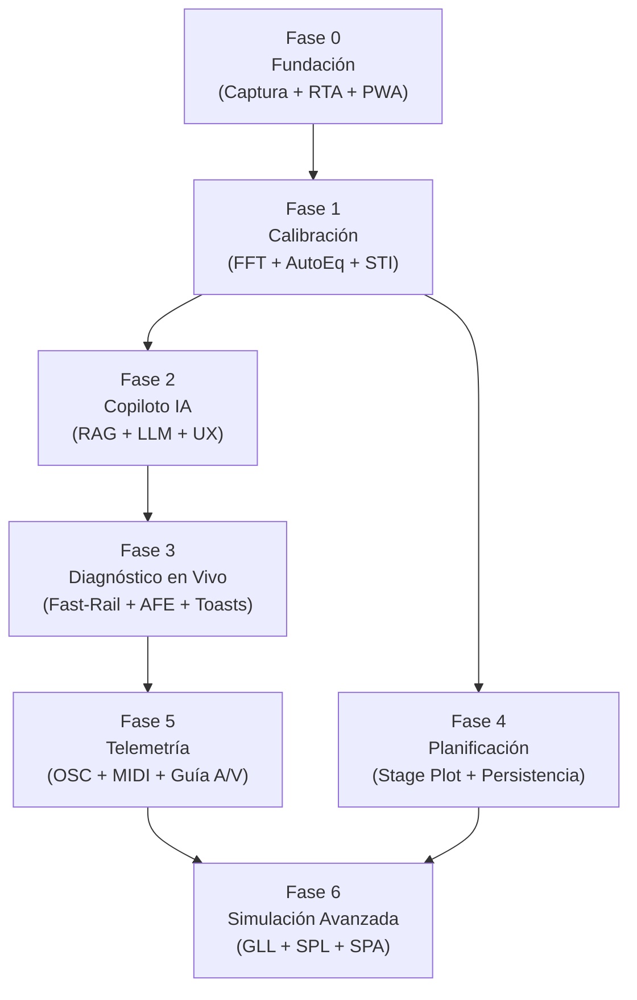

# Roadmap de implementación — Asistente de audio y video para asambleas

Cada fase produce un entregable funcional que se puede usar y testear independientemente. Las fases se construyen sobre las anteriores.

**Principio de priorización:** Primero que suene → después que mida → después que explique → después que alerte → después que recuerde → después que controle.

### Desarrollo Dual: PWA + Tauri (Transversal)
El proyecto produce **dos targets desde el mismo código** en todas las fases:
- **PWA (Web):** `npm run build` → archivos estáticos desplegados en `entrerios2.github.io/asistente`
- **Nativo (Tauri):** `cargo tauri build` → ejecutable `.exe` / `.app` con acceso ASIO, archivos locales y VRAM sin restricciones.

La separación se logra mediante un **HAL (Hardware Abstraction Layer)** establecido en Fase 0. Toda la lógica de negocio y DSP es agnóstica al entorno; solo las implementaciones de captura, archivos y red cambian.

```
asistente/
├── src/                    ← Svelte 5 (UI compartida)
│   └── lib/
│       ├── hal/            ← Capa de abstracción (interfaces)
│       │   ├── audio.ts    ← captureAudio(), playPinkNoise(), getFFT()
│       │   ├── web.ts      ← Impl: Web Audio API + AudioWorklet
│       │   └── tauri.ts    ← Impl: invoke() → Rust/cpal/ASIO
│       └── dsp/            ← Motor DSP puro (consume HAL)
├── src-tauri/              ← Backend Rust (cpal, OSC nativo, mDNS, fs)
├── static/
├── vite.config.ts          ← base: '/asistente/'
└── docs/
```

---

## Fase 0 — Fundación, Scaffolding y HAL
**Objetivo:** Proyecto dual-target funcional con captura de audio y visualización básica.
**Depende de:** —

### Entregable
Una app que captura audio del micrófono y muestra un RTA en tiempo real, ejecutable como PWA instalable y como aplicación nativa Tauri.

### Componentes

| Tarea | Sección DDS | Target | Complejidad |
|:------|:----------:|:------:|:-----------:|
| Inicializar proyecto Svelte 5 + Vite con `base: '/asistente/'` | 2.0 | Ambos | 🟢 |
| Inicializar Tauri (`cargo tauri init`) sobre el proyecto Vite | 2.4 | Nativo | 🟢 |
| **HAL: interfaces de audio** (`captureAudio`, `playPinkNoise`, `getFFT`) | 2.4 | Ambos | 🟡 |
| **HAL impl Web:** AudioWorklet + SharedArrayBuffer | 2.2 | PWA | 🟡 |
| **HAL impl Tauri:** Backend Rust con `cpal` + canal IPC | 2.4 | Nativo | 🟡 |
| Motor FFT vía WebFFT (WASM) | 2.2 | Ambos | 🟡 |
| Canvas RTA (magnitud vs frecuencia) a 20 fps | 3.4 | Ambos | 🟡 |
| Generador de Ruido Rosa integrado | 4.3.2 | Ambos | 🟢 |
| Implementar detección de Tier (0/1/2) | 2.1 | PWA | 🟢 |
| Configurar PWA (manifest.json, Service Worker, íconos) | 2.0 | PWA | 🟢 |
| Headers COOP/COEP para SharedArrayBuffer | 6.1 | PWA | 🟢 |
| Deploy pipeline a `/asistente` de entrerios2.github.io | — | PWA | 🟢 |

### Criterios de Aceptación
- [ ] La PWA se instala desde el navegador
- [ ] La app Tauri compila y ejecuta en Windows
- [ ] El RTA muestra el espectro del micrófono en ambos targets
- [ ] El Ruido Rosa suena limpio por los altavoces
- [ ] El código DSP no importa ni `Web Audio API` ni `cpal` directamente (solo HAL)

---

## Fase 1 — Motor de Calibración
**Objetivo:** Herramienta de medición profesional funcional.
**Depende de:** Fase 0

### Entregable
El operador puede medir la respuesta de la sala, ver la curva objetivo, y recibir sugerencias de EQ.

### Componentes

| Tarea | Sección DDS | Complejidad |
|:------|:----------:|:-----------:|
| Generador de Log Sweep + extracción de IR | 4.3.2 paso 1 | 🟡 |
| Cálculo de STI Estimado desde IR | 4.3.2 paso 1 | 🟡 |
| Función de Transferencia dual-canal (Magnitud + Fase + Coherencia) | 4.3.2 paso 2 | 🔴 |
| Curva Objetivo Spoken Word con parámetros editables | 4.3.1 | 🟢 |
| Motor AutoEq: derivación de filtros PEQ (cortes prioritarios) | 4.3.3 | 🔴 |
| Trace Math Visualizer (3 capas: Medición + Filtro + Predicted) | 4.3.3 | 🟡 |
| Gráfico de Coherencia ("Semáforo") como gate del AutoEq | 4.7.1 | 🟡 |
| Alineamiento Temporal (Fase Desenrollada) para delays | 4.3.2 paso 3 | 🟡 |
| Snapshot Antes/Después + Auditoría STI-Est | 4.3.2 paso 4 | 🟢 |
| Integración Meyda.js para descriptores acústicos | 2.3 | 🟢 |

### Criterios de Aceptación
- [ ] El Sweep mide la IR y calcula STI-Est
- [ ] El RTA con Ruido Rosa muestra magnitud vs curva objetivo
- [ ] AutoEq sugiere filtros que nunca exceden los límites de seguridad
- [ ] El Semáforo de Coherencia bloquea sugerencias en zonas de baja coherencia
- [ ] El Trace Math muestra la respuesta predicha antes de aplicar

---

## Fase 2 — Motor Semántico (Copiloto IA)
**Objetivo:** El copiloto entiende lenguaje natural, explica sus sugerencias y educa al operador novato.
**Depende de:** Fase 1 (necesita Meyda.js y datos de calibración para contextualizar)

### Entregable
Copiloto conversacional que diagnostica, explica y educa. Al activarse, transforma toda la experiencia de la app: las sugerencias de calibración ya existentes (Fase 1) pasan a explicarse en lenguaje humano.

### Componentes

| Tarea | Sección DDS | Complejidad |
|:------|:----------:|:-----------:|
| RAG: vectorización del corpus + búsqueda por similitud | 4.5 | 🟡 |
| Corpus RAG: fragmentación de fuentes primarias (McCarthy, IEC) | 4.5.1 | 🟡 |
| LLM local: Transformers.js + WebGPU (Tier 2) | 2.0 | 🔴 |
| LLM CPU: ONNX Runtime Web (Tier 1) | 2.0 | 🟡 |
| Ecualización Semántica ("suena encajonado" → PEQ) | 4.4 | 🟡 |
| Desplazamiento de Autoridad (Semantic Override en Modo Agnóstico) | 4.3 | 🟡 |
| UX Adaptativa: niveles Básico/Intermedio/Avanzado | 4.9 | 🟡 |
| Tiered Prompts (mensajes adaptativos por nivel de usuario) | 4.9 | 🟢 |
| Glosario Contextual vinculado al RAG | 4.9 | 🟢 |
| Tutorial Introductorio de Sonido en Vivo y Manejo de Consolas | 4.9 | 🟡 |
| Plantillas estáticas pre-compiladas para Tier 0 | 2.1 | 🟢 |

### Criterios de Aceptación
- [ ] "¿Por qué suena nasal?" genera una respuesta coherente con sugerencia de EQ
- [ ] El RAG recupera fragmentos relevantes del corpus técnico
- [ ] El nivel Básico explica cada acción en lenguaje coloquial
- [ ] El glosario contextual funciona en todos los términos técnicos de la UI
- [ ] En Tier 0 (sin IA), las plantillas estáticas cubren los diagnósticos comunes

---

## Fase 3 — Diagnóstico en Vivo (Fast-Rail + AFE)
**Objetivo:** El sistema detecta problemas acústicos en tiempo real y alerta al operador con explicaciones inteligentes.
**Depende de:** Fase 0 + Fase 2 (el Semantic-Rail y la UX Adaptativa ya están listos)

### Entregable
Dashboard de ejecución (Fase 4 del DDS) con alertas inteligentes en tiempo real. Cada alerta nace con explicaciones pedagógicas y tono lingüístico modulado por confianza.

### Componentes

| Tarea | Sección DDS | Complejidad |
|:------|:----------:|:-----------:|
| Algoritmo AFE: detección de feedback (crecimiento + tonalidad) | 4.6.1 | 🟡 |
| Fast-Rail: 5 heurísticas (feedback, clipping, proximidad, sibilancia, caja) | 4.7.1 | 🟡 |
| Sistema de Smart Toasts con Indicador de Confianza (🟢/🟡/🔴) | 4.7.1 | 🟡 |
| Modulación de tono lingüístico por confianza | 4.7.1 | 🟢 |
| Health Score (1-10) en el dashboard | 4.7.1 | 🟢 |
| Carril Semántico (Semantic-Rail) para diagnósticos complejos | 4.7.1 | 🟡 |
| Waterfall Plot (mapa de calor 2D para Tier 0, 3D para Tier 2) | 4.7.1 | 🟡 |
| Monitoreo SPL opcional (sonómetro de fondo) | 4.7.1 | 🟢 |
| Botón de Pánico (muteo masivo / instrucción pantalla completa) | 4.8.2 | 🟢 |
| Macro-Perfiles de Orador (One-Tap: Grave, Sibilante, Débil) | 4.10 | 🟢 |
| Detector de Técnica de Micrófono (proximidad, fuera de eje) | 4.10 | 🟡 |

### Criterios de Aceptación
- [ ] Un acople simulado dispara un Smart Toast en < 200ms
- [ ] El Semantic-Rail explica el diagnóstico en lenguaje natural (Tier 1/2)
- [ ] En Tier 0, la plantilla estática cubre el mismo caso con explicación pre-redactada
- [ ] El Health Score refleja el estado real del sistema
- [ ] El Botón de Pánico funciona (pantalla completa sin OSC)

---

## Fase 4 — Planificación Espacial y Persistencia
**Objetivo:** El operador puede diseñar el montaje, guardar/cargar configuraciones, y beneficiarse de la memoria histórica.
**Depende de:** Fase 1

### Entregable
Stage Plot MVP + sistema de persistencia completo + Venue Memory.

### Componentes

| Tarea | Sección DDS | Complejidad |
|:------|:----------:|:-----------:|
| Stage Plot: lienzo Canvas con sala rectangular + posiciones XY | 4.1 | 🟡 |
| Cálculo RT60 (Sabine) desde dimensiones + materiales | 4.1 | 🟢 |
| Modos de Sala (ondas estacionarias graves) | 4.1 | 🟢 |
| Reglas Geométricas (3:1, Inversa del Cuadrado, Mic/Monitor) | 4.1 | 🟡 |
| Delays multi-altavoz compensados por temperatura | 4.1 | 🟢 |
| Generador de Sweet Spots | 4.1 | 🟢 |
| Perfiles Genéricos de Seguridad (Agnóstico A/B/Desconocido) | 4.1 | 🟡 |
| Promediado Espacial Multi-punto (medición guiada) | 4.3.2a | 🟡 |
| Modo Ensayo (Rehearsal Mode + Cheat Sheet) | 4.3.2b | 🟢 |
| AvSetupPayload: exportar/importar JSON con validación de schema | 4.8.1 | 🟡 |
| Venue Memory: historial indexado por recinto | 4.12 | 🟡 |
| Reporte Post-Evento (PDF vía jsPDF) | 4.8.3 | 🟡 |
| Modo de Emergencia (PDF + QR de estado mínimo) | 4.8.2 | 🟢 |

### Criterios de Aceptación
- [ ] Se puede diseñar una sala, posicionar equipos, y calcular delays
- [ ] Las reglas geométricas disparan advertencias proactivas
- [ ] Un payload exportado se importa correctamente en otra instancia
- [ ] Al volver a un recinto, el sistema ofrece cargar la calibración anterior

---

## Fase 5 — Telemetría y Control de Consola
**Objetivo:** Integración bidireccional con consolas digitales.
**Depende de:** Fase 3

### Entregable
El asistente lee y escribe en la consola, con undo y auto-descubrimiento.

### Componentes

| Tarea | Sección DDS | Complejidad |
|:------|:----------:|:-----------:|
| Cliente OSC bidireccional (enviar/recibir) | 4.2 | Nativo | 🟡 |
| Web MIDI API para consolas USB | 4.2 | PWA | 🟡 |
| HAL: interfaz de telemetría (`readMeters`, `sendOSC`, `subscribe`) | 2.4 | Ambos | 🟡 |
| Gemelo Digital: lectura de estado (mutes, faders, EQ, meters) | 4.2 | Ambos | 🟡 |
| Niveles de Autorización (Estricto / Semiautomático) | 4.2 | Ambos | 🟢 |
| Undo/Rollback OSC (Snapshot de Canal) | 4.2 | Ambos | 🟡 |
| Auto-descubrimiento mDNS (Tauri) | 4.2 | Nativo | 🟡 |
| Modo Centinela: monitoreo pasivo + triage dirigido via Solo | 4.6.2 | Ambos | 🔴 |
| Gain Staging Wizard (con y sin telemetría) | 4.7.2 | Ambos | 🟡 |
| Hardware Wizard: checklist pre-vuelo + loopback | 4.7.2 | Ambos | 🟡 |
| Guía de A/V: ingesta JSON + timeline + alertas mute/unmute | 4.11 | Ambos | 🟡 |
| Suspensión AFE en secciones de video | 4.11 | Ambos | 🟢 |
| Aplicación opcional de perfiles de voz por sección | 4.11 | Ambos | 🟡 |

### Criterios de Aceptación
- [ ] La app lee los meters de una X32 en tiempo real
- [ ] Un comando OSC enviado se puede deshacer con un botón
- [ ] El Modo Centinela identifica correctamente el canal problemático
- [ ] La Guía de A/V alerta si un mic está muteado cuando debería estar activo

---

## Fase 6 — Simulación Avanzada (Futuro)
**Objetivo:** Predicción acústica sin encender el sistema de sonido.
**Depende de:** Todas las fases anteriores

> **Nota:** Esta fase es aspiracional y no forma parte del MVP ni del roadmap comprometido. Se incluye como referencia de la visión a largo plazo.

### Componentes potenciales
- Importación GLL con dispersión 3D
- Globos de cobertura desde specs manuales
- Mapeo SPL con isobáricas
- Detección visual de Comb Filtering
- Integración con el Sistema de Gestión AV (SPA)
- Tauri: ASIO nativo, archivos locales, VRAM sin restricciones

---

## Diagrama de Dependencias



---

## Resumen Ejecutivo

| Fase | Entregable | Módulos DDS | Principio |
|:----:|:-----------|:------------|:----------|
| **0** | PWA + Tauri con RTA funcional + HAL | 2.0, 2.1, 2.2, 2.4, 3.4 | Que suene |
| **1** | Herramienta de calibración | 2.3, 4.3, 4.7.1 (parcial) | Que mida |
| **2** | Copiloto conversacional con IA | 4.4, 4.5, 4.9, 2.1 (Tier 0) | Que explique |
| **3** | Dashboard con alertas en tiempo real | 4.6, 4.7, 4.8.2, 4.10 | Que alerte |
| **4** | Stage Plot + persistencia + historial | 4.1 (MVP), 4.3.2a/b, 4.8, 4.12 | Que recuerde |
| **5** | Control bidireccional de consola | 4.2, 4.6.2, 4.7.2, 4.11 | Que controle |
| **6** | Simulación predictiva avanzada | 4.1 (full), 9 | Que prediga |
