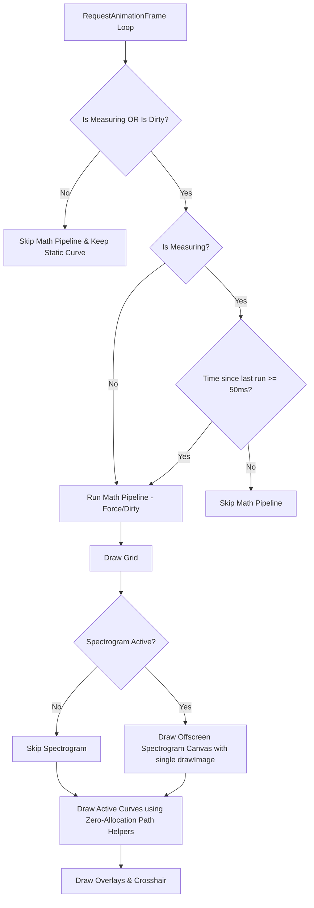

# Performance Optimization Plan: Quadrant.svelte

This plan details the corrective actions to eradicate the 95% CPU consumption in idle mode in Chrome, as well as the progressive performance degradation caused by Garbage Collection.

## 1. Architecture & Control Flow

The optimized rendering and processing pipeline is structured as follows:

---

## 2. Detailed Action Items

### 2.1. Control States & Reactive Bridge
- Add control states in [`Quadrant.svelte`](src/components/medicion/Quadrant.svelte):
  - `let dirty = $state(true);`
  - `let lastMathTime = 0;`
  - `const MATH_THROTTLE_MS = 50;` (equivalent to 20 FPS limit for real-time processing).
- Implement a Svelte 5 reactive bridge `$effect` to observe changes in variables that alter the calculation:
  - `traceManager.eqBands`
  - `activeMetrics`
  - `uiStore.isMeasuring`
  - `uiStore.isSimulating`
  - When any of these change, mark `dirty = true` instantly.

### 2.2. Throttling in Mathematical Pipeline
- Refactor `runMathPipeline` to accept a `force` parameter (which is the `dirty` flag).
- If not measuring and not marked as `dirty`, skip the mathematical pipeline and the 8,192-point IFFT entirely, reducing CPU usage to 0% in idle.
- If measuring, apply the 50ms throttle to keep CPU usage stable at 20 FPS.
- If `force === true` (manual parameter change), bypass the throttle for an instantaneous user response, then reset `dirty = false`.

### 2.3. Static Curve Jitter Removal
- Update `getPhaseValueRadians` and `getCoherenceValue` to accept an `isMeasuring` parameter.
- When `isMeasuring` is false, disable the random jitter/noise simulation (`(Math.random() - 0.5) * 0.04`), ensuring a perfectly static and stable curve when idle.

### 2.4. Zero-Allocation Curve Drawing
- Create zero-allocation drawing helper functions:
  - `drawMetricPath(ctx, dataArray, width, height, color, lw, metricType)`
  - `drawSpectrumPath(ctx, dataArray, width, height, color, lw)`
  - `drawTimeDomainPath(ctx, dataArray, width, height, color, lw, metricType)`
- These functions will directly loop over the frequency/time ranges, calculate coordinates on the fly using `valToX` and `valToY`, and trace the path with `ctx.lineTo()` directly.
- Eliminate the creation and allocation of the `points` array and the instantiation of `{ freq, val }` objects in every frame, completely eliminating Garbage Collection jank.
- Remove the unused `drawPath` function.

### 2.5. Spectrogram Drawing Optimization
- Precompute a 256-color Look-Up Table (LUT) array of RGB strings to avoid string concatenation and color interpolation on every frame.
- Create an offscreen canvas of size `maxHistory` x `numFreqs` (e.g., 100 x 70).
- When a new slice is added to `spectrogramHistory`:
  - Shift the existing image on the offscreen canvas to the left by 1 pixel using `ctx.drawImage`.
  - Draw the new slice as a 1-pixel wide column on the rightmost edge using the precomputed LUT.
- In the main `draw()` loop, render the spectrogram with a single `ctx.drawImage` call stretching the offscreen canvas to the full width and height of the main canvas.
- This reduces the rendering cost from 7,000 `fillRect` calls per frame to exactly 1 `drawImage` call per frame.

---

## 3. Verification Plan

### 3.1. Compilation Verification
- Run `npm run check` to ensure that the refactored function signatures and Svelte runes do not throw any TypeScript or compilation errors.

### 3.2. CPU Consumption Test (Idle Mode)
- Open Chrome Task Manager / DevTools Performance and verify that with measurement turned off, the CPU consumption of the assistant tab drops to near 0-2%.

### 3.3. Interactivity Test (EQ Dragging)
- Move the EQ sliders in the left panel and verify that the simulated curve in the quadrant responds instantly without any perceptible delay.

### 3.4. Live Measurement Test
- Start the microphone measurement and validate that the spectrum curve animates smoothly, keeping CPU usage moderate and without any visual freezing or jank.
