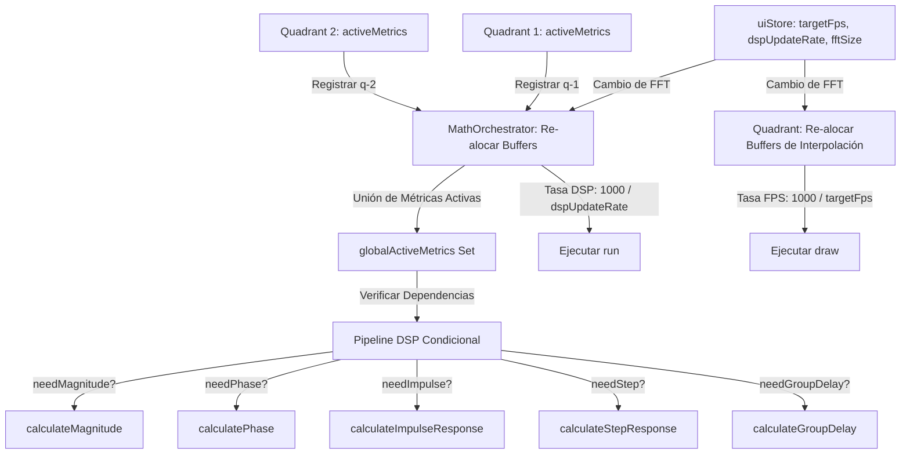

# Plan de Optimización de Rendimiento, Desacoplamiento de Tasas, Limpieza de UI y Mejoras de Visualización (v2)

Este plan detalla la estrategia para optimizar el pipeline de procesamiento matemático (DSP), desacoplar la tasa de procesamiento de datos de la tasa de refresco visual, agregar controles granulares de rendimiento mediante sliders, remover efectos visuales costosos, limpiar referencias de marcas de terceros, y añadir potentes mejoras de visualización interactiva en los cuadrantes.

---

## 1. Objetivos Principales

1. **Procesamiento Bajo Demanda:** Calcular únicamente las métricas que se están mostrando activamente en pantalla en los cuadrantes visibles.
2. **Desacoplamiento de Tasas (DSP vs. FPS):**
   - **FPS del Gráfico:** Configurable mediante slider entre 10 y 60 FPS (por defecto 30 FPS). Opciones: 10, 15, 20, 30, 50, 60.
   - **Tasa de Procesamiento DSP:** Configurable mediante slider entre 0.5 Hz y 30 Hz (por defecto 2 Hz). Control granular con paso de 0.5 Hz.
3. **Configuración Dinámica de FFT:** Permitir cambiar el tamaño de la ventana FFT (1024 a 16384 muestras) y re-alocar buffers dinámicamente sin fugas de memoria.
4. **Optimización de GPU/CPU:** Remover todos los efectos de *frosted glass* (`backdrop-filter: blur`) de la interfaz de usuario.
5. **Limpieza de Marca:** Remover toda referencia a "Open Sound Meter" (OSM) de la interfaz de usuario.
6. **Mejoras de Visualización Avanzadas:**
   - **Combinación de Spectrum y Magnitude:** Permitir activar ambas simultáneamente en el mismo cuadrante usando un eje Y secundario (izquierdo para Magnitude en dB relativos, derecho para Spectrum en dBSPL absolutos).
   - **Espectrograma Vertical Coincidente:** Rediseñar el espectrograma para que las frecuencias coincidan exactamente con el eje X logarítmico del gráfico, y la cascada de tiempo se deslice verticalmente hacia arriba.
   - **Configuración Individual por Métrica:** Añadir un icono de configuración al lado de cada métrica en el popover para personalizar su color, tipo de línea (sólida, discontinua, puntos) y grosor.

---

## 2. Arquitectura del Sistema Desacoplado y Avanzado



---

## 3. Especificaciones de Implementación

### 3.1. Configuración Global en `uiStore.svelte.ts`
Añadiremos las siguientes propiedades reactivas en [`src/lib/stores/ui.svelte.ts`](src/lib/stores/ui.svelte.ts):

```typescript
// Configuración de Rendimiento y DSP
targetFps = $state(30); // Slider: 10, 15, 20, 30, 50, 60
dspUpdateRate = $state(2); // Slider: 0.5 a 30 (paso 0.5)
fftSize = $state(8192); // Opciones: 1024, 2048, 4096, 8192, 16384
```

### 3.2. Registro de Métricas Activas en `MathOrchestrator`
Implementaremos un registro dinámico en [`src/lib/stores/mathOrchestrator.svelte.ts`](src/lib/stores/mathOrchestrator.svelte.ts):

```typescript
activeMetricsByQuadrant = $state<Record<string, string[]>>({});

registerQuadrantMetrics(id: string, metrics: string[]) {
    this.activeMetricsByQuadrant[id] = metrics;
}

unregisterQuadrant(id: string) {
    delete this.activeMetricsByQuadrant[id];
}

get globalActiveMetrics(): Set<string> {
    const active = new Set<string>();
    for (const id in this.activeMetricsByQuadrant) {
        for (const metric of this.activeMetricsByQuadrant[id]) {
            active.add(metric);
        }
    }
    return active;
}
```

### 3.3. Optimización del Pipeline DSP (`run()`)
El método `run()` evaluará las dependencias de las métricas activas globales antes de ejecutar los cálculos pesados:

* **`needMagnitude`**: `globalActiveMetrics` contiene `"Magnitude"`, `"Impulse"`, `"Step"`, `"Spectrum"` o `"Spectrogram"`.
* **`needPhase`**: `globalActiveMetrics` contiene `"Phase"` o `"Group Delay"`.
* **`needImpulse`**: `globalActiveMetrics` contiene `"Impulse"` o `"Step"`.
* **`needStep`**: `globalActiveMetrics` contiene `"Step"`.
* **`needGroupDelay`**: `globalActiveMetrics` contains `"Group Delay"`.

### 3.4. Re-alocación Dinámica de Buffers (Zero-Allocation)
Cuando cambie `uiStore.fftSize`, tanto `MathOrchestrator` como `Quadrant` re-alocarán sus buffers internos de forma segura.

### 3.5. Control de FPS en el Bucle de Animación de `Quadrant.svelte`
Implementaremos un limitador de FPS basado en tiempo en el `renderLoop` de [`src/components/medicion/Quadrant.svelte`](src/components/medicion/Quadrant.svelte):

```typescript
let lastDrawTime = 0;

function renderLoop() {
    const now = performance.now();
    const interval = 1000 / uiStore.targetFps;
    const elapsed = now - lastDrawTime;

    if (elapsed >= interval) {
        lastDrawTime = now - (elapsed % interval);
        draw();
    }
    animationId = requestAnimationFrame(renderLoop);
}
```

### 3.6. Combinación de Spectrum y Magnitude con Eje Y Secundario
* **Remoción de Exclusión:** Eliminaremos la regla que impide activar `"Spectrum"` y `"Magnitude"` simultáneamente en `isMetricDisabled()`.
* **Eje Y Secundario:**
  - El eje Y izquierdo se utilizará para **Magnitude** (rango: -30 a 30 dB).
  - El eje Y derecho se utilizará para **Spectrum** (rango: -120 a 10 dBFS o 20 a 100 dBSPL).
  - Si ambas están activas, se dibujarán ambas escalas en los laterales correspondientes con colores coincidentes con sus respectivas curvas para evitar confusión visual.

### 3.7. Espectrograma Vertical Coincidente (Cascada hacia Arriba)
Rediseñaremos el espectrograma para que se alinee perfectamente con el eje X logarítmico de frecuencias:
* **Eje X:** Frecuencias logarítmicas (coincidiendo exactamente con la grilla del gráfico).
* **Eje Y:** Tiempo (cascada deslizándose verticalmente hacia arriba).
* **Implementación con Offscreen Canvas:**
  - El offscreen canvas tendrá un ancho igual al ancho del gráfico y un alto igual al historial de tiempo (`maxHistory`).
  - En cada actualización, desplazaremos el offscreen canvas 1 píxel hacia arriba (`drawImage` con offset en Y) y dibujaremos la nueva línea de espectro en la parte inferior.
  - Al dibujar la nueva línea, mapearemos los bins de frecuencia a la escala logarítmica del eje X para que coincida perfectamente con la grilla de fondo.

### 3.8. Configuración Individual por Métrica (Estilos Personalizados)
Añadiremos un estado reactivo en `Quadrant.svelte` para almacenar la configuración de estilo de cada métrica:

```typescript
interface MetricStyle {
    color: string;
    lineDash: number[]; // [] = sólida, [4, 4] = discontinua, [1, 3] = puntos
    lineWidth: number;
}

let metricStyles = $state<Record<string, MetricStyle>>({
    "Spectrum": { color: "#a855f7", lineDash: [], lineWidth: 2 },
    "Magnitude": { color: "#ff4444", lineDash: [], lineWidth: 2 },
    "Phase": { color: "#d946ef", lineDash: [], lineWidth: 1.6 },
    "Coherence": { color: "#eab308", lineDash: [], lineWidth: 1.8 },
    "Group Delay": { color: "#10b981", lineDash: [], lineWidth: 1.8 },
    "Impulse": { color: "#3b82f6", lineDash: [], lineWidth: 2 },
    "Step": { color: "#f97316", lineDash: [], lineWidth: 2 }
});
```

* **UI de Configuración:** Al lado de cada checkbox de métrica en el popover, añadiremos un botón de engranaje/paleta. Al hacer clic, se desplegará un sub-panel para configurar:
  - **Color:** Selector rápido de paleta (5-6 colores profesionales).
  - **Tipo de Línea:** Sólida, Discontinua, Puntos.
  - **Grosor:** Slider de 1px a 4px.

### 3.9. Remoción de Efectos de Frosted Glass (`backdrop-filter`)
Eliminaremos los estilos de desenfoque de fondo en los archivos CSS/Svelte correspondientes para evitar el redibujado costoso de la GPU:
* **`Quadrant.svelte` (Cabecera):** Reemplazar `backdrop-filter: blur(12px); background: rgba(8, 8, 11, 0.7);` por `background: #0c0c10;`.
* **`Quadrant.svelte` (Popover):** Reemplazar `backdrop-filter: blur(16px); background: rgba(12, 12, 17, 0.94);` por `background: #0e0e14;`.
* **`TraceMath.svelte`:** Reemplazar `backdrop-filter: blur(4px);` por `background: #0c0c10;`.

### 3.10. Limpieza de Marca "Open Sound Meter"
* Reemplazar el texto `"Métricas de Open Sound Meter"` por `"Métricas de Medición"` en el popover de configuración de `Quadrant.svelte`.
* Limpiar comentarios internos que hagan referencia a OSM.

---

## 5. Plan de Verificación y Pruebas

1. **Verificación de Compilación:** Ejecutar `npm run check` para asegurar que no haya errores de TypeScript.
2. **Prueba de Desacoplamiento:**
   - Configurar la tasa DSP a `2 Hz` y los FPS a `30`. Verificar que la curva se mueva de forma ultra-suave (gracias a la interpolación) pero que los datos reales solo cambien dos veces por segundo.
   - Configurar los FPS a `10` y verificar que el uso de GPU/CPU del navegador disminuya drásticamente.
3. **Prueba de Combinación de Ejes:** Activar Spectrum y Magnitude simultáneamente. Verificar que el eje izquierdo muestre la escala de Magnitude y el derecho la de Spectrum, y que ambas curvas se dibujen correctamente.
4. **Prueba de Espectrograma Vertical:** Activar el espectrograma y verificar que las líneas de color coincidan exactamente con las líneas de frecuencia de la grilla logarítmica de fondo, y que la cascada se deslice verticalmente hacia arriba.
5. **Prueba de Estilos Personalizados:** Cambiar el color y tipo de línea de una métrica y verificar que se aplique instantáneamente en el gráfico y en la retícula (crosshair).
