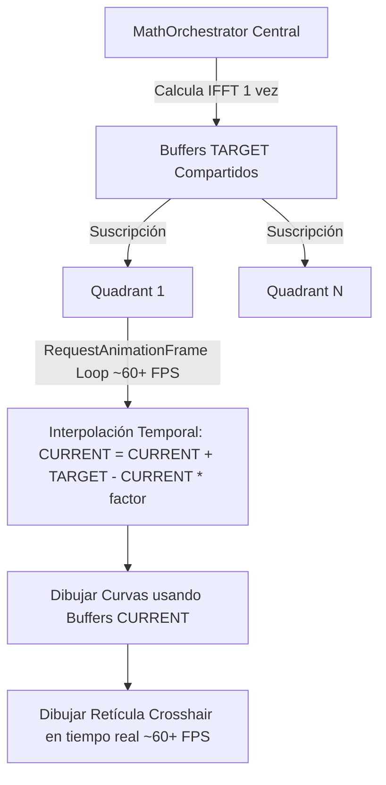

# Plan de Renderizado Suave, Interactividad y Centralización: Quadrant.svelte

Este plan detalla la estrategia para implementar un renderizado suave mediante interpolación temporal, desacoplar la retícula interactiva (crosshair) para garantizar una respuesta instantánea a la entrada del usuario, adaptar dinámicamente la tasa de procesamiento y **centralizar el pipeline matemático** para máxima eficiencia.

## 1. Arquitectura de Renderizado Desacoplado, Adaptativo y Centralizado

Para lograr un rendimiento óptimo, centralizamos el cálculo pesado y adaptamos la tasa de refresco:

---

## 2. Cambios Propuestos

### 2.1. Centralización del Pipeline Matemático
- Mover la lógica de `runMathPipeline` y los buffers de cálculo (`fftInputReal`, `outputMagnitude`, etc.) desde `Quadrant.svelte` a un nuevo store centralizado o `MathOrchestrator`.
- Los componentes `Quadrant` se suscribirán a los resultados del orquestador.
- Esto reduce el costo de CPU de `O(N)` (donde N es el número de cuadrantes) a `O(1)`.

### 2.2. Throttling Dinámico según la Carga
- El `MathOrchestrator` ajustará su tasa de ejecución (`MATH_THROTTLE_MS`) basándose en `uiStore.layout`:
  - **1 Cuadrante**: 10 FPS (100ms).
  - **2 Cuadrantes**: 7 FPS (142ms).
  - **4 Cuadrantes**: 5 FPS (200ms).
  - **6 Cuadrantes**: 3 FPS (333ms).

### 2.3. Buffers de Interpolación Temporal (Zero-Allocation)
Cada `Quadrant` mantendrá sus propios buffers `current` para interpolar hacia los resultados del `MathOrchestrator` (buffers `target`):
- `const currentMagnitude = new Float32Array(BINS);`
- `const currentPhase = new Float32Array(BINS);`
- ... (y así para todas las métricas).

### 2.4. Paso de Interpolación en el Bucle de Animación
En cada frame del bucle `draw()` (60+ FPS):
- Se realiza la interpolación lineal exponencial: `current[i] += (target[i] - current[i]) * factor`.
- Si el usuario cambia un parámetro (ej. EQ), el `MathOrchestrator` marca `dirty = true`, ejecuta el cálculo inmediatamente y los cuadrantes hacen un "snap" (copia directa) de los valores para respuesta instantánea.

### 2.5. Desacoplamiento de la Retícula Crosshair
- La retícula se dibuja al final de `draw()` usando las coordenadas del ratón, garantizando 60+ FPS de respuesta táctil, independientemente de la tasa de refresco de los datos acústicos.

---

## 3. Plan de Verificación

### 3.1. Verificación de Compilación
- Ejecutar `npm run check`.

### 3.2. Verificación Visual de Fluidez
- Validar que las curvas se deslicen suavemente y que la respuesta a los sliders de EQ sea instantánea.

### 3.3. Verificación de Rendimiento Centralizado
- Comprobar en Chrome DevTools que el consumo de CPU es constante al abrir múltiples cuadrantes, confirmando que el cálculo matemático solo ocurre una vez.
